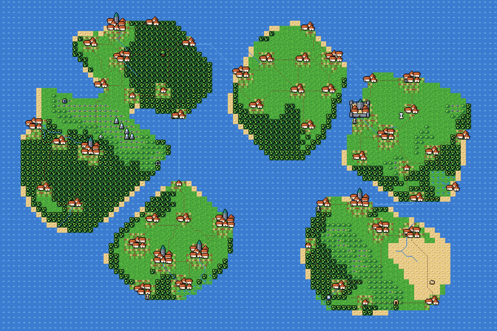
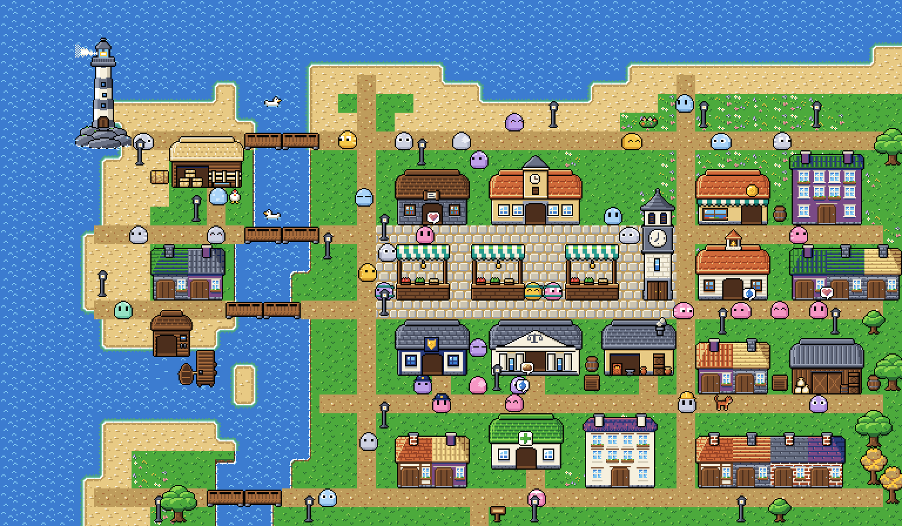
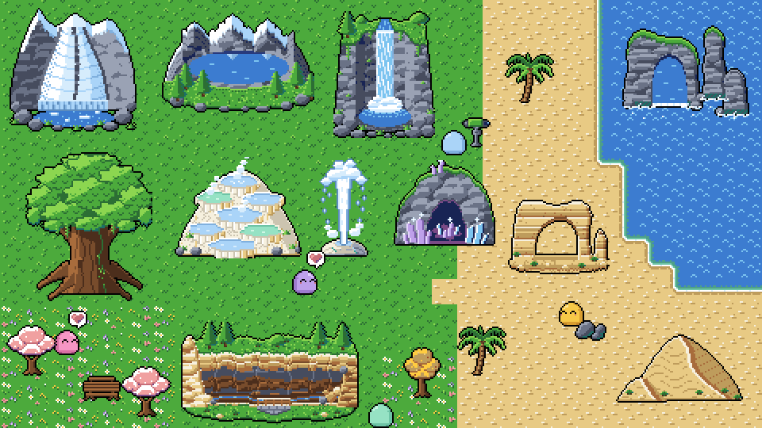
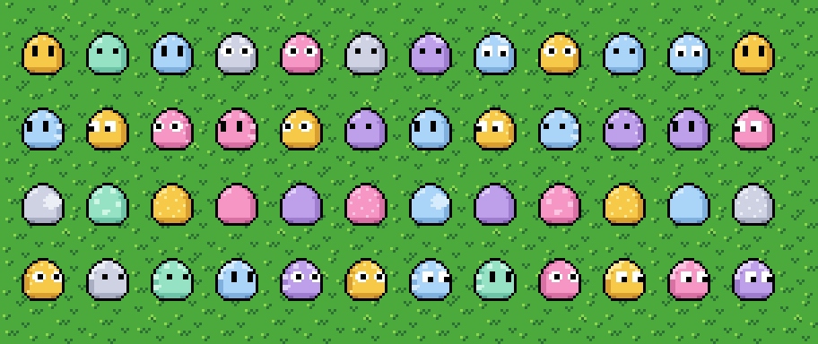
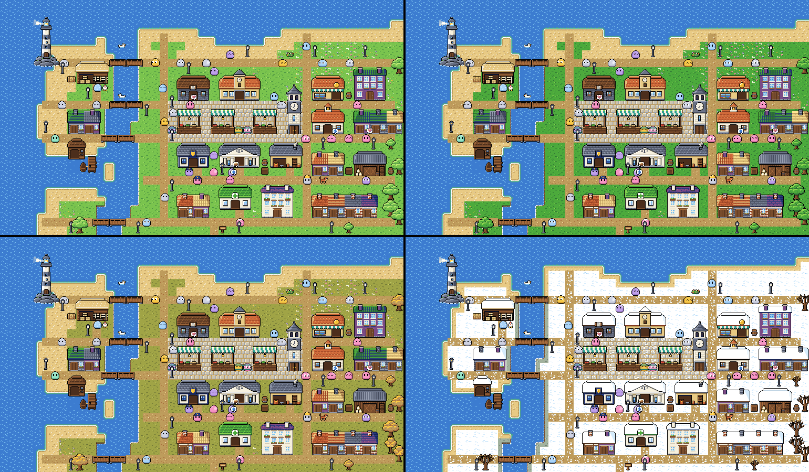

# Nomos

A society simulation that runs entirely in the browser. Blob-shaped people work, trade, eat, celebrate and sometimes steal across a randomly generated country, and you can zoom from the whole map down to a single street. Money is exact to the cent, and every run replays identically from its seed. The core lesson: the crime record is not the crime, because what gets watched shapes what gets recorded.

<p>
  
  
</p>

*One random world, seed `09f02ffe`: the country map and its capital up close. Both were drawn by `tools/worldgen` from the original sprites; the game itself is not built yet.*

**Status: planning and art.** There is no game code yet. What exists today:
- eight research rounds and a ten-milestone build plan, in [`docs/`](docs/);
- an original pixel-art sprite set of 1,342 sprites in 13 sheets, drawn as code, in [`tools/sprites/`](tools/sprites/), with seasons and snow;
- a random world generator that previews worlds with that art, in [`tools/worldgen/`](tools/worldgen/).

## What it will be

- **Watch, never control.** You set up a world and its policies, press play and watch: pause, speed up, skip ahead a season or a year, follow and inspect people. Trying a different policy starts a new branch.
- **Seasons and years.** A year is four 28-day seasons. Crops are planted in spring and harvested in autumn, snow falls in winter, and people age a year at a time.
- **A new world every game.** Each game generates a country from a seed: coasts, mountains, rivers, climate, towns, roads, natural wonders and landmarks. The same seed always rebuilds the same world, so worlds can be shared.
- **Zoom from country to street.** Every settlement runs as an exact ledger. Zoom in and its people appear, spawned from the ledger; zoom out and they fold back into it.
- **An exact economy.** Money is stored in whole cents and always balances. Goods move through production chains, food spoils, and wellbeing and wealth respond to both.
- **Crime and policing.** Anyone can choose crime. The sim keeps true crime apart from recorded crime, so you can watch where police look shape the record. Crime is an act, never a costume: nobody looks like a criminal.
- **Fictional cultures.** Learned customs (foods, festivals, music, naming and home region) shape what people prefer, never their ability, honesty, work or crime.
- **One body, 96 looks.** Everyone shares one blob body with a random hue, eye shape and pattern. Looks are never inherited, and no rule reads them.
- **Lab mode.** Primer-style experiment cards: lock in a prediction, run paired seeds and see whether it held.
- **Three skins, one renderer.** Coloured dots, blobs or a GBA-era pixel-art town, switchable at any time.
- **Browser only.** A TypeScript sim in a Web Worker and a custom WebGL2 renderer, with no backend. The plan's budgets cover 10,000 people on any phone, 25,000 on a capable phone and 100,000 on a desktop.

<p>
  
  
</p>

*Natural wonders, and the first 48 people of a world, each with a random look.*

<p>
  
</p>

*The capital through one year, from a single season map: palette swaps, bare trees in winter and snow on the ground and roofs.*

## Try the tools

You need Python 3.10 or newer, with Pillow and NumPy.

- `python tools/worldgen/generate.py` makes a new random world on every run and prints its seed. Add `--seed <hex>` to rebuild one. Output goes to `dist/worldgen/<seed>/`:
  - the country and region maps;
  - the capital, a town and a village up close;
  - every natural wonder's view;
  - a line-up of the world's first 48 people.
- `python tools/sprites/build_all.py` rebuilds every sprite sheet and `assets/LICENSES.md`.
- `python tools/sprites/test_sprites.py` checks every sheet against the art rules.

## Layout

```
docs/          Research, plans and mockups: everything that is not product code
  plan/        Implementation plan: milestones M0–M9, the performance budget and CI gates
  research/    Eight research rounds, each with a summary, report, notes and prototypes (round 7 is paused)
  mockups/     Concept art, sprite showcases and world previews, with their sources
assets/        Sprite sheets and manifests; LICENSES.md records every file's provenance
tools/
  sprites/     The pixel-art sprite set, drawn as code
  worldgen/    The random world generator, a reference for the sim's own
apps/          Planned for M0: the web app
packages/      Planned for M0: sim-core, sim-protocol, sim-worker, render-gl
```

Code under `docs/research/*/prototypes/` is throwaway benchmark code from the research rounds. Do not import it.

## Where to start

1. [Implementation plan](docs/plan/implementation-plan.md): what to build, in order, and the checks that close each milestone.
2. [Docs index](docs/README.md): every research round and what each file holds.
3. [Findings and plan](docs/research/round-1-baseline/findings-and-plan.md): the original research and architecture.
4. The [sprite](tools/sprites/README.md) and [world generator](tools/worldgen/README.md) READMEs: the art rules and how worlds are made.

## Commits

Commits go straight to `main`; there is one maintainer. Messages follow [Conventional Commits](https://www.conventionalcommits.org/): a short `type(scope): description` header of at most 72 characters. The types are `feat`, `fix`, `chore`, `refactor`, `perf`, `test`, `docs`, `style`, `build`, `ci` and `revert`. Run `git config core.hooksPath .githooks` once per clone so the `commit-msg` hook checks the header.

## Names

During research the project was called "Dot Society" (codename) and "Civilization Simulation" (working title). The research files keep those names.

## Licences

No licence has been chosen for this repository yet; the plan assumes MIT for code. The sprites in `assets/sprites/` are original art drawn as code, and [`assets/LICENSES.md`](assets/LICENSES.md) records each file's checksum. The concept art in `docs/mockups/` is original, with two exceptions:
- the town mockups use CC0 tiles from the Ninja Adventure pack;
- `docs/mockups/previews/` holds unmodified CC0 images, each with its licence file.

Provenance is recorded in [`docs/mockups/SOURCES.md`](docs/mockups/SOURCES.md).
