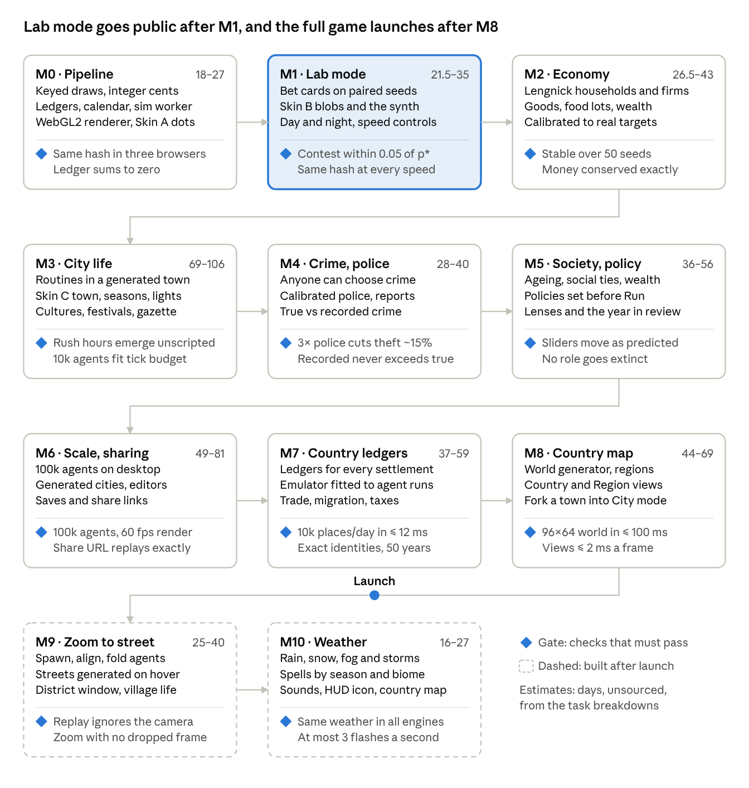

# Implementation plan

Oct 6, 2026 · @Rd

## How to use this plan

Work top to bottom: each milestone lists what to build and the checks that close it, merged from every research round. Tick a box when it lands; a milestone is done when its exit checks pass in CI, not when the demo looks right.

- **Where items come from:** round 1 is Findings & plan and Full report, round 2 is Follow-up research, round 3 is 2D game look & assets, round 4 is Villages, cities & countries, round 5 is the Performance budget section below, round 6 is Goods & wellbeing, round 8 is Cultures, round 9 is Maps and world builder, and (Sound), (Military), (Calendar) and (Gazette) mark the owner's plans of 7 October 2026, in the Sound, Military, Time & calendar and Gazette tabs, (Weather) marks the owner's Weather tab of 8 October 2026, and (CI/CD) marks the CI/CD tab of the same day. (Structure) and (Countries) mark the owner's Structure and Countries tabs of 9 October 2026.
- **Effort:** rough full-time estimates for one developer; round 1 put the whole plan at 12–19 weeks, and an AI coding assistant shortens that.
- **Something to look at from week one:** every milestone ships at least one of the three visual styles below, so the project is never just a test suite.

## Roadmap

The drawing shows all eleven milestones in build order: round 1's seven, round 4's three country milestones and the owner's M10. Its estimates come from the repo's task breakdowns, which estimate every task. The sections below add each round's tasks without changing the order, except where the owner moved work, as the paragraphs below say.

Round 9 moves launch after M8: M7 and M8 become pre-launch milestones and M9 stays after launch, so the drawing's launch line now falls after M8 (R9).

The owner added M10 Weather on 8 October 2026. It follows M9 after launch (Weather).

On 9 October 2026 the owner put an explorable map ahead of M1. Right after M0 and its M0.7, M8.1 ports the world generator to TypeScript, and M8.3 draws its Country and Region views with pan and zoom. Each world now holds 3–5 countries. The rest of M8 keeps its place after M7 and before launch, and blobs stay in the town until M9 joins the map to the streets. The new build order is M0, M8.1, M8.3, M1–M7, the rest of M8, launch, M9 and M10 (Countries).

## Visual styles

Coloured dots, blobs and a pixel-art town are three skins over one renderer and one 12-byte-per-agent snapshot, so changing the look is a setting, not a rewrite. Semantic zoom picks a skin automatically, and viewers can override it with a toolbar toggle or `?skin=dots|blobs|town`.

| Skin | Ground | Agents | Best for | Ships in |
| --- | --- | --- | --- | --- |
| A: coloured dots | Minimap colours from the town map; a heatmap when zoomed far out | Role colour plus shape: circle citizen, square merchant, diamond police, a ring for a theft in progress (true view only) | City mode at 10k–100k agents, debugging, the Canvas2D fallback | M0 (heatmap in M6) |
| B: Primer-style blobs | Flat zone colours from the same map | One shared blob body; jobs as caps and aprons; Primer faces and blinks | Lab cards, teaching, share clips | M1 |
| C: pixel-art town | Tilemap of CC0 tiles with roofs, signs and light periods | Skin B's blobs by default; human characters only as an opt-in variant | The Pokémon-style look at street and follow-cam zoom | M3 (justice buildings M4, generated cities M6) |

Every skin reads the same per-agent data: x, y and a 32-bit visual word for outfit, action and emote. The mockups for all three are in the 2D game look & assets tab.

## Performance budget

Every tier has a hard tick budget that CI enforces: 5.3 ms for 10k agents, 13.3 ms for 25k and 16 ms for 100k, and 1.5 ms (1k settlements) or 12 ms (10k) per country day. Optimised JavaScript already fits each with at least 20% slack, provided perception uses per-cell aggregates and decisions are event-driven. WebAssembly SIMD and workers are kept for the two loops where they pay.

Budgets are in reference-machine (RM) milliseconds: a 4-vCPU Xeon cloud VM whose Speedometer 3.1 score (9.5) falls between budget and mid-range Android phones. They assume 10 ticks a second at 1× speed on one sim worker, the rate the owner fixed on 7 October 2026, with 1,440 ticks a day (Calendar). Device times use conservative multipliers built from search-snippet Speedometer scores: ×1.5 for budget Android, ×0.6 for capable phones and ×0.75 for desktops.

| Tier | Budget, RM | On the device | Measured now, optimised JS |
| --- | --- | --- | --- |
| 10k agents, any phone | 5.3 ms a tick | ≈ 8 ms (budget Android) | 0.9 ms, before the systems not yet built |
| 25k agents, capable phone | 13.3 ms a tick | ≈ 8 ms | 2.2 ms, before the systems not yet built |
| 100k agents, desktop | 16 ms a tick | ≈ 12 ms | 9.1 ms, before the systems not yet built |
| Country, 1k settlements | 1.5 ms a day | ≈ 2.3 ms (budget Android) | 0.76 ms JS; 0.44 ms WASM |
| Country, 10k settlements | 12 ms a day | Desktop only | 8.4 ms JS; 4.7 ms WASM |

**Sub-budgets per system (RM ms a tick; these are the CI gate values)**

| System | 10k | 25k | 100k | Measured, optimised JS (10k / 25k / 100k) |
| --- | --- | --- | --- | --- |
| Movement | 0.10 | 0.25 | 0.8 | 0.061 / 0.153 / 0.642 |
| Spatial grid rebuild | 0.30 | 0.70 | 2.8 | 0.203 / 0.471 / 2.48 |
| Perception: cell aggregates, plus capped and staggered exact queries | 1.0 | 2.5 | 6.0 | ≈ 0.57 / 1.42 / 5.61 (exact every tick: 2.90 / 6.99 / 28.9) |
| Decisions: timing wheel or at least 1/8 stagger | 0.20 | 0.50 | 0.6 | ≈ 0.03 / 0.082 / 0.40 |
| Other agent systems (needs, jobs, inventory, social) | 1.2 | 3.0 | 1.4 | Not built yet |
| Pathfinding and events | 1.0 | 2.8 | 0.8 | Not built yet |
| Ledger transfers | 0.15 | 0.4 | 0.3 | ≈ 3.7 ns per transfer |
| Snapshot to the render thread | 0.10 | 0.2 | 0.6 | ≈ 0.1 |
| Slack for GC, jitter and spikes | 1.25 | 2.95 | 2.7 | — |

On 8 October 2026 the owner raised the 100k snapshot row from 0.3 to 0.6 ms, taken from the slack, after M0.3's snapshot writer measured 0.40 ms at 100k agents on a desktop.

**What the measurements settled**

- **Algorithms beat micro-optimisation.** Per-cell aggregates cost 5–9× less than exact radius queries, and 21–35× less in clustered towns, exactly where cities form. A timing wheel cuts decision cost to 6–8% of "every agent every tick", and dense awake lists make sleeping agents nearly free, while a flag check still costs about half a full pass. An optimised 100k tick took 9.1 ms against 36.5 ms naive.
- **WebAssembly only where it pays.** WASM SIMD runs the exact neighbour query 2.7–3.5× faster than the best JS for floats and 2.8–4.4× for integers, and the settlement model 1.7–2.5×. Utility scoring gains only 1.2–2× over hoisted JS. All 15 test kernels came to 5.8 KB gzip (SIMD build) and compiled in under 2 ms in Chromium.
- **One preallocated memory, no copies.** JS kernels on typed-array views over WASM memory ran as fast as on JS-owned buffers, while copying state in and out erased the gain for light kernels. Never grow the memory in play, because `grow` detaches existing views.
- **Workers only above about 20–25k agents.** Each barrier costs 50–130 µs with `Atomics.wait`, so at 10k staggering and aggregates save more. At 100k, four Chromium workers gave 2.1–2.3× under contention, and WASM SIMD with 3–4 workers ran an exact tick in 7.5–8.7 ms in Node and Bun. Results were bit-identical for one to four workers.
- **Zero allocation in hot loops.** Typed-array code triggered no garbage collection in 200 ticks in Node, and only tiny scavenges in Chromium, while temporary arrays, objects or closures allocated 5–77 MB a tick. That slowed ticks 1.3–4.9× and caused pauses up to 12 ms in Chrome and 67 ms tails in Bun, and per-tick objects kept as history caused 17–21 ms pauses.
- **Integers for anything replayed.** Integer kernels were bit-identical across JS, WASM scalar, WASM SIMD, V8 and JavaScriptCore. Plain JS f64 and WASM f32 diverged in 107 of 50,000 position words after 200 ticks. `BigInt64Array` was 115× slower than integer-valued `Float64Array` cents in JavaScriptCore.
- **Sparse flows between settlements.** Dense all-pairs flows at 10k settlements cost 376–564 ms a day in JS and would need 400 MB, so flows use sparse CSR graphs with up to 24 neighbours. WebGPU is not worth it here: the CPU cost is a few milliseconds a day, and only integer kernels are reproducible.

**Memory:** at most 256 bytes per agent plus 60 bytes of render snapshots, three pooled 12-byte buffers and the renderer's two copies (3.2 MB at 10k, 32 MB at 100k; corrected by the owner on 8 October 2026), where the measured systems use 56 bytes. M0's arena held 22.9 bytes per agent at 100k agents (measured); each blob's name key, wallet and claims rows add 28, for about 51 (computed), and no tier's reservation changes (Structure). Each settlement gets at most 1 KB including its graph edges. One `WebAssembly.Memory` is reserved at start: 32 MB on phones and 64–128 MB on desktops.

**CI gates**

- [ ] **Budget:** Playwright with headless Chromium, plus Node, runs each system at 10k, 25k and 100k agents and the country at 1k and 10k settlements; fail if the fastest of at least 9 samples exceeds its sub-budget by more than 10%. Medians drifted 10.8% between runs at the 90th percentile on a shared machine, so they would flake (R5).
- [ ] **Allocation:** zero scavenges over 1,000 ticks per system after warm-up, and heap growth under 64 KB a tick, read from Node's `perf_hooks` GC events (R5).
- [ ] **Lint:** an ESLint `no-restricted-syntax` profile for hot folders, their class methods, getters and setters included, bans literals, closures, `new`, spread, `for…of`, array callbacks, `subarray`, `BigInt`, `Math.random`, transcendental `Math` and clocks; in testing it caught every violation (R5, Structure).
- [ ] **Determinism:** golden state hashes for fixed seeds match across Node (V8), Bun (JavaScriptCore, a Safari proxy) and Chromium, and between JS and WASM for integer systems, tested on full-mantissa data (R5).
- [ ] **Ledger and size:** total cents match exactly every tick, and the WASM core stays under 64 KB gzip (R5).

**Load, download and memory**

A cold first visit should draw its first frame within 1.5 s and be interactive within 2.0 s on a mid-tier phone over Fast 4G. A stand-in build measured 1.06–1.21 s and 1.55–1.66 s. Network round trips took most of that time, and all CPU stages together took under 0.15 s, so this budget is about bytes and request order.

| Budget | Limit | Measured, stand-in build |
| --- | --- | --- |
| Bytes before the first frame (HTML, initial JS, map; brotli) | ≤ 100 KB, of which JS ≤ 35 KB | 42.5 KB |
| First frame, cold Fast 4G with mid-tier phone CPU | ≤ 1.5 s | 1.06–1.21 s |
| Interactive | ≤ 2.0 s | 1.55–1.66 s |
| Repeat visit with a service worker, first frame | ≤ 0.6 s | 0.36–0.39 s |
| Everything, including the town atlas | ≤ 450 KB | ≈ 363 KB |
| App memory at 10k / 25k / 100k agents | ≤ 64 / 72 / 160 MB, plus any WASM reservation | 12.3 MB at 10k and 17.0 MB at 100k, plus a 16 MiB atlas |
| Main-thread draw per frame, dots at 10k | median ≤ 1 ms, p95 ≤ 4 ms | 0.17 / 1.99 ms at 4× CPU |

- **Load order:** the first frame needs only the dots skin, the HUD and the sim worker (about 8 KB of JS) plus a 33 KB binary map. An inline `<head>` script should start the worker and the map fetch, which brought the first frame from 1.21 s to 1.06 s. uPlot and lil-gui load after the first frame and the town atlas in idle time; country mode, the inspector and WebGPU load on demand. The atlas or raw LDtk JSON on the critical path each added 0.7–1.0 s.
- **Maps:** convert LDtk JSON to a compact binary at build time: 33 KB against 271 KB, parsed in 0.4 ms against 58 ms. Serve it with a compressible content type, because Cloudflare does not compress `application/octet-stream`.
- **Images:** the atlas ships as lossless WebP, 285 KB against 461 KB for the best PNG, with similar decode time. Keep an oxipng PNG fallback, never use lossless AVIF (2.9× larger, 5× slower to decode), and ship pixel art at native resolution so the GPU does the scaling.
- **UI framework:** at 4–10 updates a second every framework took 1.0–1.3 ms per update, mostly style and layout, so bytes decide. Use Solid (5.9 KB for the test app), or Preact with signals (8.6 KB) for React familiarity, and vanilla TypeScript for the always-visible HUD. Avoid React, whose 59.5 KB is about seven times the initial JS.
- **Hosting:** static files on Cloudflare Pages or Netlify, with `Cache-Control: public, max-age=31536000, immutable` on hashed `/assets/*` through `_headers`, and COOP/COEP headers so workers can share memory. A hand-written service worker of 0.5 KB made repeat visits start in 0.36–0.39 s and work offline, as well as Workbox did at 5.2 KB.
- **Memory:** the app's own memory is small; the risks are high-density canvases (about 24 MB at a device pixel ratio of 3), the 16 MiB atlas and the WASM reservation. Keep a whole iOS tab well under about 300 MB.

**Load CI gates**

- [ ] **Bytes:** size-limit with brotli on every chunk, failing on any overrun: initial JS ≤ 17 KB for the stand-in (the owner raised it from 12 KB on 9 October 2026) and ≤ 35 KB in production, town map ≤ 40 KB, atlas ≤ 300 KB (R5).
- [ ] **Startup:** a Playwright benchmark of 7 cold loads on throttled Fast 4G, with the CPU calibrated to a mid-tier phone (Lighthouse BenchmarkIndex ≈ 375). It fails when the median exceeds the budget, or regresses by more than 15% and 20 ms against `main`. Chrome's CPU throttling skips workers, so the worker gets a matching busy-wait (R5).
- [ ] **Memory and frames:** `measureUserAgentSpecificMemory` in full Chromium against the tier budgets, with growth of at most 2 MB over 60 s, plus frame-time regression checks; there is no absolute frame-rate gate under software WebGL (R5); the owner moved this gate to M6.2 on 8 October 2026, where 100k agents make it meaningful.
- [ ] **Lighthouse CI (optional):** gate the first-frame and interactive user timings; it cannot throttle the worker (R5).

All of these timings come from a stand-in app in headless Chromium with software WebGL, on a shared 4-vCPU machine with phone CPU emulated. Re-baseline them once the real sim and renderer exist, and check one mid-range Android phone and one 3–4 GB iPhone.

## M0 Pipeline

Goal: a deterministic core, the worker loop and the renderer contract, drawing Skin A dots, with a name and a wallet for every blob. Effort: about 1 week, plus 4–6 days for the visual layer, plus 5–8 days for the owner's Structure tab of 9 October 2026 (unsourced estimate). R1, R2 and R3 mark the round each item comes from.

**Build**

- [ ] Set up the pnpm monorepo: `sim-core` (pure TypeScript, no DOM), `sim-protocol`, `sim-worker`, `render-gl`, `apps/web`, `tools/cli`, `tools/bench` (R1).
- [x] Write the `AgentStore` of typed columns and seeded sfc32 streams per subsystem, with every random draw keyed to a stable agent ID and tick (R1, R2).
- [x] Write the integer-cent ledger with a MINT account, and run `checkInvariants` every tick in development (R1).
- [x] Lint-ban `Math` transcendental functions and `**` in `sim-core`; use @stdlib-built lookup tables in per-agent code and @stdlib calls elsewhere (R2).
- [x] Build the worker loop: fixed timestep, MessageChannel yield, pause on `visibilitychange`, checkpoint on `pagehide`, resume without catching up (R1, R2).
- [x] Define snapshot v1: float32 x and y plus a 32-bit visual word per agent (12 bytes) in pooled transferable buffers, with the bits documented in `sim-protocol` and no "wanted" bit; choose the eight action states the 3-bit field holds, since sneak and carry must displace two of the rendering research's list (R1, R3).
- [x] Build one WebGL2 `WorldRenderer` (`init`, `resize`, `setMap`, `pushSnapshot`, `draw`, `setSkin`, `setLod`, `dispose`) on one context, with context-loss handling, a Canvas2D fallback capped near 5,000 agents, and no PixiJS (R2, R3).
- [x] Draw Skin A: shape-coded dots at least 5 px across, in the sprite palette (it replaces round 2's Tol muted set, which vanishes on sand tiles), with dark outlines on light ground and light rims on dark ground (R3).
- [x] Load `town.ldtk` in the worker (IntGrid walkability and zone entities, quicktype types) and draw its zone colours as Skin A's minimap (R3).
- [x] Build the camera: integer device-pixel zoom, `devicePixelContentBoxSize` with a Safari fallback, texel and pixel snapping, no CSS scaling (R3).
- [x] Add the skin switch: `?skin=dots|blobs|town`, a toolbar toggle and an automatic policy; unbuilt skins fall back to dots (R3).
- [ ] Add uPlot charts and a per-system millisecond HUD (R1).
- [ ] Set device tiers: phones 10k agents, 25k after a start-up check, 100k desktop only (R2).
- [ ] Lay out `assets/` by licence family with `assets/LICENSES.md`, a git-ignored slot for paid packs and an atlas build stub (R3).
- [ ] Cover accessibility basics: Play/Pause first in tab order, start paused under reduced motion, a data table for each chart (R2).
- [x] Make every draw a counter-based hash, `draw(seed, entity, tick, stream)`, built from `Math.imul`, xor and shifts, with separate salts for agents and ledgers, so a focus change can never shift another draw (R4).
- [x] Reserve ledger account ranges for MINT, a national treasury, per-settlement sector accounts (households, firms, local government, police budget) and a rounding account, keeping the one-line Σ = 0 invariant (R4).
- [x] Add a day-boundary phase to the fixed-step loop where aggregate commits and any tier switch that writes canonical state take effect, and record focus changes as tick-stamped inputs (R4).
- [x] Add exact apportionment (largest remainder, ties by index, leftover cents along a keyed stride) with a BigInt path once total × weight reaches 2^53 (R4).
- [ ] Add a plan-then-apply helper for flows between entities, with a metamorphic test that shuffles iteration order, and extend the `Math` lint to world-generation and map code (R4).
- [x] Allocate sim state as SoA typed arrays in one `WebAssembly.Memory` reserved at start for the device tier (32 MB on phones, 64–128 MB on desktops) and never grown; JS systems use views created once (R5).
- [x] Store replay-relevant positions as Q8 or Q16 fixed-point Int32 with power-of-two grid cells, keep money as integer-valued `Float64Array` cents, and keep `BigInt` out of hot code (R5).
- [ ] Set up the compute and load CI gates from the Performance budget section, recording `/proc/loadavg` beside every timing (R5).
- [ ] Start the sim worker and the map fetch from an inline `<head>` script, and load uPlot and lil-gui only after the first frame (R5).
- [x] Convert `town.ldtk` at build time into a compact binary map, served with a compressible content type (R5).
- [ ] Build the HUD in vanilla TypeScript and any richer UI (inspector, event log) in Solid, or Preact with signals; never React (R5).
- [x] Record 1,440 ticks per sim day and 112 days per sim year (4 seasons of 28 days) in `sim-protocol`; convert every half-life and rate from them at build time (R6, Calendar).
- [x] Add a claims ledger beside the cash ledger, one record per loan (lender, borrower, principal in cents, rate in ppm, payment), asserting Σ borrower debt = Σ lender loan assets every day (R6).
- [x] Add `mulPpm`, an exact floor of cents × ppm through a 10⁶ split with a ±1 correction, and lint-ban raw `cents * rate` in `sim-core` (R6).
- [x] Reserve integer quantity registries for homes (one per LDtk home), property titles and firm shares; value them as integer price index × quantity at the day boundary, logged as a revaluation line and never posted to MINT (R6).
- [x] Build at build time with @stdlib, shipped as data: a Q16 log2 table, fade tables for 0.35-, 1- and 2.6-year half-lives, an inverse-normal table for set points, the ledger band-share table and a Gaussian-copula table for wealth ranks (R6).
- [x] Ban `TypedArray.prototype.sort` on views of shared memory in hot and day-boundary code, add it to the lint profile, and take top shares from a 16-bins-per-octave histogram (R6).
- [x] Run day work as fixed 1,024-entity slices from the boundary, on the same schedule for every device and worker count, committing the settlement record when the last slice ends, with expired food skipped, as the owner chose on 8 October 2026 (R6).
- [x] Warm the day-boundary code at worker start on a 1,024-agent dummy world (about 20–30 ms), so the first in-game day does not run cold (R6).
- [x] Add culture columns to `AgentStore`: `culture` and `birthCulture` (Uint8), `customs` (Uint16, four 4-bit culture-of-origin nibbles for food, festival, music and naming) and `homeRegion` (Uint16), at most 8 cultures per world, drawn on their own keyed stream; document the layout in `sim-protocol` (R8).
- [ ] Put culture code in its own package, `sim-culture`: preference rows, festival calendar, naming rules, region ids, and the splits by culture of migration flows and spawned households, which act on totals from culture-blind code. Add a dependency-cruiser `reachable` rule and an ESLint profile so crime, police, labour, wage, wealth, ability, housing and migration code can neither import it nor read culture columns by property, destructuring or brackets (R8).
- [x] Add a `hue` column (Uint8), now a one-byte look: one of 96 looks, a body hue (sun, lilac, rose, ice, mint, silver) × eye shape × pattern, drawn uniformly at birth from draw(seed, LOOK, id) and never inherited. Only the renderer reads it, drawing body, pattern, face, then job item; no sim rule ever does (content rule 1) (R8, R9).
- [ ] Key culture-level draws, such as festival scheduling, by a stable culture uid, never its index. Never key a guarded decision's draw on culture, never let culture set a loop order that matters, and never index anything but custom tables by culture (R8).
- [ ] Add the relabel test to every pull request: permuting culture ids together with their custom rows leaves every non-culture state hash identical (R8).
- [x] Add a stride scheduler for staggered checks: agent i is due on day d when i ≡ d − offset (mod P), with the offset re-keyed yearly. It reads a day-boundary snapshot, applies an ordered change list, and gives identical hashes in reversed visiting order (R8).
- [x] Give the keyed draw a murmur3-style finaliser after every input, and extend the χ² test to cross-stream pairs (R8).
- [x] Split every flow of people by culture with keyed stochastic rounding, never flooring or plain largest remainder (R8).
- [ ] Extend the name lint with a real-world fixture of countries, demonyms, languages, ethnonyms and religions, and add text lints that reject bare-plural generic sentences and hierarchy words in culture strings (R8).
- [ ] Make worldgen's `draw(seed, stream, ...keys)`, with the seed hashed first, the sim's single keyed draw, with fixed-arity hot-path variants. Lint-ban bare `/` and `%` in generator code outside floor-division helpers (R9).
- [x] Define one binary map for generated and hand-made maps: terrain kinds, IntGrid walkability, and entities (homes with capacity, workplaces, shops with hours, civic buildings) (R9).
- [ ] Publish the sprite manifest as a versioned JSON Schema with generated TypeScript types. Maps name frames, never atlas indices (R9).
- [x] Add a calendar module to sim-core: day = tick ÷ 1,440, year = day ÷ 112 + 1, season = day of the year ÷ 28, and weekday = day mod 7 (5 workdays, 2 rest days), plus a build-time table of sunrise and sunset minutes; integer maths only (Calendar).
- [ ] Group every package's source into concern folders directly under `src/`, keeping only entry files at `src/` and changing no behaviour, and lint the layout, the hot folders and class methods (Structure).
- [ ] Add the `Blob` handle: one per world, re-pointed to a row with `at(index)`, with accessors for position, velocity, heading, action, facing, the name key and the wallet. Per-tick loops use its accessors or plain columns and call no method per blob (Structure, R5).
- [ ] Give every blob a name: a 32-bit `nameKey` drawn at birth and never read by the sim, shown as "Given Family" from a generated table of 1,024 words of the shared sound set, round 8's design H, each passing a person-name filter pulled forward from M3's name filter (Structure, R8).
- [ ] Give every blob a wallet: one cash account per blob in the cash ledger, opened at birth from MINT with 100,000 cents (1,000.00), the owner's opening balance, inside the invariant that all accounts plus MINT sum to zero. Production workers then skip the per-tick check, which tests, the CLI and development builds keep (Structure, R1, R4).
- [ ] Show a clicked blob's name and wallet in the inspector's shell, a small panel loaded on demand, which M3's click-to-explain inspector grows from (Structure, R1).
- [ ] Let blobs walk in any direction instead of only up, down, left and right, an owner request built ahead of M0.7, with gentle turns and walls that slide the walker, keeping movement exact and within its budget (Structure).

**Exit checks**

- [ ] Seed 42 gives an identical state hash at tick 1,000 across runs, and identical replay hashes in Chromium, Firefox and WebKit (R1, R2).
- [x] The ledger sums to zero on every tick (R1).
- [x] Skin A draws a 10k-agent replay in at most 1 ms of main-thread time per frame in CI, and golden-frame statistics agree at 1–4× zoom and device pixel ratios 1, 1.5 and 2 in all three engines (R3).
- [ ] CI passes context-loss recovery, pause on hide, outline contrast of at least 3:1, role colour difference of at least ΔE 20 under three simulated colour-blindness types, a name lint rejecting "pokemon" and "poké", and a library budget of about 45 KB gzip (R2, R3).
- [x] The same (seed, entity, tick, stream) gives the same draw in any visiting order, and a 16-bucket χ² test over a million entities passes (R4).
- [x] Apportionment sums exactly and matches a BigInt reference over 10,000 random cases, including totals above 2^53 ÷ 4,095; logging a focus change that touches nothing leaves the replay hash unchanged (R4).
- [ ] The compute gates, size-limit and the startup benchmark run on every pull request, and the M0 pipeline passes all of them (R5).
- [ ] The CI budget gate gains a day-slice row: worst slice ≤ 0.35 ms RM at every tier, with the zero-scavenge window covering a full day of slices (R6).
- [x] The claims and cash identities hold exactly every day, and no revaluation changes the MINT balance (R6).
- [ ] The lint profile and dependency-cruiser catch planted direct, property, destructuring, bracket and transitive violations, and pass the consumption package (R8).
- [ ] The relabel test gives identical hashes for 3 seeds × 1 simulated year (R8).
- [ ] The kernel fuzzer (draw, below, fade, value, fbm) matches the Python vectors in Node, Bun, Chromium, Firefox and WebKit (R9).
- [x] Every date round-trips through its tick count; a season is 28 days and 4 weeks, a year is 112 days, and every season starts on a workday (Calendar).
- [ ] After the move into concern folders, seed 42's replay hashes equal the goldens at every tier, and the layout lint rejects a planted file at `src/` (Structure).
- [ ] `move` through the handle's accessors stays within 10% of the column loop at every tier with zero scavenges, and every word in the name table passes the full person-name filter (Structure, R5, R8).
- [ ] With a wallet per blob, all accounts plus MINT sum to zero every tick at every tier, and clicking a blob shows its name and wallet in Chromium, Firefox and WebKit (Structure, R1).
- [ ] Blobs walk in any direction, the replay goldens match in Node, Bun, Chromium, Firefox and WebKit, and `move` stays within its budget at every tier (Structure, R5).

## M1 Lab mode

Goal: Primer-style lab cards in discrete days, drawn as Skin B blobs, with claims judged by properly powered tests. Effort: 1–2 weeks, plus 6–9 days for the visual layer (about half of it pixel art).

**Build**

- [ ] Write the discrete-day engine with the thief/trader contest, Primer's ±1 market and animated day phases (R1).
- [ ] Turn rules cards into bet cards that lock in a prediction before Run; hand-pick and label first seeds; use neutral names; unlock city sliders through lab cards (R2).
- [ ] Tag every claim as an estimate, per-seed property or comparison: comparisons on 50 paired seeds per arm (Holds at p < 0.01 and A ≥ 0.64, Fails only if significantly reversed, otherwise Inconclusive), Wald's sequential test for properties, equivalence bands for estimates, nightly fresh seeds (R2).
- [ ] Draw the blob sheet on an 18×22 canvas: stand and walk frames in four views, sit in three and sneak in two, six faces, the navy police cap with badge, a teal headband and sash for merchants, and builder, clinic, farmer and soldier job items; the carry and cheer frames are still to draw (R3).
- [x] Draw the first bubbles as original 12×12 art: "!", "?", coin, "Zz" and bread, plus heart and sweat, so Kenney's CC0 emotes are not needed (R3).
- [ ] Add the sprite pass: atlas cells from outfit, direction and frame; facing and walk frame from interpolated velocity; depth-test y-sorting; face overlays; staggered blinks (R3).
- [ ] Add the bubble pass: one bubble per agent, four to six on screen, priority justice > crime > economy > needs > mood, overflow to a ticker and a log line per bubble (R3).
- [ ] Stage Skin B on the flat zone map: up to 40 agents and at most four protagonists with Primer-style wallet and hunger bars that ride with the sprite; link charts to the animation (R1, R3).
- [ ] Drive faces from lab rules (angry eyes on a refused price, happy on a purchase, a wince and "?" on a victim) and show takes only as acts: a sneak and the item hopping from victim to taker, with no thief bubble, sack, mask or colour (R3).
- [ ] Implement reduced motion: no hops, bobs or pans, 150 ms fades, camera cuts and static rings (R3).
- [ ] Pass the IP gate before going public: original or CC0 art only, `assets/LICENSES.md` complete, "Pokémon" absent from every name and tag (R3).
- [ ] Ship lab mode publicly once the exit checks pass (R1).
- [ ] Deploy to dev on every push to `main` that passes CI, then smoke-test the live site: COOP and COEP, immutable caching on hashed assets, the map served compressed, a first frame, and the commit in `version.json` (CI/CD).
- [ ] Release by hand from the Actions page: promote the newest build that passed CI and the perf gates, smoke-test it, then tag it and publish notes built from the commit headers. Running an earlier version rolls back (CI/CD).
- [ ] Add a bet card, "Does money buy happiness?": doubling one agent's income gives +0.60 at first and +0.35 for good; doubling everyone's gives +0.30 and then +0.05 (R6).
- [ ] Add a bet card, "Jobs or prices?": one point of unemployment against one point of inflation, about 4 : 1 in this model (R6).
- [ ] Keep wallet bars to lab cards, labelled lab-only, and never draw them in city or town skins outside the wealth lens (R6).
- [ ] Allow scripted event timing only as logged inputs on lab and scenario cards, never as a state-driven director in the sim core (R6).
- [ ] Add a bet card, "Evening events: are people out at night stopped more?", on paired seeds, framed by place and hour, never by culture. In the toy, evening festivals raised victimisation 8.7% and stops 1.3% against daytime ones, while the rate per outdoor hour stayed the same (R8).
- [ ] Add speed controls: pause, 1×, 4×, 16× and skip to the next season or year, with Space and keys 1–4, per-tier speed caps, and a paused start under reduced motion (Calendar).
- [ ] Show the date, time, light period, day type, season icon and year progress in the HUD, such as "Spring 12, Year 3 · 08:40 · morning · workday" (Calendar).
- [ ] Add five light periods from the sunrise table as a calendar function: dawn and dusk span 30 minutes either side of sunrise and sunset, morning runs to noon, afternoon from noon to dusk, and night the rest. The renderer tints only the ground, never people, with fades of at least 2 s and a tint-off toggle, and lab days take the periods with their phases (R3, Calendar).
- [ ] Make runs watch-only: while a run plays, the worker accepts only pause, speed, skip and read-only queries, and lab cards set treatments before Run (Calendar).
- [ ] Load the audio chunk after the first frame and start the audio context on the first click. Add master, music, ambience, effects and UI buses with ducking, `M` to mute, three sliders saved per device and never in share links, and a classroom mode that starts muted (Sound).
- [ ] Port `tools/sounds/soundkit.py` to a TypeScript synth in an AudioWorklet: hash32, waves, envelopes, sweeps, one-pole filters, loop folding and the step sequencer. A port test renders every bank entry in both and compares them within a tolerance (Sound).
- [ ] Play the UI bank: clicks, toggles, panels, the lab bet, Run and the three result reveals, which match in length and loudness (Sound).
- [x] Build `tools/sounds/`: sound definitions as data, 7 JSON banks holding 94 sounds, WAV previews, licence rows, and tests for determinism, levels, length, loop seams and wrongful stop against arrest (Sound).

**Exit checks**

- [ ] The contest's median hawk share lands within 0.05 of the paper-computed p\* over 50 seeds, and the ±1 market price converges on the supply-and-demand intersection (R1).
- [ ] In a recognition test, at least 8 of about 10 novices identify each role and each M1 glyph at 2× and 3×, and playtests with colour-blind players and a demographically diverse panel leave no unresolved readability or fairness issue (R3).
- [ ] The body layer is byte-identical across roles, a 40-agent card never shows more than six bubbles, and a reduced-motion golden run contains no hops or pans (R3).
- [ ] No sound plays before the first click, mute and sliders survive a reload, and a replay with sound on and off gives identical state hashes (Sound).
- [ ] Every bank entry renders in the TypeScript synth within the port test's tolerance, and comes from `tools/sounds/` or a CC0 file listed in `assets/LICENSES.md` (Sound).
- [ ] Changing speed or skipping never changes the state hash at any date, and the worker refuses settings messages while a run plays (Calendar).
- [ ] The light period at every minute of all 112 days follows the sunrise table, every dot and body hue clears 3:1 against the tinted ground in every period by its outline or its fill, and the tint never changes the state hash (Calendar).
- [ ] A rehearsal release serves dev's exact build and passes the smoke test, rerunning an earlier version restores it, and every workflow passes actionlint (CI/CD).

## M2 Economy

Goal: Lengnick's household–firm economy, calibrated to measured targets and linked to the street through money glyphs. Effort: 2–3 weeks, plus 1–2 days for the visual layer.

**Build**

- [ ] Implement Lengnick households and firms: posted prices, labour search, Stone–Geary budgets, closed and fiat money, BAM entry and exit, a wholesale call auction (R1).
- [ ] Add Lengnick's missing parameters, ξ = 0.01 and a separate ψ\_quant = 0.25; write down the integer-cent rounding rules; start prices inside 1.025–1.15 × w/63 (R2).
- [ ] Measure the burn-in with MSER-5 instead of assuming 1,000 months (R2).
- [ ] Ship two presets: an exact Lengnick replication, and a city preset with shop markups of 1.36–1.50 over wholesale and 0.8–1.6 months of stock (R2).
- [ ] Log the share of firm visits that find an acceptable vacancy; raise π toward 0.3–0.6 if job-to-job moves fall short; make workers differ so long unemployment spells occur (R2).
- [ ] Add a firm credit line as a slider only if cycles prove too mild, and test it against both Mark-0 phase tables (R2).
- [ ] Choose household cash holdings deliberately and chart money velocity; target the saving rate only when money is issued (R2).
- [ ] Draw the economy glyphs (coin with "+" for wages, empty purse and closing shutter for bankruptcy, stock pips on stalls) and use one coin glyph for bubbles, price-chart ticks and the legend (R3).
- [ ] Add a follow-the-money view in the inspector that animates coins between counterparties (R1, R3).
- [ ] Write `spawnFromLedger(record, seed, time)` and use it as the city's initializer: exact role counts, a keyed shuffle, homes by LDtk capacity, jobs by firm size, cash apportioned exactly with 12-bit lognormal weights, prices drawn around the record's index; write `foldToLedger(state)` to return exact sums by compartment and account (R4).
- [ ] Log daily flows per district in headless runs (hires, separations, wage bill, consumption, repricing share and size, vacancies, firm entries and exits, taxes), and add a headless design runner over seeds × city sizes (1,000–100,000 agents) × police shares × unemployment shocks that writes columnar logs (R4).
- [ ] Give every firm one of eight sectors (grain, fresh food, timber, stone, metal, fuel, wares, services) and an integer recipe of at most two inputs, one output and worker-days per batch (R6).
- [ ] Run the wholesale call auction once per tradable good, never for services, and log unmet demand per good for the needs system (R6).
- [ ] Seed household baskets per good from ICP 2021 shares by development preset (food 45 / 33 / 19 / 9% of consumption) with the Stone–Geary rule (R6).
- [ ] Stock shops with dated food lots in six categories (≤ 32 per shelf), sell first-expiry-first, and remove expired lots into per-category waste counters only at the day boundary (R6).
- [ ] Price food as base × grade (100 / 135 / 180%) × freshness (100% fresh, 75% stale, 50% last day) in integer cents, flooring after each multiply; log markdown sales and waste per category (R6).
- [ ] Choose food grade from the household's consumption budget per adult relative to the price index, never from a wealth band; keep food value as a memo line outside net worth and tax bases (R6).
- [ ] Give households a balance sheet: deposits, unsecured debt (limit 0.5–1× annual income at 12–20% a year, discharged after 5–7 years at ≥ 80% of the limit), durables (about 0.35× earnings) and shares in named firms (R6).
- [ ] Pay firm profits as dividends to each firm's shareholders; log returns and check an SD near 6% a year with a persistent part near 3 points, re-drawn every 10–20 years (R6).
- [ ] Use a saving rule rising by income quintile (about 0, 2, 6, 9 and 15–18% of income above subsistence and housing), with 5% a year drawn from liquid wealth and less from illiquid wealth as wealth rises (R6).
- [ ] Define happiness income as household disposable income per adult; feed it into each agent's Q16 log2 income habit, and publish each settlement's median log income from a histogram at the day boundary (R6).
- [ ] Extend `spawnFromLedger` to wealth: keyed rank, a per-preset quantile table, income–wealth rank correlation near 0.6, exact apportionment to group totals, a portfolio split by group, and homes by rank plus noise (R6).
- [ ] Spawn agents household by household, so members stay adjacent in agent index (R6).
- [ ] Let culture change only the Stone–Geary marginal shares (β) of the six food categories and one wares-against-services split. Shifts sum to zero, stay within ±25% of the neutral share (±40% on lab cards), and keep every category at 0.6× its neutral share or more (R8).
- [ ] Keep subsistence γ (in portions, bought cheapest-first), saving, labour supply, total consumption, the food total share and grade culture-blind (R8).
- [ ] Make customs cost-neutral: favoured categories start at equal base prices, favourite foods swap within the budget, and festivals draw one equal per-person budget for every culture, asserted exactly in a unit test. Publish a "basket cost by culture" line per settlement in headless reports, expected within ±2.5% of food spending (R8).
- [ ] Set a household's shift to the mean of its adults' shifts, rounded by largest remainder to sum to zero, and recompute it only when the household or a culture changes (R8).
- [ ] Extend `spawnFromLedger` to culture: apportion settlement culture counts exactly, household by household; give "mixed" people one or two local-plurality customs by keyed draw; keep culture independent of wealth rank, home, job and body hue; fold returns exact counts (R8).
- [ ] Let shops stock anticipated festival demand from the public calendar, and log festival-week sales, markdowns, spoilage and price moves per category (R8).
- [ ] Recalibrate to the 112-day year: daily wage = annual income ÷ 80 workdays, item prices that keep the calibrated shares of income, and interest, debt limits and loan terms per in-game year (Calendar).

**Exit checks**

- [ ] Over 50 seeds × 20,000 sim days: no NaN, exact money conservation, and household saving that averages zero under fixed money (R1, R2).
- [ ] Known-answer tests pass: random exchange gives Gini ≈ 0.5, saving half gives ≈ 0.27, and Godley–Lavoie SIM goes 38.46 → 47.9 (R1).
- [ ] The economy targets hold: prices change in 9–12% of months, about 2% of job-stayers see a pay cut a year, about 26% of the unemployed find work each month, plus the BAM bands and the Mark-0 phase table (R2).
- [ ] Every economy event maps to exactly one glyph across bubble, log, chart marker and legend, and price-chart ticks coincide with purchase bubbles in a replay (R3).
- [ ] Spawn then fold returns the record exactly, in people and cents, for 1,000 random records, and the same (seed, record, time) gives a byte-identical city in Node, Bun and Deno (R4).
- [ ] 100,000 agents spawn in ≤ 10 ms in Node, excluding LDtk lookups, and a spawned city's MSER-5 burn-in is no longer than the hand-built start's (R4).
- [ ] In portions, every day and exactly: produced + imported = eaten + spoiled + exported + pre-retail loss + Δstock + Δin-transit; city-preset shops spoil 0.5–3% of throughput (R6).
- [ ] Known answers: an earnings-only economy settles within 0.1 of the earnings Gini; the Yard-Sale model without redistribution drifts toward Gini 1; cash and loan identities hold over 50 seeds × 400 simulated years (R6).
- [ ] Swapping the lot layout (packed against field arrays) leaves state hashes identical (R6).
- [ ] Engel's law holds for every culture alike: the food share falls about 7.8 points per doubling of income (R8).
- [ ] Unmet food need and the food-insecurity tally do not differ by culture at equal income on paired seeds, and Cramér's V between culture and wealth decile, home district and job stays below 0.05 at spawn over 50 seeds (R8).
- [ ] Over 50 paired seeds, food, housing and saving shares and the wealth Gini stay within their calibrated bands on the 112-day year (Calendar).

## M3 City life

Goal: daily routines in a real town, drawn as the Skin C pixel-art town from one generated, hand-edited map. Effort: 2–3 weeks, plus 8–12 days for the visual layer (3–5 of them editing the generated town).

**Build**

- [ ] Put homes, jobs and shops on a 128²–256² grid with flow fields, a timing wheel, needs plus utility scoring plus a state machine, and Huff shop choice (R1).
- [ ] Build the inspector with a click-to-explain panel showing the top three scored actions (R1).
- [ ] Optional: idle back-off, shop hours shifted by travel time, day plans made at dawn and one global witness pass (R2).
- [ ] Use Ninja Adventure only as placeholders: re-download it from its canonical page, confirm the CC0 text and drop culturally specific tiles. The original sprites, on the sprite rules' master palette of at most 64 colours, replace round 3's 32-colour re-index (R3, R9).
- [ ] Set up the LDtk project: IntGrid values for wall, water, road, sidewalk, grass and door; auto-layer rules; a roof and treetop layer; entities for homes, shops, workplaces and the market with capacity, owner and opening hours (R3).
- [ ] Make the 256×256 default town a fixed seed of the place generator, with apartment blocks, house rows, shop rows, a market square and a park, hand-edited in the developer Build mode; hand-authoring it in LDtk is the fallback if the port slips (R3, R9).
- [ ] Add the tile pass (a tile-index texture read with `texelFetch`, animated tiles) and the roof pass drawn over people (R3).
- [ ] Add the phone path: render at one pixel per texel into a framebuffer and blit at integer scale, retiring the pixel-ratio cap of 2 for the world layer (R3).
- [ ] Extend M1's light periods to the town: buildings take the tint, and windows and lamps light from dusk to dawn (R3, Calendar).
- [ ] Turn on automatic skins (dots at city zoom, the town from district zoom inward) with 15% hysteresis and 150 ms cross-fades, keeping the manual override (R3).
- [ ] Add the follow-cam at 5–6× with a thought panel synced to the inspector (R3).
- [ ] Draw the civic signals: teal-and-cream shop awnings with a gold coin sign, and home roofs chosen at random, never by wealth (R3).
- [ ] Optional: a human character sheet for Skin C as an opt-in variant, with appearance redrawn at every birth, never inherited (R3).
- [ ] Make per-cell aggregates the default perception, with exact radius queries only for agents that need them (collision, conversation, pursuit), staggered to at least 1/4 per tick and capped at 16 neighbours (R5).
- [ ] Keep sleeping and off-screen agents in dense index lists maintained by swap-remove, never filtered by a flag in every system (R5).
- [ ] Ship the atlas as lossless WebP at native resolution with an oxipng PNG fallback, loaded in idle time after the first frame (R5).
- [ ] Add LDtk workplace entities per sector (farm, pasture or dock, lumber camp, quarry, mine, fuel works, workshop) with worker capacity; services use the clinic, school, shop and market (R6).
- [ ] Add the grain season: crops accrue daily and are harvested over 9–14 days of autumn once a year (round 6's 30–45 days on the 112-day year) as dated lots, scaled by Q16 soil fertility and a keyed weather draw (SD 0.13–0.22, regional plus local) (R6, Calendar).
- [ ] Show production through places only (stock pips; fields, forests and docks that empty and regrow), with at most four or five removable job items, none black (R6).
- [ ] Store each need as the Int32 tick at which it reaches zero and schedule meals on the timing wheel; never decay every agent's needs every tick, and make rates fractional (Q8) on the 1,440-tick day (R6, Calendar).
- [ ] Store each pantry as at most 8 Uint32 lots (`exp:16 | cat:3 | grade:2 | storage:2 | qty:9`) sorted by expiry, merging only equal keys, or into the same-category lot with the earlier expiry when full (R6).
- [ ] Build the 6 × 3 shelf-life table from FoodKeeper and the FDA chart; derive freshness, convert storage moves by integer proportion, and give only staples in poor storage a 0.015–0.04% daily pest loss (R6).
- [ ] Track a 6-bit weekly category mask and an 8-item monthly FIES-style tally per household, and add food poisoning at 0.01% per meal, ×10 when stale and 2% for spoiled food eaten when starving (R6).
- [ ] Add life satisfaction to `AgentStore` (Int16 0–10,000, Int16 set point, Int32 income habit, saturating Uint16 event counters; about 12 bytes), updated in one order-independent daily pass into a back buffer (R6).
- [ ] Wire the drivers: income terms, −700 unemployed, −200 scarring, −450 after 7 days without contact, and the food-insecurity penalty as a labelled unsourced knob (default −150 per missed-meal day, floor −700) (R6).
- [ ] Scale on-the-job search by 1 + 0.15 per ladder point below 7, capped at ×2, and check that firm-level LS and quits correlate near r = −0.25 (R6).
- [ ] Optional: a meal-mood knob (default 0) giving a one-day effect for grade and freshness, measured against the agent's own recent average quality, never by class (R6).
- [ ] Let low needs and low LS only lower utility weights, except physiological collapse, and name the driver behind every effect in the click-to-explain panel (R6).
- [ ] Show signed LS drivers with remaining fade times, household food reserves and pantry freshness in the inspector, and add a settlement LS meter (mean plus suffering, struggling and thriving shares) to the HUD (R6).
- [ ] Keep freshness to the inspector, stall stock pips and waste charts; keep grade and stale food out of bubbles outside the wealth lens; draw carried goods by category; fire no bubble from the LS level (R6).
- [ ] Make housing a fixed stock of LDtk homes with owners or renters, rent paid to the owner, mortgages at LTV ≤ 80% and payments ≤ 35% of income above subsistence, a forced sale at a 10% discount on default, and a monthly district price index from recent sales (R6).
- [ ] Draw every home from the map; no tile, roof, size or decoration may depend on the occupant's wealth or the home's price (R6).
- [ ] Transmit customs at birth from both parents: keep shared customs with fidelity rising from 0.5 to f₁ (0.9 food and naming, 0.95 festival, 0.5 music) as they become locally rare; when parents differ, succeed vertically with probability 0.6 and follow a lead parent 75% of the time; otherwise learn from five district adults with conformity 0.3 (R8).
- [ ] Run adult adoption on a 30-day stride from day-boundary per-district custom counts, at yearly rates of food 3%, festival 1%, naming 2.5% and music 1% (15% at ages 10–24), halved for people holding all four of their own customs, raised 1.5× for two and doubled for one or none (R8).
- [ ] Show the inherited label (`birthCulture`) in the inspector and the culture lens, while `culture` tracks practice by the switching rule. Switching is gradual, caused by contact and symmetric, with no default or target culture; the person keeps their name, and the inspector's Customs tab shows their history (R8).
- [ ] Assign each culture's favoured food categories by keyed draw within the ±25% band; M8 switches this to what each hearth region produces in abundance (R8).
- [ ] Give each culture 4–6 festivals totalling 8–12 days a year, the same total and the same daytime and evening mix for every culture, spread across the year and open to all, in a global table of about 8 B per festival. Hold festivals only on rest days or evenings (R8).
- [ ] Count festival attendance as social contact that resets the isolation counter. Cap festival days per person per year at the culture total, with no wellbeing bonus by default (a knob, default 0) (R8).
- [ ] Raise demand for a festival's favoured categories 2–4× on festival days (an unsourced estimate), funded from the festival budget within the month's discretionary spending, keeping the monthly food total within +5%, never from subsistence (R8).
- [ ] Model music as an abstract preference (tempo, loudness, structure) with invented style names. Hold music events at the park or square, buying services; any services worker may perform any style (R8).
- [ ] Generate personal names in the UI from each blob's stored name key and its birth culture's naming custom, from M0's shared invented sound set, with naming customs setting the structure: no gendered forms, no diacritics, site words kept separate. Show names only in the inspector and follow-cam (R8).
- [ ] Use M0's name filter for people, places and festivals, which M8.1 applies to place names first: distinctive Pokémon town and city names and species names (edit distance 1 up to 5 letters, 2 above), the "poke" and "-mon" bans, LDNOOBW Latin-script lists (exact for 3-letter entries, substring for 4+), real festival names and the real-world fixture (R8).
- [ ] Screen the shared sound set at authoring time by trigram similarity to real name bases (below 0.26 pass, 0.26–0.40 review, above 0.40 fail) (R8).
- [ ] Use one shared set of festival decorations, never in national-flag colours or the six body hues, and the culture emblems in `assets/sprites/culture.png`. Banner and lens colours also avoid the job colours and the reds and oranges kept for crime (R8).
- [ ] Port `place.py` to TypeScript, with plan-then-apply shore tidying, 64×64 districts, frontage lot packing and entity export (R9).
- [ ] Build the minimal developer-flag Build mode as a lazy chunk, in 8–12 days: `WorldRenderer.patchTiles` over 32×32 chunks; terrain brush, rectangle and fill, with a 3-tile minimum land brush; prefab stamps; cell-diff undo; save and load in a versioned container; and a Play hand-off to the worker (R9).
- [ ] Draw the two shore saddle keys (`1001`, `0110`) for both shores: 4 frames, or 8 with variants. Then the corner set is complete and tidying can drop its diagonal clause (R9).
- [ ] Add seasons to the town: plant in spring, grow in summer, harvest over 9–14 days of autumn and lie fallow in winter; day length from the sunrise table; seasonal palettes, winter snow and ambience by season (Calendar).
- [x] Draw seasonal palettes for ground and foliage, snow tiles and roof overlays, bare and snowy trees, and HUD season icons distinct from the eight culture emblems (Calendar).
- [ ] Add the soldier job: a public-sector job paid from taxes, with shifts like other jobs and home after work; the helmet and baldric come off at home (Military).
- [ ] Play town events near the camera, panned by screen position: purchase, emotes, doors, footsteps, work, the clock and animals. Cap voices at about 24 and each kind per second, and step the town bed from quiet to busy to market instead of stacking sounds (Sound).
- [ ] Play ambience by biome, time of day and season, crossfaded at dawn and dusk with the town's light periods (Sound).
- [ ] Add the music player: title, lab, town day and town night, one track at a time with crossfades and variations keyed on (world seed, place, day). Music loads as its own chunk when first needed (Sound).
- [ ] Play festival music in one of the four styles, which differ only in tempo, loudness and structure; culture music never plays in justice views (Sound).
- [ ] Build the record store the gazette reads: append-only records, written only at the day boundary and read only through its read API; M4's justice records and M5's year-end edition extend it (Gazette).
- [ ] Add the town gazette: one edition per settlement each morning at 06:00, built only from the record store at the day boundary, with town, market and calendar stories in plain templates, no personal names, and a HUD panel with back issues by date (Gazette).
- [ ] Draw the gazette button icon at 16 and 8 px and the paper panel frame (Gazette).

**Exit checks**

- [ ] Rush hours emerge without scripting, and the win counters show no action that never wins or always wins (R1).
- [ ] One LDtk file drives both walkability and tiles: every walkable cell has a ground tile and every zone entity a building (R3).
- [ ] 10k agents in the 256² town stay within the tick budget, and rendering at 3× stays in budget in CI and when re-measured on one mid-range Android phone and one iPhone (R1, R3).
- [ ] Outlines clear 3:1 against every walkable tile by day (the yellow body needs none at night), skin switches drop no frame, and the framebuffer path is pixel-exact at a device pixel ratio of 3 (R3).
- [ ] Windows and lamps light only from dusk to dawn, and every body hue clears 3:1 against every walkable tile in every light period, by its outline or its fill (Calendar).
- [ ] At 10k and 25k agents, every system stays within its sub-budget in the CI budget gate (R5).
- [ ] With cool storage, households spoil 3–6% of purchased portions; a no-fridge, weekly-market variant spoils ≥ 15% of perishables; no per-day random loss exists for perishables (R6).
- [ ] In the default town, 5–15% of households score ≥ 4 on the tally (R6).
- [ ] Within a town, LS rises 0.30–0.45 per doubling of income and the employed–unemployed gap is 0.6–1.0 (R6).
- [ ] At 10k and 25k agents, needs, meals, the LS pass and day slices stay within their sub-budgets with zero GC (R6).
- [ ] Second-generation children keep 40–85% and third-generation children 8–30% of heritage customs, and exogamy rises from the first generation to the second (R8).
- [ ] Culture costs at most 0.1 ms RM a day at 10k agents, with zero scavenges across a year of day passes (R8).
- [ ] With equal festival days and timing, mean contact and wellbeing do not differ by culture on paired seeds (R8).
- [ ] The name filter passes 1,000 seeds per culture at ≤ 5% rejection, and the shared sound set passes the screen (R8).
- [ ] The harvest comes once a year in autumn, and stores carry the town through winter (Calendar).
- [ ] Every event type with a sound also has a visual twin (Sound).
- [ ] No soldier frame draws a weapon out of its sheath or shows a fight (Military).
- [ ] Every gazette story traces to a record id, the gazette module imports only the record store, a replay prints byte-identical editions, and turning the gazette off changes no state hash (Gazette).
- [ ] Every gazette template and printed edition passes the name, profanity, generic-claim and hierarchy-word filters (Gazette).

## M4 Crime and police

Goal: crime as an action any agent can take, calibrated policing, and the true-versus-recorded split drawn without stereotypes. Effort: 2–3 weeks, plus 4–6 days for the visual layer.

**Build**

- [ ] Implement the offend action, the Short hotspot field, respond, pursue, hot-spot and random patrol, lingering deterrence, jail, stigma, recidivism, true versus recorded crime, and guardrails against cascades (R1).
- [ ] Default police to about 0.25% of the population (0.2–0.5%), or label police dots as patrol units; keep exaggerated shares to labelled lab cards (R2).
- [ ] Calibrate realised arrests so clearances per true theft land near 3–7% (robbery about 20%), and consider damping Epstein's perceived risk (R2).
- [ ] Write the Short decay as (1 − ω·δt) with one time step for every rate, never applying ω = 1/15 per hourly update; rescale θ; add the police suppression term (R2).
- [ ] Add trip lengths, exp(−d/λ) per cell with λ drawn per offender, and displacement, with about 25% of deterred offenders moving nearby (R2).
- [ ] Set reporting by crime type within a 2.5× band between districts, let legitimacy fall with arbitrary arrests, and give reporting bias and patrol feedback separate switches (R2).
- [ ] Build the justice buildings from recoloured CC0 tiles: a slate-roofed police station with a plain badge and no flags, a jail with bars, a yard and an occupancy counter, and a records office with a ledger sign (R3).
- [ ] Choreograph justice events: a witness "!" with a short straight sight line, a victim "?", clipboard reports carried to the records office, a handcuff ring with an escort at walking speed, bars on jailing and an open door on release, with wrongful stops drawn as heavily as arrests (R3).
- [ ] Keep record states (none, suspected, arrest, incarcerated, parole, discharged) at the records office and in the inspector, never over heads (R2, R3).
- [ ] Filter true-view cues (the carried item, Skin A's act ring) out of the recorded view, and show true and recorded crime as two synced small panels (R2, R3).
- [ ] Audit police iconography (cap and badge only, no weapons or heroic poses, the same emotes as citizens), drive patrol schedules from data rather than night-only, and draw patrol and station overlays for Skin A (R3).
- [ ] Log true and recorded offences, arrests, releases and the top-5% concentration share per district per day, and export and import the hotspot field as a 32×32 Uint16 grid (2 KB), upsampled on revisits (R4).
- [ ] Make targets per offender grow with density and detection fall with anonymity, log each channel's share of offending, and add a police reaction-delay parameter for the district tier (R4).
- [ ] Add victimisation to LS (−900 violent, −200 property, half-life 0.35 years) and a fear term of up to −300 from each cell's perceived danger, fed by true and recorded crime and the witness pass, never by police presence alone (R6).
- [ ] Add food theft as an offend option whose gain rises with unmet food need, inside the opportunity-based utility; no agent ever becomes a "criminal" type, and LS never enters the offend utility (R6).
- [ ] Give victims and 1–3 close contacts a "case unresolved" flag until the records office clears the case; log its prevalence, and keep any LS effect as an unsourced knob, default 0 (R6).
- [ ] Let wrongful stops lower trust in police for the person stopped and 3–5 acquaintances (a Norland design number, to calibrate), charted beside arrests (R6).
- [ ] Extend the appearance audit and content lint to forbid punishment spectacles, shame marks, scars from punishment and mood rewards for watching punishment (R6).
- [ ] Write every guarded decision as an integer threshold followed by one keyed draw. Add the flip test: shuffle culture, re-derive culture-package outputs, hold behaviour fixed, and require identical thresholds, utilities and draw keys across offending, targeting, patrols, stops, arrests, sentencing, reporting, hiring, wages, productivity and spawn wealth rank (R8).
- [ ] Never show culture or names in justice bubbles, log lines, record states, the records office or the true and recorded panels; show case numbers and roles. Add no offence or report type tied to customs (noise, gathering, street vending), and never let patrols read culture, the festival calendar or crowds (R8).
- [ ] Add the outcome and exposure audit in headless CI over 50 paired seeds × 20 simulated years, using agent-level units: raw per-culture rates of true offending, victimisation, stops, wrongful stops, arrests, records and wealth decile within 0.9–1.1 of the population rate, and Mantel–Haenszel ratios on place × time × visible-cue strata within |ln ratio| ≤ 0.05, overall and by period. Log reporting and trust by culture too (R8).
- [ ] Run the audit against a single-culture world, a culture-blind twin with preference shifts set to zero, and customs counterfactuals on the same seeds (R8).
- [ ] Play the justice sounds under the visual rules: theft in the true view only and the same for everyone; report, stop, arrest, wrongful stop, release and record filed, with the wrongful stop matching the arrest (Sound).
- [ ] Add the gazette's justice column from police and court records: reports, stops, arrests, wrongful stops, releases and verdicts, by case number and role only, with a wrongful stop given an arrest's priority. In the true view, a margin note counts the day's unrecorded crimes (Gazette).

**Exit checks**

- [ ] Tripling police from the new default cuts true theft by about 15%, certified on paired seeds, and a tipping test shows the police effect nearly flat near the default and steep at very low staffing (R2).
- [ ] 50% of crime falls in 2–6% of cells, recorded crime is more concentrated than true crime when patrols follow records, and cumulative re-arrest runs about 43% / 66% / 82% at 1 / 3 / 10 years (R2).
- [ ] Unit test: mean hotspot attractiveness equals θΓ/ω at steady state (R2).
- [ ] An appearance audit over 50 seeds finds no rendered attribute, apart from true-view act cues, that differs between agents who stole and agents who did not; accessories depend only on job and on random neutral items (R3).
- [ ] The recorded view never shows a true-view cue, and every justice event produces a bubble, a log line and a chart glyph (R3).
- [ ] District logs sum exactly to city totals, recorded never exceeds true on any district-day, and a re-imported field keeps the top-5% share within 0.05 (R4).
- [ ] In a 1,000–100,000-agent size sweep, loot and detection explain no more than about 45% of the per-capita theft gradient, Glaeser and Sacerdote's bound (R4).
- [ ] A violent-crime victim's LS averages 0.3–0.45 below baseline in the year of the crime and under 0.1 the year after (R6).
- [ ] At full employment, true theft stays above zero on paired seeds (R6).
- [ ] The flip test changes zero thresholds and draw keys over one seed-year of ticks, and catches planted id, custom, keyed-draw and hiring leaks (R8).
- [ ] The audit passes both bands, or each exception is explained by a named place-time mechanism (R8).
- [ ] Audio audit: outside festival music, no sound parameter differs by hue, look, culture, wealth decile or offender status in the recorded view, and a wrongful stop matches an arrest in length and loudness (Sound).
- [ ] No code path sends soldiers into a town to keep order; town stops and arrests come only from the police (Military).
- [ ] Over 50 paired seeds, the gazette's justice counts equal the recorded counts, never the true ones (Gazette).
- [ ] No justice story carries a name, culture, look or wealth term, a wrongful stop and an arrest get the same priority, and the culture flip test leaves every gazette story outside festivals unchanged (Gazette).

## M5 Society and policy

Goal: the social layer and policy sliders, set before Run and each with a predicted size of effect, and wealth and fear shown without stereotypes. Effort: about 2 weeks, plus 1–2 days for the visual layer.

**Build**

- [ ] Add the friend network, rumours and fear, contagion and Schelling moves (R1).
- [ ] Add the treasury, taxes, welfare and police budget, the policy sliders and role transitions (R1).
- [ ] Give each slider a size, not just a direction: a moderate minimum wage moves employment about ±1%, welfare cuts labour-force participation by 2–4 points, taxes and transfers take the income Gini from about 0.49 to 0.45; flag the default wealth tax (about 3% a year) as aggressive (R2).
- [ ] Add Morris screening and then Sobol indices via SALib text files beside the slider sweeps; calibrate against patterns with one or two held out (R2).
- [ ] Add an opt-in wealth lens, fear-of-crime and trust-in-police meters, and rate-limited sweat-drop and heart bubbles (R3).
- [ ] Show policy changes through places and overlays (station staffing, patrol density, shop shutters), never through how agents look (R3).
- [ ] Add city size (at least four sizes from 1,000 to 100,000 agents) as a factor in the calibration sweeps and keep every run's daily flow logs, so the same runs train the country emulator (R4).
- [ ] Add development presets that set productivity per sector from World Bank 2023 bands (0.7 / 1.5 / 4.4 / 47 t of cereal per farm worker a year) (R6).
- [ ] Add resource sliders with predicted sizes: fishing effort (collapse above 0.75 r), logging quota (recovery 70–85 years) and manure or fertiliser (unfertilised floor 0.35–0.45 of manured) (R6).
- [ ] Add a markdown-and-donation policy predicting about 20% less shop waste, and a home-refrigeration subsidy moving homes from ambient to cool; verify Sanders's 21% first (R6).
- [ ] Add −20 per point of settlement unemployment and −7 per point of inflation to LS, and give each policy slider a predicted LS size (R6).
- [ ] Add an opt-in district wellbeing lens, a government-approval readout from mean LS, and a district panel of the suffering share and strongest drivers; never show mood per house, and add no elections or protests (R6).
- [ ] Optional: a happiness-affects-productivity switch at ±4% per ladder point, capped at ±8%, off by default (R6).
- [ ] Ship euro-like and US-like wealth presets with CI bands, measured from a spawned start (R6).
- [ ] Add wealth-tax (0–3% above 4× mean net worth), estate-tax (0–70%), property-tax (0–2%, default 1%) and credit-access (0–2× income) sliders with the Gini and negative-net-worth sizes from the Goods & wellbeing tab (R6).
- [ ] State on each wealth slider that Nomos has no avoidance channel, so top-end effects are upper bounds (Denmark's long-run elasticity is about 0.5), and label 3% as above Denmark's historical 2.2% (R6).
- [ ] Log households stuck at the credit limit for at least 5 years as the poverty-trap meter (R6).
- [ ] If a wealth term is enabled, measure liquid wealth in years of settlement median income (+50 per year, capped at +150), never by fixed coin thresholds (R6).
- [ ] Add harvest shocks as logged scenario inputs, announced as forecasts with uncertainty (R6).
- [ ] Extend the appearance audit: no body pixel varies with LS, faces stay event-driven, bubbles are capped per agent per day, and every rendered attribute has |Spearman| < 0.05 with wealth decile outside the lens over 50 seeds (R6).
- [ ] Keep housing and Schelling moves culture-blind. Any kin placement is a labelled knob, off by default, shown with the dissimilarity index and the place-driven disparity monitor. Keep round 1's Schelling known-answer test on neutral colours, and flag culture dissimilarity above 0.2 (R8).
- [ ] Weight partner candidates by how many customs they share, calibrated to the prototype's exogamy bands (the prototype used own-culture preference of 0.2 plus 0.1 per own custom kept); never by hue (R8).
- [ ] Offer M5's friend network as an optional source for adoption, keeping district counts as the default. Keep festival contact transient, building no lasting ties, unless an employment-by-culture audit also runs (R8).
- [ ] Add the opt-in culture lens: off by default and never in share cards or default replays; customs only (district shares as small multiples and the festival calendar; M8 adds the home-regions map mode); justice cues hidden while it is on; separate Customs and Records inspector tabs; a palette apart from body hues and crime colours, with icons or patterns (R8).
- [ ] Add a culture panel inside the lens (shares, effective number of cultures, customs from other cultures 0–4, generational retention) and City mode's boundary inflow of culturally different arrivals, defaulting to 0.5% a year (R8).
- [ ] Add a place-and-hour Exposure lens: night outdoor hours, and victimisation and police contacts per 1,000 outdoor hours, by district and hour, never by culture. Remedies act only on places and times (R8).
- [ ] Extend the appearance audit with a culture row (|Cramér's V| < 0.05 for every rendered attribute outside the lens over 50 seeds), add a hue × culture independence test over 10⁶ births, and let no policy slider read culture (R8).
- [ ] Run the diverse playtest panel on customs and names: which real people does each culture resemble, and which commits more crime? A proposed bar: at least 8 in 10 name none and see no difference (R8).
- [ ] Extend the appearance audit and the hue × culture independence test to eye shape and pattern (R9).
- [ ] Set policies before Run: moving a slider during a run forks a labelled what-if branch at the next day boundary, the original keeps running, and both replay from (seed, settings, fork day, change) (Calendar).
- [ ] Age people one year per 112-day year, with real lifespans, birthdays spread over the year, and age hazards converted as 1 − (1 − p)^(1/112) into build-time integer tables (Calendar).
- [ ] Add the year-in-review card (population, births and deaths, festivals held, true against recorded crime, wealth shifts) and history charts on a year axis, never broken down by culture (Calendar).
- [ ] Add the defence budget as a policy set before Run: soldier posts and pay from taxes, with its predicted effect on raids and taxes (Military).
- [ ] Print the year in review as the gazette's year-end edition, and add an opt-in follow-the-news camera that eases to the front-page story at 4× and 16× (Gazette).

**Exit checks**

- [ ] Every slider moves its metric in the predicted direction and by roughly the predicted size; the Gini falls steadily as the wealth tax rises (R1, R2).
- [ ] No role goes extinct across seeds (R1).
- [ ] The appearance audit, extended to wealth, finds no rendered attribute that correlates with wealth decile outside the opt-in lens (R3).
- [ ] The emulator fitter reads the sweep logs without conversion (R4).
- [ ] The food share falls about 7.8 points per doubling of income across presets (R6).
- [ ] Without policy changes, wealth drift over 50 years stays within 0.03 Gini and 3 points of top-10% share; the wealth-tax Gini check runs from a spawned near-stationary state (R6).
- [ ] The age pyramid stays within its band, no culture's festivals cluster in one season, and a branch replays identically from (seed, settings, fork day, change) (Calendar).
- [ ] Recruitment and postings never read culture, region, looks or wealth, and the appearance and culture audits cover soldiers (Military).
- [ ] The follow-the-news camera is off by default and never changes the state hash, and the year-end edition never breaks figures down by culture (Gazette).

## M6 Scale and sharing

Goal: 100k agents on desktop, share links that replay in any browser, and a clean, honest launch. Effort: 2–4 weeks, plus 5–8 days for the visual layer.

**Build**

- [ ] Stagger decisions, add per-cell aggregates, and move to SharedArrayBuffer workers behind a `crossOriginIsolated` check (R1).
- [ ] Finish semantic zoom for 25k and 100k agents: a Skin A heatmap from 128×128 render-side bins with a log ramp, visible-set compaction, and optional 16-bit positions at 8 bytes per agent (R3).
- [ ] Generate cities of 400² to 1,024² tiles with the place generator's district grid, building 64×64 districts lazily as they come into view; no LDtk prefab blocks or wave function collapse (R3, R9).
- [ ] Extend the Canvas2D fallback to all three skins (R3).
- [ ] Add saves and share URLs that encode seed, config, skin, zoom and camera, and replay identically across browsers (R1, R2, R3).
- [ ] Prepare the launch kit: playable with no signup, a 1200×600 preview card per scenario drawn in Skin C with blobs and alt text, a share text that carries a bet, translation-ready text files (R2, R3).
- [ ] Put the "What this toy leaves out" page live at launch, including why everyone shares one blob body and a random look that no sim rule reads (R2, R3, R8, R9).
- [ ] Write ODD+D with purpose and patterns first, keep a TRACE notebook and submit to CoMSES (R2).
- [ ] Ship THIRD\_PARTY\_NOTICES and an in-app credits screen covering every asset, and describe the look as "GBA-era top-down pixel art" in all launch copy (R2, R3).
- [ ] Optional: LLM narration of a clicked agent, called rarely and asynchronously, with a deterministic fallback and every output logged (R1, R2).
- [ ] Add country sections to the save format (settlement and route ledgers, regions and markets, per-settlement edit diffs, the notables cache, multi-resolution history, generator versions), gzipped with `CompressionStream` into OPFS or IndexedDB, and extend share URLs with `mode=country`, the world seed, generator versions and the focus log (R4).
- [ ] Parameterise the city generator by a context record (tier, population, route-entry bearings, river, coast, biome, port and crossroads, without walls), and seed it by the world seed and the settlement's stable cell id, never by the generator version (R4, R9).
- [ ] Port the exact neighbour query and the settlement model to Rust compiled to WASM SIMD, with raw pointer exports and no wasm-bindgen, keeping integer JS fallbacks (R5).
- [ ] Run workers only when `crossOriginIsolated` is true and a phase carries at least 0.5 ms: fixed 1,024-agent chunks, chunk-ordered reductions, a spin of at most 50 µs before `Atomics.wait`, and at most min(hardwareConcurrency − 2, 3) helpers (R5).
- [ ] Add a hand-written service worker for offline starts, and a `_headers` file with immutable caching for hashed assets plus COOP/COEP (R5).
- [ ] Name the class colours, culture conflict and punishment spectacles that games like Norland use, and Nomos excludes, on the "What this toy leaves out" page (R6).
- [ ] On the "What this toy leaves out" page, say that cultures are fictional, learned, preference-only and never drawn; that real cultures are far richer; that housing ignores culture; that festival and taste spending never crowds out food (Atkin; Banerjee and Duflo); and what Nomos leaves out on purpose (real cultures, discrimination by law as in Victoria 3, xenophobia and culture conflict as in Norland). Publish the outcome-audit result in words, and link the illusory-correlation and generic-language studies (R8).
- [ ] Review the custom catalogue and a sample of generated names with sensitivity readers or the diverse panel before launch (R8).
- [ ] Add the settlement culture block to the save format as top-3 sparse counts with dense counts where needed; budget 50–118 KB gzip at 10,000 settlements, and measure before the format freezes (R8).
- [ ] Define a world as seed + pinned generator versions + per-stage edit layers. Edits are stage inputs, applied before day 0 (R9).
- [ ] Share links: `#w1.` + deflate-raw columns + base64url + CRC32, carried in the URL fragment; caps of 32 KiB of link, 1 MiB inflated and 20,000 ops; a `.nomos` file above 8,000 characters; no free text (R9).
- [ ] Freeze each released generator version with golden fingerprints for about 100 seeds, and ship old versions as lazy chunks. "Rebuild on the latest generator" is explicit and lists conflicts (R9).
- [ ] Add a "New town" settings panel: seed with re-roll, 3–5 presets, size tier, biome, river, coast and port (R9).
- [ ] Open the Build mode to players as a street editor: M3's tools plus an eraser, an eyedropper and a line tool; place buildings and props; edit home, shop and workplace zones. The palette offers building kinds, never styles (style is a keyed uniform draw with a "restyle" button), with no person, costume, culture or hue tools and no asset import. Edits apply before day 0, pass hard validation (doors on roads, capacity, reachability) and are shared as links or `.nomos` files (R9).
- [ ] On opening a player-made world, show a "made by a player" badge, a "hide custom names" switch, and a report button that emails the owner (R9).
- [ ] Once M1 cards and M6 links exist, add card remix: choose the visible knobs and a pre-validated treatment, then share a link or QR code; paired arms keep entity ids stable (R9).
- [ ] Once M1 cards and M6 links exist, add card authoring: players set arms, metrics, claim type and seeds; prompts come from templates, not free text; M1's statistics judge every claim, with the "hand-picked setup" label; treatments never key on culture (R9).
- [ ] Profile sound at 100,000 agents: aggregation, voice caps and worklet cost within budget (Sound).
- [ ] Play the builder sounds (`ui_build_*`) in the player street editor: brush, place, erase and undo (Sound).

**Exit checks**

- [ ] On a desktop, 100k agents keep decisions at 10–20 Hz and rendering at 60 fps, in Skin A at city zoom and Skin C at street zoom (R1, R3).
- [ ] A share URL restores the same skin and frame and replays identically in Chromium, Firefox and WebKit (R2, R3).
- [ ] A generated city's map hash is identical across engines for a given seed (R3).
- [ ] Launch metadata passes the name lint (R3).
- [ ] A save of 10,000 settlement ledgers stays under about 0.3 MB gzip, and a share URL with a focus log restores the same canonical hash (R4).
- [ ] The city generator returns byte-identical maps in Node, Bun, Deno and three browsers for 100 random context records (R4).
- [ ] A 100k-agent tick fits 16 ms on the reference machine, exact queries run only through WASM SIMD or workers, and state hashes match for one to four workers (R5).
- [ ] A save of 10,000 settlement ledgers with goods, food, happiness and wealth blocks stays under about 0.5 MB gzip, replacing the 0.3 MB target (R6).
- [ ] The audio chunks stay within budget, and main-thread audio work stays under about 0.5 ms a frame at 100,000 agents (Sound).

## M7 Country of ledgers

Goal: every settlement in a country advances daily as an integer ledger, headless, with rules fitted to the city model and national accounts exact to the cent. Decision: the ledger owns history (shadow-canonical), so agents never write it and one seed yields the same country wherever anyone looks. Effort: 19–28 days (4–6 weeks), 5–8 of them for the emulator; the ledgers and the test generator need only M0, so they could start once M0 lands, while the emulator waits for M2–M5.

**Build**

- [ ] Build the settlement store as typed arrays: people by state (employed, unemployed, merchants and owners, police, jailed), optionally in three age and three wealth bands; integer-cent accounts by sector; price and wage indices, inventory, vacancies and firm counts; true and recorded crime over a 21-day window, arrests, a top-5% concentration share and the police mode (R4).
- [ ] Draw daily flows as integer stochastic draws: stochastic rounding below a mean of 8, otherwise a 4,096-entry inverse-normal table plus `sqrt`; price revisions as the share of firms repricing (R4).
- [ ] Fit the emulator from the M2, M4 and M5 logs, each hazard a binned lookup table or a fixed-point GLM, and dock ledger trajectories against agent fold-ups on held-out runs (R4).
- [ ] Add the national layer on Godley–Lavoie Model REG: one treasury, a central bank as the only issuer, a uniform national tax, services and police paid per settlement, Hamilton apportionment, an optional equalisation grant, local police with an optional national force; this one layer serves all 3–5 countries, since they differ only by map facts (R4, Countries).
- [ ] Plan, then apply, the flows between settlements: margin-driven trade per good with losses and stock in transit; monthly migration by expected wage over a gravity or radiation kernel; commuting as cross-settlement wages within about 50–100 km; movers carry their cents (R4).
- [ ] Add village rules to the ledger: own production outside the cent ledger, a market every 2–10 days by density, seasonal harvests into stores, a rural youth migration hazard; add the region tier for unlisted hamlets (R4).
- [ ] Add a terrain-free generator for tests: Zipf sizes, hexagonal or Poisson-disc spacing by level, Gibrat growth with a reflecting floor, and a Delaunay → spanning tree → spanner route graph (R4).
- [ ] Add the country CI suite: daily identities, the integer-cent SIM known answer, the five scaling tests, Zipf and spacing, the trade band and gravity, migration and commuting decay, crime ratios, police staffing and response times (R4).
- [ ] Keep flows on sparse CSR graphs with at most 24 neighbours per settlement, update settlements round-robin across a day's ticks, and allow dense matrices only between regions (R5).
- [ ] Extend the settlement store with eight Int32 goods stocks and prices, a standing crop, Q16 fertility and weather, fish, forest and ore stocks as integer-valued Float64, and workers by sector (about 30 numbers, 130 B) (R6).
- [ ] Add the 12-number food block (a 6-slot perishable ring by days left {1, 2, 3, 4–6, 7–10, 11+}, two dated staple cohorts, eaten and spoiled), aged daily, with a second ring for weekly-market villages (R6).
- [ ] Never model a stored harvest with a single daily loss rate, which lost 19–29% of a year's harvest in testing against 0% for dated cohorts (R6).
- [ ] Add the happiness block (employed and unemployed mean LS, income habit, base level, 5 band counts cut at 4.0, 5.5, 7.0 and 8.5), rebuilt daily from the band table by largest remainder (R6).
- [ ] Add the wealth block (net-worth totals for the bottom 50%, next 40%, top 10% and top 1%; counts with net worth ≤ 0 and owners; debt totals; the price index; σ and α), kept separate from the crime top-5% share (R6).
- [ ] Step goods weekly, round-robin over seven days: extraction with logistic regrowth (Q24 rates, depensation below K/4), recipes, consumption, decay, then band prices clamped to 25–175% of base (R6).
- [ ] For storable seasonal goods, target stock at demand × days to the next harvest plus a carrying-cost drift of 1.5–3% a month (R6).
- [ ] Trade grain, timber, metal and wares on weekly market days by margin per good (sea 1 : river 5–10 : road 23–52); send fresh food only under a day's travel and stone only to neighbours (R6).
- [ ] Bound settlement prices by import and export parity plus transport cost, add arbitrage flows when local prices leave the band, and model market saturation as decaying demand memory, adapted from Norland's caravan ceiling (R6).
- [ ] Apply pre-retail food loss by group (fruit and vegetables 25.4%, meat 14.0%, roots 12.3%, cereals 8.4%), scaled by a cold-chain factor of 0.75–1.73 (R6).
- [ ] Add +150 per doubling of settlement median income over the national median, and let mean LS below the national mean raise out-migration by up to 10% per point (R6).
- [ ] Fit wealth group-transition hazards from the M5 sweep logs; spawn and fold reproduce group totals exactly in cents (R6).
- [ ] Use one keyed draw per settlement-day plus one hash round per rounding decision, or deterministic remainders, for aggregate band shifts; never a full keyed draw per cell (R6).
- [ ] Budget the goods-and-wellbeing extension at ≤ 0.7 µs RM per settlement-day at 1,000 settlements, and port it to WASM with the settlement model before the 10,000-settlement tier (R6).
- [ ] Add the settlement culture block: counts by primary culture plus mixed counts (2K Int32, 64 B at 8 cultures) and a region id, stepped yearly on each settlement's stride day: births by homogamy and conformist learning, then mixing and switching hazards (R8).
- [ ] Split every migration flow by culture exactly, outflow by culture first and then by destination, with about 20% long-distance movers weighted by pop^1.5, spread over the month with sparse loops. Migration never reads culture (R8).
- [ ] Derive settlement demand shifts as Σ share × Δβ, recomputed only when counts change (R8).
- [ ] Fit the culture hazards from M3–M5 agent runs and dock them on held-out runs, as round 4 does for other flows (R8).
- [ ] Run the 50–100-year spin-up (5,600–11,200 days) and country skip-ahead in 112-day years (Calendar).
- [ ] Build the route ledgers that patrols need and M8 draws: traffic, bandit pressure, patrols, and true and recorded incidents on each route (R4, Military).
- [ ] Add garrison posts to settlement ledgers and give each route ledger a patrol intensity from nearby garrisons and the defence budget. Raids fall as patrols rise, true and recorded raids stay apart, and records follow reports and sightings (Military).

**Exit checks**

- [ ] 10,000 settlements advance one simulated day within the 12 ms country budget on the reference machine and 1,000 within 1.5 ms (prototypes took 5.1–10.4 ms in JS and 4.7 ms in WASM at 10,000), and every identity holds exactly every day over 20 seeds × 50 simulated years (R4).
- [ ] Integer-cent model SIM reaches exactly Y = 10,000 = G/θ (R4).
- [ ] For each logged flow, the ledger's mean, variance and lag-1 autocorrelation fall inside the 5–95% seed band of agent fold-ups on held-out runs (R4).
- [ ] On ≥ 30 settlements spanning three orders of magnitude, the GDP-like exponent's interval overlaps 1.08–1.15 and rejects 1, while homicide-like and household exponents do not reject 1 (R4).
- [ ] Zipf's ζ stays within 0.9–1.2 for 50 years; trade distance elasticity is −0.9 ± 0.2; commuting decays at about −2; migration between settlements runs at 3.6–5.5% a year (R4).
- [ ] Urban-to-rural property victimisation is 3.4 ± 30%; officers per 1,000 peak in towns under 10,000; an export shock to one region is partly offset by its net fiscal inflow within the year (R4).
- [ ] The goods identity holds exactly per good every day, with spoilage as its own term; harvest stores lose only pest loss (≤ 7% a season) (R6).
- [ ] The fishery catch at u = r/2 lands within 0.1% of rK/4, and the ledger ring's waste stays within 1 point of an exact per-day ring on presets (R6).
- [ ] Seasonal price gaps run 17–33% in isolated villages and 2.5–3 times lower in integrated markets; grain's price doubles at about 290 km by road (R6).
- [ ] Total migration stays at 3.6–5.5% a year with the LS push on, and 10,000 settlements meet the 12 ms budget with every block in (R6).
- [ ] People by culture sum exactly to population every day, spawn and fold are exact per culture, and minority move rates stay within 5% of their population share over 30 years (R8).
- [ ] Over 100 years, regional G\_ST stays at 0.3 or more with acculturation, at least 90% of settlements keep their dominant culture, and each capital's effective number of cultures exceeds the village median (R8).
- [ ] Culture is independent of settlement wealth bands within the audit's bands (R8).
- [ ] On paired seeds, more patrols cut true raids, and recorded raids rise or fall with sightings (Military).

## M8 Country map

Goal: country mode ships, with a generated, seeded map of 3–5 countries, Country and Region views, map modes and flows, and a detached fork into City mode as the first and cheapest form of zoom. Its world generator and the core of its Country and Region views are built first, right after M0 (Countries). Effort: 13–20 days (3–4 weeks), plus about 3.5–5.5 days for countries (Countries).

**Build**

- [ ] Build the terrain stage in the worker as the TypeScript port of tools/worldgen on a square grid, not a Voronoi mesh: template plus noise elevation, keyed mountain chains, priority-flood, flow accumulation, erosion-lite passes, climate, biomes and habitability, each stage proven against Python golden fingerprints and ported in pipeline order (R4, R9).
- [ ] Place settlements on the mesh, capitals then towns then villages, with minimum spacing and P₁/k sizes (R4).
- [ ] Build routes as a spanning tree per landmass plus spanner shortcuts, routed by A\* with slope, bridge and road-reuse costs, with sea lanes where no land path exists; the Python reference generator skips round 4's Delaunay step. Add multi-source Dijkstra regions and market territories (R4, R9).
- [ ] Add names: a place-name table built from the shared sound set, keeping only words that pass the full name filter, replaces round 4's seeded foswig chain on an original corpus and its site suffixes; the filter's Pokémon place names and profanity list stay a test fixture only (R4, Countries).
- [ ] Draw the Country and Region levels: the mesh in a small palette-quantised framebuffer or an 8-px tilemap, settlement icons and routes by tier, label bands by zoom (R4).
- [ ] Implement map modes as (state, entity) → {base, stripe}: true crime as base and recorded as stripe, plus population, growth, clearance, police, prices, wages, trade and danger (R4).
- [ ] Draw flows as directed, side-offset bands along routes, aggregated per level, with capped particles for the selected flow only (R4).
- [ ] Show route ledgers (traffic, bandit pressure, patrols, incidents), with robbery markers in the recorded view only once they are reported (R4).
- [ ] Add the focus state, the breadcrumb (Country › Region › Settlement › District) and charts re-keyed by focus, with shared colour scales and "estimated" labels on every ledger-driven panel (R4).
- [ ] Add "Open in City mode": a detached City-mode run seeded from a settlement's ledger and labelled as a what-if (R4).
- [ ] Keep multi-resolution history (weekly for a year, monthly before that), quantised to Uint16 with delta coding (R4).
- [ ] Add goods map modes: main product per settlement (eight classes, icon plus colour), the price of a chosen good, days of stock, and resource health (fish B/K, forest V/K, ore left) (R6).
- [ ] Place 4–8 culture hearths by keyed Poisson-disc, grow regions by multi-source Dijkstra on the travel-cost mesh with terrain costs (no `Math.random`), mix a border band, reject layouts whose cultures differ in mean land quality or development beyond a set tolerance, flag development regions that hold only one culture, and spin the ledger up 50–100 years before play. Give cultures similar country-wide shares, and derive each culture's favoured foods from its hearth region's abundance (R8).
- [ ] Name places, regions and festivals with theme words in the UI language and the shared sound set, keeping descriptive words such as "Ford" and "Port" separate, and run them through the name filter for 1,000 seeds (R8).
- [ ] Add the home-regions map mode to the culture lens: dominant culture with hatching for diversity, and labels. It never uses the six body-hue colours or the police, merchant and crime colours, and it is never the default view (R8).
- [ ] Run settlements and routes on the grid, and add sea lanes between landmasses. Grow regions by multi-source Dijkstra (R9).
- [ ] Key place seeds, landmark draws and names on a stable settlement uid (its cell), never on population rank (R9).
- [ ] Place 4–8 natural wonders per world by site rules, each kind at most once. Hot springs, geyser and caldera lake share one geothermal hotspot (R9).
- [ ] Place built landmarks by tier and site: in-place ones on the settlement, and viaducts, observatories and lighthouses on cells of their own (R9).
- [ ] Draw the Country and Region views as 8- and 16-px tilemaps of the same cells, with map-scale coast overlays and wonder and landmark icons (R9).
- [ ] Add a snow biome for cold lowland (R9).
- [ ] Draw about 55–81 tiles: map-scale coast and cliff-coast overlays, snow at map and street scale, cliff faces for east, west and north, rock ground and sand variants (R9).
- [ ] Add a "New country" settings panel: about 10 overrides, grouped by stage and badged ("keeps coastline", "new world"); standard or large size; a culture count and a single-culture switch; presets, a live preview, and validation (R9).
- [ ] Validate on Play, on Share and on every open: every settlement reaches its own country's capital by road or sea lane; food capacity over the whole world, since trade crosses borders; no pin in water; names through round 8's filter in ASCII; payload caps (R9, Countries).
- [ ] Add god tools on the country: lock and re-roll with per-stage keyed counters; raise, lower and smooth brushes; biome paint; drawn rivers and roads; town and wonder placement; pins, tombstones that lower counts, a conflict list and one undo log. Every edit reruns from its first dirty stage, and the generator re-places cultures (R9).
- [ ] Re-baseline M7's and M8's settlement counts to listed places plus a region tier, and fit Zipf on true ranks (R9).
- [ ] Add a countries stage to the world generator, in `tools/worldgen` first: 3–5 countries per world, picked by the seed; capitals taken from the largest settlements, at least isqrt(land cells ÷ countries) cells apart; each country grown from its capital by multi-source Dijkstra over terrain costs, so its borders bend to mountains, lakes, rivers and coasts; every land cell and settlement in exactly one country (Countries).
- [ ] Keep countries to map facts: they differ only by name, map colour, capital, borders and towns, while laws, money and cultures stay shared, so no sim rule reads a country id, and trade, migration and taxes cross borders freely (Countries).
- [ ] Name countries and places from the place-name table, keyed on the capital's or the settlement's cell, with no name repeated in a world; country names never follow a culture's naming custom (Countries).
- [ ] Give each country a map colour from a fixed table of five map-only colours outside the sprite palette, which the owner picks from a swatch sheet, kept apart from body hues, role and crime colours, black and the culture emblem colours, and used only on map overlays and the legend, never on a person, building or soldier (Countries).
- [ ] Draw countries on the Country and Region views: border lines with a band of each side's map colour, country names at Country zoom, a legend of each country's name, colour, capital and towns, and a flat Countries view that draws before the atlas loads (Countries).
- [ ] Open the map on demand in a worker of its own, so the page still opens on the town, its first frame and the sim worker stay as they are, and the town pauses while the map shows (Countries).
- [ ] Keep cultures across borders: draw culture hearths near land borders, and check after spin-up that every culture keeps at least 15% of its people outside its main country and that no country is over two-thirds one culture, in at least 90 of 100 seeds; the home-regions mode shows borders only as neutral lines (R8, Countries).
- [ ] Place garrisons in each country's capital and in coastal or border towns, forts at road junctions near coasts and borders, and watchtowers along long roads, all in the world generator; a border is the land boundary between two countries, and a border town or fort lies within 3 cells of one; draw their map icons and play the military sounds (Military, Countries).
- [ ] Play country and region music and ambience, and the 11 wonder loops in wonder views (Sound).
- [ ] In country mode, print each town's own paper from its ledger, one paper per town, and add a gazette for each country from that country's aggregate ledgers: harvests, prices, migration and recorded raids on its roads (Gazette, Countries).

**Exit checks**

- [ ] A standard 96×64 world generates in ≤ 100 ms and a large 192×128 world in ≤ 400 ms in desktop Chromium, with per-stage fingerprints matching the Python goldens in Node, Bun, Chromium, Firefox and WebKit (R4, R9).
- [ ] The name filter passes 1,000 seeds (R4).
- [ ] Country and Region views take ≤ 2 ms of main-thread render time per frame in CI's software-GL Chromium, a proposed bar (R4).
- [ ] A render-filter test checks that the recorded view never shows a true-only cue; a fork's fold at its first tick equals the source ledger; a save with ten years of history stays under about 3 MB gzip, since history alone came to about 1.9 MB on synthetic data (R4).
- [ ] After spin-up, cultures' mean development stays within the set tolerance, and the share of development regions holding only one culture is reported (R8).
- [ ] Every figure in each country's gazette equals that country's recorded ledger figure (Gazette, Countries).
- [ ] Over 100 seeds of each size, every world has 3–5 countries, every land cell and settlement belongs to exactly one, each country holds at least 3 settlements, and the countries stage matches the Python goldens in Node, Bun, Chromium, Firefox and WebKit (Countries).
- [ ] Place and country names pass the name filter over 1,000 seeds, and no name repeats within a world (Countries).
- [ ] After spin-up, in at least 90 of 100 seeds, every culture keeps at least 15% of its people outside its main country, and no country is over two-thirds one culture (Countries).

## M9 Zoom across scales

Goal: zooming from Region to street shows agents spawned from the ledger, aligned to it daily and folded back on exit, and the camera never changes canonical history. Effort: 20–30 days (4–6 weeks); round 9 drops the 3–5 days of village-kit authoring.

**Build**

- [ ] Turn camera focus into switch requests with hysteresis (enter below z(1 − f), leave above z(1 + f)) and a minimum dwell of one simulated day, logged as inputs (R4).
- [ ] Spawn on focus with M2's spawner, keyed by (seed, settlement, entry tick, purpose): agents start indoors or at their scheduled places, with notables and the cached field loaded, or a per-map template scaled to the ledger (R4).
- [ ] Align interior totals daily by sorting, carrying each day's shortfall; execute boundary flows exactly, releasing arrivals and removing departures at entry tiles (R4).
- [ ] Keep two ledgers: the canonical one, which agents never touch, and an apportioned micro-ledger that changes across the boundary only through mirrored flows, with a reconciliation band between households and firms (R4).
- [ ] Add a divergence meter: daily z-scores per flow in the developer panel, logged for emulator refits (R4).
- [ ] Fold on leave: drop the micro-ledger; cache in an LRU the notables (officers, owners, anyone with a record, anyone followed or named), the 2 KB hotspot field and the price list (R4).
- [ ] Build every tier's street maps with the district generator, prefetched on hover and cross-faded in; building interiors stay abstract, as building cards (R4, R9).
- [ ] Add the district window: above the device cap, agents run only in the districts in view, and the district tier with a 16×16 crime lattice runs elsewhere (R4).
- [ ] Add village agent rules: one general shop, own-farm work as the default for the unemployed, kin credit that nets to zero, and a market day with itinerant merchants (R4).
- [ ] Add the route strip view: a seeded strip map 20–40 tiles wide whose caravans, bandits and patrols are aligned to the route's ledger (R4).
- [ ] Add consequential focus as an opt-in, with an observer-effect notice and the focus log in share URLs (R4).
- [ ] Optional: pinned live settlements chosen at world creation (one on phones, up to three on desktops), agent-canonical and folded exactly into the national accounts every day (R4).
- [ ] Fold pantry and shop lots into the ring and cohorts exactly in portions; spawn lots by largest remainder, with keyed expiry offsets inside wide slots and the category mix drawn from demand shares (R6).
- [ ] Make spawn draw set points so spawned LS bands match the ledger, and make fold return exact band counts and summed LS (R6).
- [ ] Add each notable's balance sheet (home ID, shares, debts) to the notables cache, so a revisited owner still owns the same home and firm (R6).
- [ ] Spawn and fold customs exactly from the culture block, and keep notables' customs across visits (R8).
- [ ] Adopt place record version 2: a stable id and cell, edge biomes per side, elevation and relief, river size, road rank, region, founding tier and versions, with temperature and moisture quantised to the place generator's bands (R9).
- [ ] Lock each place's plan type at its founding tier, and build keyed lots by population, so growth never moves a street (R9).
- [ ] Build route strips from route cells with the place code, and wonder views with vista props (R9).
- [ ] Place edits are reservations the generator flows around. They are stored per place uid with the place version and a record hash, and go dormant rather than being dropped (R9).
- [ ] Show patrols walking the route strip view, aligned to the route ledger (Military).
- [ ] Crossfade music and ambience between country, region, city and street (Sound).

**Exit checks**

- [ ] Under shadow-canonical, replay hashes match across three different focus logs for one seed; under consequential focus they match for the same log (R4).
- [ ] Every switch is a spawn-fold identity, both ledgers sum to zero every day, and the micro-ledger total equals the canonical total at every tick (R4).
- [ ] Zooming from Region to City shows agents with no dropped frame: interior generation (≤ 60 ms; 59 ms warm in Node) and spawning (≤ 10 ms) start on hover and finish under the cross-fade (R4).
- [ ] On presets, daily |z| < 2 on at least 95% of flow-days (a proposed bar), and a camera oscillating across the threshold causes at most one switch per dwell period (R4).
- [ ] Notables and followed agents reappear on revisits with consistent records; under consequential focus, the hand-off twin test keeps output, prices, crime and money per head within the ledger's noise; under shadow-canonical it passes by construction, so the divergence meter does that job (R4).
- [ ] A village preset shows money and transactions per head well below the city's at equal real consumption (R4).
- [ ] A zoom-consistency CI test passes: road, river and sea sides match the country exactly; every landmark icon appears in its place; edge farmland shows as fields (R9).

## M10 Weather

Goal: weather the player can see and hear, with rain, snow, fog and storms by season and biome, replaying exactly from the seed. It comes last, after M9 and after launch, as the owner decided on 8 October 2026. Effort: about 16–27 days (unsourced estimate).

**Build**

- [ ] Draw each region's weather once a day at the day boundary: clear, cloudy, rain, storm, fog or snow, with start and end minutes for showers, storms and fog. A chain on `draw(seed, WEATHER, region, day)`, with odds by season and biome, makes wet and dry spells (Weather).
- [ ] Give weather one source: M3's harvest draw and M7's settlement weather agree with the weather on screen, and share links made before M10 still replay (Weather).
- [ ] Draw the weather over the world layer: rain and snow particles, fog, drifting cloud shadows, wet ground and puddles that dry, and weather tints stacked on the light periods, with people untinted (Weather).
- [ ] Keep weather calm to watch: lightning is a soft glow at most once every few seconds, never a full-screen flash, and under reduced motion rain and snow draw as still overlays (Weather).
- [ ] Draw the weather art as code in `tools/sprites`: rain streaks, snowflakes, puddles, wet-ground palettes, fog, and HUD weather icons at 16 and 8 px (Weather).
- [ ] Make the weather sounds as synth data in `tools/sounds`: light rain, heavy rain, storm wind and distant thunder, layered over the biome ambience within the voice caps (Weather).
- [ ] Show the weather in the HUD beside the season icon, and let the gazette's calendar stories report it (Weather).
- [ ] If the owner chooses routines, let weather change where people go: shelter in rain and storms, thinner markets and festivals, and slower travel. Weather never changes crime directly, only who is out and who sees it (Weather).
- [ ] Show each region's weather on the country map, the same weather that zooming into it shows (Weather).

**Exit checks**

- [ ] The same seed gives the same weather every day in Node and all three browser engines, and drawing or hiding the weather never changes the state hash (Weather).
- [ ] Over 50 seeds, each biome's share of rain, storm, fog and snow days per season lands in its target band (Weather).
- [ ] No frame sequence flashes more than three times a second, and a reduced-motion golden run has no falling particles (Weather).
- [ ] At its heaviest, weather keeps the town within its frame budget at 3× (Weather).
- [ ] Every weather sound has a visual twin, and the owner has listened to each (Weather).
- [ ] If weather changes routines: on paired seeds, rain lowers outdoor hours, and true against recorded crime is reported by weather, never by culture (Weather).

## Ongoing and verify-first

Total effort to launch is roughly 20–30 weeks of one developer's full-time work: round 1's 12–19 weeks, about 6–9 weeks for the visual layer and about 2 weeks of country hooks in M0–M6. Country mode (M7–M9) then adds 55–83 days, about 11–17 weeks. Round 2's calibration and test work comes on top and was not estimated; all of these are unsourced guesses that an AI coding assistant shortens.

Round 9 adds a full world builder and moves M7 and M8 before launch: about 178–271 days to launch, up from 100–150 (computed from the milestone estimates) (R9).

The owner's plans of 7 and 8 October 2026 add about 34.5–55.5 days before launch (sound 11.5–18, military 4–7, calendar 11.5–18.5 now that its art is drawn, gazette 5.5–9, CI/CD 2–3), 1.5–2 days in M9 and 16–27 days for M10 Weather after launch. That puts launch at about 213–327 days (computed from unsourced estimates).

The owner's decisions of 9 October 2026 add about 8.5–13.5 days before launch, 5–8 for the Structure tab and 3.5–5.5 for the Countries tab, and move M8.1 and the core of M8.3 ahead of M1 without changing their size. That puts launch at about 221.5–340.5 days by the plan's own lines (computed from unsourced estimates). The repo's task breakdowns, which estimate every task, come to 341–535 days before launch.

**Ongoing**

- [ ] Re-check economySim, SocSim and ndouglas/SugarScape weekly until launch, including ndouglas's announced "underworld" campaign (R2).
- [ ] Treat GPL, AGPL and unlicensed repositories as study-only; keep `assets/LICENSES.md` current with author, pinned URL, licence, hash and changes for every file (R2, R3).
- [ ] Keep "Pokémon", "Poké-" and creature names out of the title, repo, packages, domain, tags, store text and code; copy nothing from Nintendo, including the decompilation repos (R3).
- [ ] Re-check Norland's "fundamental update", due before the end of 2026, for its trade, upkeep and knowledge reworks (R6).
- [ ] Refresh the US wealth preset when SCF 2025 is released (R6).
- [ ] A no-op edit leaves the replay hash unchanged, and a treatment edit changes no unrelated entity id (R9).
- [ ] A partial rerun from the first dirty stage equals a full rerun, byte for byte, for random edit logs (R9).
- [ ] Before any new sound is committed, a person listens to it for resemblance to well-known jingles (Sound).

**Verify before hard-coding**

| Figure or question | Decides | Milestone |
| --- | --- | --- |
| Canonical licence pages for Ninja Adventure, Kenney and LimeZu, and Mana Seed's AI clause | Which packs to commit, buy or drop | M0, M3 |
| @stdlib bit-identity in Firefox, on ARM64 and with Apple's math library: verified on 8 October 2026, with the same digests under Node on x64, ARM64 and macOS, under Bun on macOS and in Firefox | The cross-browser replay promise | M0 |
| Tick and frame times on a mid-range Android phone and an iPhone | Device tiers and the phone framebuffer path | M0, M3 |
| Whether novices read the roles and 16×16 glyphs; palette with colour-blind players; fairness of the blob cast with a diverse panel | The visual vocabulary | M1 |
| Lengnick's own figures and starting values, the size of price changes, a direct job-to-job rate, headless runs per second | Economy presets and the sensitivity budget | M2 |
| Short et al.'s A0, time step and grid spacing; NCVS 2024 reporting and FBI 2025 clearance by crime type | Hotspot and capture constants | M4 |
| Effect sizes behind the stereotype studies | How the "What this toy leaves out" page cites them | M6 |
| Draw independence across neighbouring seeds once the seed is hashed first (the prototype's seed ^ entity shuffled draws between seeds that differ in low bits) | Whether two worlds are truly different | M0 |
| FBI tables 16 and 70–74, BJS reporting by location, and Bettencourt 2007 with intervals | Crime, police and scaling bands for country mode | M7 |
| Alignment nudges with the real emulator, read on the divergence meter | Shadow-canonical as the default, or pinned live cities | M7, M9 |
| Day-step, spawn and map-generation times in browser workers and on phones | The phone tier for country mode, and for the map built before M1 | M8.1 before M1, then M8 and M9 |
| Whether a stream of animated crime events, or the gazette's daily justice column, builds illusory correlation as static sentence lists do (round 8) | How strict the culture lens and justice-view rules must be | M4, M5 |
| The culture audit's outcome band (0.9–1.1), equivalence margin (0.05) and power over 50 paired seeds | Whether the audit detects culture leaks | M4 |
| Round 8's transmission bands re-run with similar culture shares, not one 60% culture | CI retention bands and the 0.5% inflow default | M3, M5 |
| Festival demand spikes (2–4×), attendance targets, and festival and music transmission rates | Festival markets, crowds and custom rates | M3 |
| Culture lens and emblem colours against body-hue shade tones (CIEDE2000 6.0–9.1) | Whether a lens colour reads as a body colour | M5, M8 |
| A manual search of Reddit, Steam and itch.io | Competitor risk | Ongoing |
| Round 6's calibrated targets on the 112-day year, including the 1.5–3% monthly carrying cost and the ≤ 7% pest loss a season | Daily wages, prices and storage rates | M2 |
| WCAG 2.2's audio-control rule and browser autoplay rules | Sound controls and the first-click start | M1 |
| Whether a Cloudflare direct upload to the production branch goes live as production, and whether dashboard rollback covers direct uploads | The release deploy and its rollback | M1 |
| Season and biome odds for each weather kind, the length of wet and dry spells, and the evidence on weather, time outdoors and crime (research round 10) | Weather odds, and whether weather changes routines | M10 |
| A source for distinctive Pokémon town, city and species names other than the pret decompilations, and each new name fixture's licence | What the name fixtures folder may hold | M0.7 |
