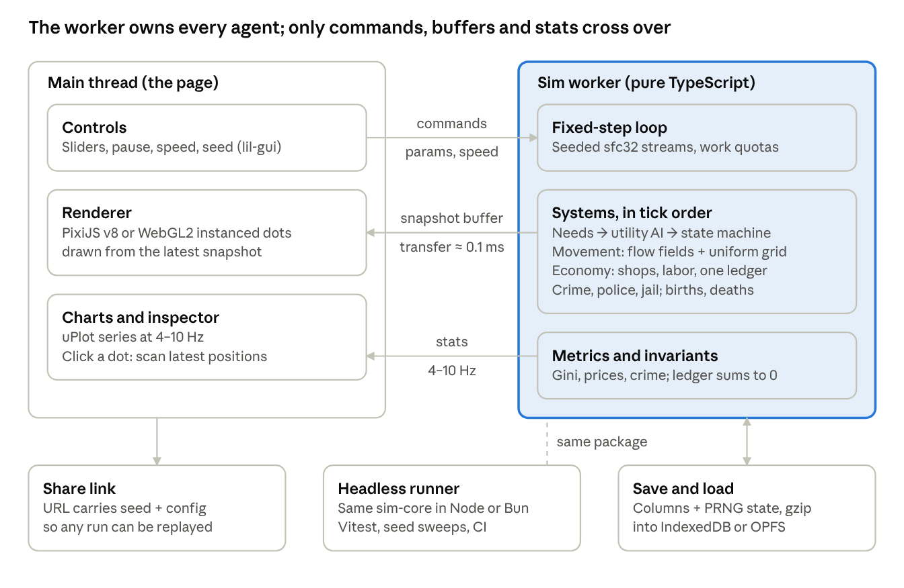
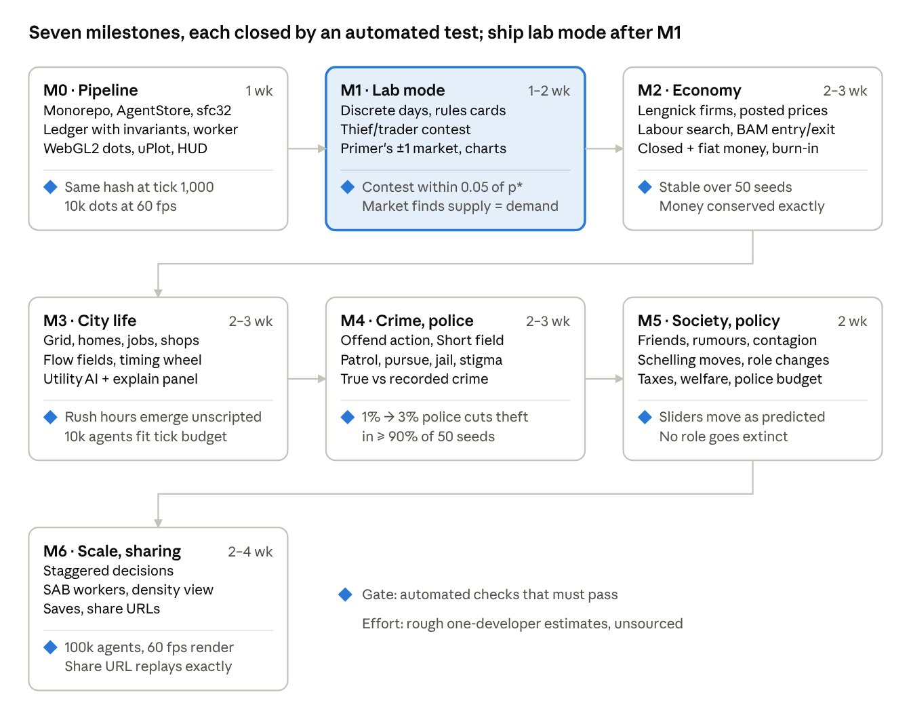

# Civilization Simulation — Research & Build Plan

Oct 4, 2026 · @Rd

## Bottom line

Nobody has published exactly this: a browser-only, rule-based society of dots with police, thieves, merchants and a market economy. Every ingredient exists somewhere, mostly in code we can read, so this is assembly more than invention.

- **Closest prior art:** [ndouglas/SugarScape](https://github.com/ndouglas/SugarScape) (Rust→WASM core, TypeScript UI, Web Worker, deterministic, MIT) already has Epstein's citizens-vs-cops model, firms and theft extensions. [Common Ground](https://fraferra.github.io/agents-world/) runs 120 trading agents in vanilla JS + Canvas, with no crime.
- **Recommended build:** a TypeScript sim core on struct-of-arrays typed arrays inside a Web Worker, drawn with PixiJS v8 on WebGL. Utility-AI decisions, posted-price shops, one money ledger, and Becker/Epstein crime with hot-spot policing.
- **Scale:** target about 10k dots first. JS and WASM reach similar peak speed, so WASM or WebGPU only earns its cost past about 100k.
- **Primer's lesson:** few rules, one trait per visual channel, and a live population chart beside the animation.

**What will set it apart:** a deterministic browser society with trade is now a few days' work with an AI assistant; Common Ground's 15 commits span three days. The differentiators are the police–thief–merchant loops nobody has closed, a view that separates true from recorded crime, and Primer-style legibility.

Evidence: the network proxy blocked many academic and vendor sites, so some figures rest on search summaries rather than the primary page. The Sources tab marks how each source was checked.

## Prior art

Seven projects come closest, and each misses at least one of: live dots, police and crime, a market economy, or running without a server.

| Project | What it has | What it lacks | Stack · license | Status |
| --- | --- | --- | --- | --- |
| [ndouglas/SugarScape](https://github.com/ndouglas/SugarScape) | Sugarscape, Epstein civil violence (cops), Schelling, firms, zero-intelligence traders, theft and watching extensions; seeded runs, share links, sweeps across workers | Not a city of roles; single-author project that needs vetting | Rust→WASM core, TS UI, Web Worker · MIT | Last commit 2026-10-03 |
| [Common Ground](https://fraferra.github.io/agents-world/) ([repo](https://github.com/fraferra/agents-world)) | 120 agents trade, barter and work for companies that entrepreneurs start; deterministic | No crime or police; anthropological timescales | Vanilla JS + Canvas 2D in a Worker | Built 24–26 Sep 2026; 0 stars |
| [Songs of Syx](https://www.songsofsyx.com/wiki/index.php/Law) | Unhappiness spawns criminals; guards patrol and pursue; courts set punishments | Closed source, desktop only | Java, commercial, pre-1.0 | 10k–40k+ citizens reported (sources conflict) |
| [Brunnfeld](https://github.com/marcopatzelt/brunnfeld-agentic-world) | About 19 roles, order-book market, debt, tax, a steal action, a council that votes to banish agents to prison | Every agent calls an LLM each tick: needs a server, $0.03–0.23 and 8–30 s per tick; no police role | TypeScript · MIT | 136 stars |
| [Civitas](https://github.com/NehvX/simulated-society) | Police, prisoners, Becker-style crime, labor market, taxes; 600–900 citizens | Batch model with HTML dashboards, not a live sim | Python | 1 star |
| [BazaarBot](https://github.com/larsiusprime/bazaarBot) + [Economia.js](https://github.com/Jimimimi/economia) | Market core: farmer, woodcutter, miner, refiner and blacksmith trade on per-agent price beliefs; bankrupt agents switch to the most profitable role | No space or crime; asks ignore cost, so prices drift to pennies ([issue #17](https://github.com/larsiusprime/bazaarBot/issues/17)) | Haxe (393 stars); JS port (19 stars) with a demo | Dormant since July 2017 |
| [AI Town](https://github.com/a16z-infra/ai-town) | LLM-driven town residents | Needs a backend (Convex) and LLM calls | TS + Convex + PixiJS · MIT | 10.6k stars; last commit 2026-08-26 |

**Explorables to learn legibility from.** [Parable of the Polygons](http://ncase.me/polygons) and [The Evolution of Trust](https://github.com/ncase/trust) are public domain (CC0). The Washington Post's [corona simulator](https://www.washingtonpost.com/graphics/2020/world/corona-simulator/) was 200 bouncing dots and became the site's most-read story ([Poynter](https://www.poynter.org/reporting-editing/2020/how-a-blockbuster-washington-post-story-made-social-distancing-easy-to-understand/)). The shared patterns: small N, one colour per state, a chart synced to the animation, one rule introduced at a time, and a way to follow one agent.

**Lessons from shipped games:**

- Dwarf Fortress disabled its economy in version 0.31; coins had to be hauled, and dwarves stopped working ([DF Wiki](https://dwarffortresswiki.org/index.php/DF2014:Dwarven_economy)).
- Ultima Online's ecology collapsed when players hoarded a closed resource loop ([GameTyrant](https://gametyrant.com/news/ultima-online-spent-3-years-developing-systems-that-were-destroyed-by-players)).
- Oblivion's Radiant AI was toned down after NPCs killed a skooma dealer, and quest-givers, for items ([The Escapist](https://www.escapistmagazine.com/oblivion-npcs-brought-their-world-to-life-then-they-nearly-killed-it/)). Cap simultaneous criminals and protect key roles.
- SimCity 2013's GlassBox sent workers to the nearest job and home, with no persistent ones, and players noticed ([PC Gamer](https://www.pcgamer.com/simcity-inside-the-glassbox-engine/)). Give every dot a fixed home and workplace.
- Cities: Skylines I hard-capped 65,536 citizens and 16,384 vehicles ([Steam guide](https://steamcommunity.com/sharedfiles/filedetails/?id=2712549268)). Skylines II needed a 2024 "Economy 2.0" rebuild ([Paradox](https://www.paradoxinteractive.com/games/cities-skylines-ii/news/dev-diary-economy-part-one)).
- Victoria 3 simulates aggregated pops, not individuals ([Dev Diary #1](https://forum.paradoxplaza.com/forum/developer-diary/victoria-3-dev-diary-1-pops.1476573/)).
- EVE Online publishes a monthly report of money entering and leaving its economy ([April 2026](https://www.eveonline.com/news/view/monthly-economic-report-april-2026)).

**LLM-driven agents are a different product.** Stanford's Smallville cost "thousands of dollars" for 25 agents over two game days ([paper](https://dl.acm.org/doi/fullHtml/10.1145/3586183.3606763)). Per-agent, per-tick LLM calls are not viable in a browser. What is viable: opt-in narration or "interview a dot" through WebLLM, which decodes an 8B model at about 41 tok/s on an M3 Max ([paper](https://arxiv.org/html/2412.15803v2)) after a download of 0.7 GB or more.

**Toolkits fit worse than their models.** NetLogo Web and AgentScript are GPL, Mesa reaches the browser only through Pyodide ([its demo rendered blank in 2026](https://github.com/mesa/mesa/issues/3778)), and krABMaga's WASM view is still a release candidate. Use NetLogo Web as a throwaway sandbox and port rules into your own TypeScript core.

**What you may copy** (not legal advice):

| Source | License | Practical rule |
| --- | --- | --- |
| [Primer's repos](https://github.com/Primer-Learning/PrimerTools) | None | Study, then reimplement the rules; the blob models are private |
| [MinuteLabs Evolution Simulator](https://github.com/minutelabsio/evolution-simulator) | GPL-3.0 | Study only, unless the app can be GPL |
| [NetLogo library models](https://github.com/NetLogo/models/blob/main/Sample%20Models/Social%20Science/Rebellion.nlogox) | CC BY-NC-SA 3.0 | Reimplement from the published rules |
| [NetLogo Web](https://github.com/NetLogo/Tortoise), [AgentScript](https://github.com/backspaces/agentscript) | GPL | Use as a sandbox only |
| [Mesa examples](https://github.com/mesa/mesa/blob/main/LICENSE) | Apache-2.0 | Port with attribution |
| [ndouglas/SugarScape](https://github.com/ndouglas/SugarScape/blob/main/LICENSE), Brunnfeld, [Lengnick replication](https://github.com/avakeeling199/Lengnick-replication) | MIT | Port with attribution |
| [Parable of the Polygons](https://github.com/ncase/polygons/blob/gh-pages/README.md), Evolution of Trust | CC0 | Reuse freely |
| Common Ground, older JS Sugarscapes | None visible | Study only |

## Primer's blob simulations

Primer's restraint is the thing to copy: one mechanic per video, fixed inherited strategies, small hand-checkable payoffs, and a chart beside every animation. The rules below were read from his own source code; no Primer video covers crime, police or money, so the dot-society mapping is our extrapolation.

| Video | Date | Verified rules |
| --- | --- | --- |
| [Simulating Natural Selection](https://www.youtube.com/watch?v=0ZGbIKd0XrM) | 2018-11-14 | Energy per step = size³·speed² + sense, 800 energy per day; eat blobs at least 1.2× smaller; 0 food = die, 1 = survive, 2 = reproduce; each trait has a 5% chance per child of mutating by ±0.1 ([natural\_sim.py](https://github.com/Helpsypoo/primer/blob/master/blender_scripts/tools/natural_sim.py)) |
| [Simulating Supply and Demand](https://www.youtube.com/watch?v=PNtKXWNKGN8) | 2019-04-27 | Private price limits drawn from 0–50, shared starting expectation 30; trade when the ask is at or below the buyer's limit; after a trade the seller's ask rises 1 and the buyer's bid falls 1; failures move 1 toward the limit ([market\_sim.py](https://github.com/Helpsypoo/primer/blob/master/blender_scripts/tools/market_sim.py)) |
| [Simulating the Evolution of Aggression](https://www.youtube.com/watch?v=YNMkADpvO4w) | About Jul–Aug 2019 | 61 food sites worth 2; dove–dove 1 each; hawk–dove 1.5 / 0.5; hawk–hawk 0 each; survive if score > random, reproduce if score > 1 + random; settles at 50/50 ([hawk\_dove.py](https://github.com/Helpsypoo/primer/blob/master/blender_scripts/tools/hawk_dove.py)) |
| [Green Beard Altruism](https://www.youtube.com/watch?v=goePYJ74Ydg), [Sacrificing for Family](https://www.youtube.com/watch?v=iLX_r_WPrIw) | Unconfirmed | A fed blob gives one food to a hungry one; green-beards help only badge carriers, kin help relatives up to 3 generations away; splitting "has badge" from "helps" lets cheaters appear |
| [Evolution of Rock, Paper, Scissors](https://www.youtube.com/watch?v=tCoEYFbDVoI) | 2024-07-13 | Trees as food, blobs pair up and play; offspring = floor(reward) plus one more with probability of the remainder; parents replaced daily; a tie cost of 0.5 stabilises 800 blobs on 400 trees ([EvoGameTheorySim.cs](https://github.com/Primer-Learning/RockPaperScissors/blob/main/EvoGameTheorySim.cs)) |
| [Evolution of Aging](https://www.youtube.com/watch?v=1_JbJTeLZJs) | Unconfirmed (code about Feb 2025) | Energy = 0.1 + 0.2·((speed/5)² + awareness/5) per second; diploid genetics; death genes with activation ages; a pleiotropy gene doubles speed but adds 3%/s death risk after maturity ([PrimerTools](https://github.com/Primer-Learning/PrimerTools/tree/main/Simulation)) |

**Presentation patterns, from his code:**

- One trait per visual channel: size → body scale, sense → eye size, speed → colour gradient, aggression → blue-to-red blend, a beard for the green-beard gene.
- Day phases of 0.5 / 0.25 / 4 / 0.25 / 0.5 seconds, then fast-forward through later days.
- A library of blob expressions (angry eyes, cheer, wince) so state reads without labels.
- Graphs that update in step with the blobs, 3-D trait scatters, and ternary plots for three-way mixes.
- Simulate first, save, render after, with a seeded RNG; 40–150 blobs on screen, 800–11,000 for statistics without animation.

**Mapping onto the dot society:**

| Primer mechanic | Dot-society version |
| --- | --- |
| Food 0 / 1 / 2 → die / survive / reproduce | Daily income vs cost of living; below upkeep → hardship; surplus → take an apprentice, open a shop or hire |
| Traits with an energy cost | Inherited dispositions (diligence, greed, honesty, boldness, perception) with a mild daily upkeep so none becomes a dump stat |
| 5% chance of ±0.1 mutation | Children copy a parent's dispositions with small drift, clamped to \[0, 1\] |
| Hawk–dove payoffs | A thief / merchant / police encounter table; compute the equilibrium crime rate by hand first, then check the sim converges there |
| Rock, paper, scissors | Police beat thieves, thieves beat merchants, merchant taxes fund police; plot role shares on a ternary chart |
| Green beard and kin | Guilds or families with badges help members; expect badge-wearing free-riders unless badges cost something |
| ±1 price rule | Merchant asks and customer bids step after each success or failure |
| Day phases | Morning stock and jobs, daytime work and shopping, evening home, night settlement of books, births, deaths and charts |

Primer leaves out money as a stock, neighbourhoods, learning within a lifetime, inventories, and institutions such as taxes. Add each only after the core loop works, because each breaks the hand-computable equilibria.

**Code and licenses.** His repos ([Helpsypoo/primer](https://github.com/Helpsypoo/primer), archived; [PrimerTools](https://github.com/Primer-Learning/PrimerTools), Godot 4 + C#) are public but carry no license, so re-implement the rules rather than copy code or blob art. The official browser version, [MinuteLabs Evolution Simulator](https://labs.minutelabs.io/evolution-simulator/), runs Rust→WASM in a worker with Vue 2, Three.js and Chart.js under GPL-3.0. [Maaack/Supply-and-Demand-Simulator](https://github.com/Maaack/Supply-and-Demand-Simulator) is an MIT Godot remake of the market video. Several community remakes get the hawk–dove payoffs wrong, so treat Primer's code as the reference.

Two corrections: "Simulating an Epidemic" is 3Blue1Brown's video, and "Simulating Lifespan" is MinuteLabs', not Primer's.

## Agents and roles

Use a three-layer hybrid: a utility selector picks the next activity, places advertise what they offer, and a tiny per-dot state machine carries it out. Crime is an action any dot can choose, not a fixed role, so poverty and policing change who offends.

**Decision architecture**

- **Selector:** utility AI in the style of Dave Mark's Infinite Axis Utility System. Each action's inputs pass through response curves and are multiplied; the last chosen behavior gets a 25% bonus to stop flip-flopping ([Curvature wiki](https://github.com/apoch/curvature/wiki/Utility-Theory-Crash-Course)).
- **Options:** shops, homes and workplaces publish Sims-style "advertisements" of the needs they satisfy ([Motive.c](https://codepen.io/blixt/pen/ayyjpZ)); pick at random among the top few scores.
- **Execution:** a small state machine per dot — travelling, working, shopping, sleeping, pursuing, jailed.
- **Scheduling:** decide only when an activity ends or an interrupt fires, spread across tick buckets with jitter; off-screen dots skip steering.
- **Rejected:** GOAP and HTN planners cost more and build multi-step plans dots rarely need; behavior trees work but are static.

**Role rules**

| Role | Core rule | Starting values and evidence |
| --- | --- | --- |
| Citizen | 4–6 decaying needs (hunger, fatigue, social, fear, financial stress) scored against loose time-of-day windows | About 9 h sleep and 8.1 h work on workdays ([BLS ATUS 2024](https://www.bls.gov/news.release/archives/atus_06262025.htm)); more time away from home raised street robbery in Groff's model ([NIJ](https://nij.ojp.gov/library/publications/simulation-theory-testing-and-experimentation-example-using-routine-activity)) |
| Offender (any dot) | Offend when desperation × suitable target × no guardian × (1 − perceived arrest risk) clears a threshold | Perceived risk = 1 − exp(−2.3 × cops ÷ (1 + active offenders)) within vision; NetLogo defaults: threshold 0.1, vision 7, cops 4%, max jail 30 ([Rebellion source](https://github.com/NetLogo/models/blob/master/Sample%20Models/Social%20Science/Rebellion.nlogox)) |
| Police | Short repeated stops at hot spots (about 10–15 minutes, the Koper curve) plus dispatch to reported crimes; arrest on contact | Random patrol had no effect in Kansas City ([report](https://www.policinginstitute.org/wp-content/uploads/2015/07/Kelling-et-al.-1974-THE-KANSAS-CITY-PREVENTIVE-PATROL-EXPERIMENT.pdf)); 62 of 78 hot-spot tests cut crime ([Campbell review](https://onlinelibrary.wiley.com/doi/full/10.1002/cl2.1046)) |
| Merchant | Customers pick shops by a gravity rule, P ∝ attractiveness ÷ distance^β; shops restock and are theft targets | β ≈ 1.5–2; competing shops cluster ([Hotelling](https://en.wikipedia.org/wiki/Hotelling's_law)); concealable, valuable "CRAVED" goods are stolen most ([Clarke 1999](https://www.ojp.gov/ncjrs/virtual-library/abstracts/hot-products-understanding-anticipating-and-reducing-demand-stolen)) |
| Everyone | Die, get replaced and pass on wealth Sugarscape-style; bankrupt producers switch to the most profitable role | Wealth stays highly skewed even when replacements start with random endowments |

**Targets to validate against, not hard-code:**

- Unemployment +1 percentage point → property crime +2.8–5% ([Raphael & Winter-Ebmer](https://escholarship.org/uc/item/5hb4h56g)).
- 82% of released prisoners rearrested within 10 years; the yearly rate falls from 43% in year 1 to 22% in year 10 ([BJS](https://bjs.ojp.gov/library/publications/recidivism-prisoners-released-24-states-2008-10-year-follow-period-2008-2018)).
- Certainty of capture deters far more than sentence length ([NIJ](https://nij.ojp.gov/topics/articles/five-things-about-deterrence)).
- Burglary risk stays raised for nearby homes, typically within 200–400 m, for weeks afterwards ([National Policing Institute](https://www.policinginstitute.org/wp-content/uploads/2018/09/Burglary_9.12.18.pdf)); Short et al.'s attractiveness field reproduces this ([paper](https://www.math.ucla.edu/~bertozzi/papers/M3AS-final.pdf)).
- Allocating patrols by detected crime can run away into over-policing one area ([Ensign et al.](https://proceedings.mlr.press/v81/ensign18a.html)).

**Movement.** Use a 128×128 to 256×256 grid; dots move continuously but navigate by shared flow fields ([Game AI Pro ch. 23](https://www.gameaipro.com/GameAIPro/GameAIPro_Chapter23_Crowd_Pathfinding_and_Steering_Using_Flow_Field_Tiles.pdf)), with light separation steering. A spatial hash took 10,000 seek-and-separate agents from 671 ms to 16.7 ms per frame in Unity ([frame-budget](https://github.com/jdseo921/frame-budget)).

**Social layer, later:** peer effects explain much of the variance in petty crime ([Glaeser et al.](https://papers.ssrn.com/sol3/papers.cfm?abstract_id=225805)); Granovetter thresholds drive cascades ([PDF](https://gwern.net/doc/sociology/1978-granovetter.pdf)); Nowak–Sigmund image scoring is a cheap reputation model.

## Economy

Run retail through posted-price shops whose prices react slowly to inventory, and route every coin through one ledger so money cannot appear or vanish by accident. BazaarBot's double auction is the famous alternative, but as written it is unstable.

**Why not BazaarBot as-is.** Its matching never checks bid ≥ ask, bids ignore the buyer's budget, and asks ignore production cost, so prices drift to pennies ([issue #17](https://github.com/larsiusprime/bazaarBot/issues/17)). Money leaks too: idle fines destroy $2 and each replacement agent creates $100 ([code](https://github.com/larsiusprime/bazaarBot)). Keep an auction only for wholesale trades between producers, with no selling below cost and no buying above value — the rule behind Gode & Sunder's efficient zero-intelligence traders ([abstract](https://ideas.repec.org/a/ucp/jpolec/v101y1993i1p119-37.html)).

**Base loop: Lengnick's 2013 baseline model** ([paper](https://ideas.repec.org/a/eee/jeborg/v86y2013icp102-120.html), [replication](https://github.com/avakeeling199/Lengnick-replication)). Households and firms only, a day tick and 21-day months; it produces business cycles, a Phillips curve and a Beveridge curve.

| Parameter | Value |
| --- | --- |
| Households / firms | 1,000 / 100 |
| Consumption exponent α | 0.9 |
| Supplier links per household | 7 |
| Labour productivity (goods per worker-day) | 3 |
| Liquidity buffer χ | 0.1 |
| Months fully staffed before a wage cut γ | 24 |
| Max monthly wage change δ | 1.9% |
| Inventory band (× last month's demand) | 0.25–1 |
| Price band (× marginal cost) | 1.025–1.15 |
| Max monthly price change | 2% |
| Probability a price change happens θ | 0.75 |
| Firms sampled by each unemployed worker β | 5 |
| On-the-job search probability | 0.1 |

Its known weakness is "zombie" firms that never hire again; BAM's rule fixes it by replacing each bankrupt firm with a new one at 50% of average size ([bam-engine](https://github.com/kganitis/bam-engine)).

**Money: one ledger.** Every transfer has a payer and a payee, in integer cents, and all creation or destruction goes through a single MINT account. The invariant is one line: all balances, MINT included, sum to zero.

- **Fixed supply:** the price level settles near money per household ÷ c\*^(1/α), where c\* is steady-state monthly consumption per household.
- **Government-issued money:** Godley & Lavoie's SIM model (α1 = 0.6, α2 = 0.4, θ = 0.2, G = 20) self-limits at output 100 and household money 80 ([SFC\_models](https://github.com/brianr747/SFC_models)).
- **Drains:** Ultima Online's closed loop failed through hoarding ([UO economics](https://dergigi.com/assets/files/UO-Economics.pdf)), so plan sinks such as taxes, upkeep and decay.

**Policy sliders and the response each should produce:**

| Slider | Default (range) | Expected response |
| --- | --- | --- |
| Income tax | 15% (0–50%) | Consumption falls a month later, then price cuts and layoffs; more money for police and welfare |
| Sales tax | 5% (0–25%) | Quantity bought falls; regressive, so Gini rises |
| Wealth tax | 0.25%/month (0–2%) | Velocity up, Gini down, less hoarding |
| Minimum wage | Off (0–150% of median) | Low wages and prices rise; too high and firms cannot price within band, so unemployment rises |
| Police headcount | 0–5% of population | Thefts fall with diminishing returns; taxes must rise |
| Welfare | 0–100% of subsistence | A consumption floor and less crime; at or above the wage, labour supply falls |
| Money regime | Fixed or fiat | Fixed: deflation as population grows; fiat: self-limiting deficits, mild inflation |

For the police link, Chalfin & McCrary estimate a murder elasticity of −0.67 ± 0.48 to police numbers ([paper](https://eml.berkeley.edu/~jmccrary/chalfin_mccrary2018.pdf)); no source calibrates police against theft.

**Consumption and inequality.** Allocate budgets Stone–Geary style: subsistence first, then fixed shares ([overview](https://en.wikipedia.org/wiki/Stone%E2%80%93Geary_utility_function)). Inequality targets make good unit tests: random money exchange gives Gini 0.5, saving half each round gives about 0.27, and the Yard-Sale model with no redistribution goes to 1 ([review](https://arxiv.org/pdf/0709.1543), [Boghosian](https://www.siam.org/publications/siam-news/articles/the-mathematics-of-poverty-inequality-and-oligarchy)).

## Emergent dynamics

Interesting behavior comes from feedback loops that combine memory with local interaction; memoryless dice rolls and global knobs only add noise. Build these eight loops in on purpose.

| Loop | Chain | What you should see | Evidence |
| --- | --- | --- | --- |
| Hotspots (+) | Crime raises a place's attractiveness, which decays and spreads; offenders return | Clustered, drifting hotspots | [Short et al. 2008](https://www.math.ucla.edu/~bertozzi/papers/M3AS-final.pdf) |
| Guardianship (+) | Crime → fear → fewer people out → fewer guardians → more crime | No-go zones and evening dead zones | Routine activity theory; [Groff 2007](https://nij.ojp.gov/library/publications/simulation-theory-testing-and-experimentation-example-using-routine-activity) |
| Poverty trap (+) | Crime → shop revenue falls → bankruptcies → unemployment → desperation → crime | Local decline spirals and diverging neighbourhoods | Inference from the loops above |
| Jail stigma (+) | Arrest → job loss and stigma → low hiring → re-offending | A persistent core of chronic offenders | [BJS recidivism](https://bjs.ojp.gov/library/publications/recidivism-prisoners-released-24-states-2008-10-year-follow-period-2008-2018) |
| Police allocation (− and +) | Deterrence: presence cuts crime. Detection: presence finds more crime, attracting more patrols | Suppression, displacement or runaway over-policing; chart recorded vs true crime | [Ensign et al.](https://proceedings.mlr.press/v81/ensign18a.html); [Short et al. 2010](https://pdodds.w3.uvm.edu/files/papers/others/2010/short2010a.pdf) |
| Legitimacy | Unfair arrests or inequality → legitimacy falls → grievance rises | Bursts of disorder; a sudden shock explodes, gradual erosion does not | [Epstein 2002](https://www.pnas.org/doi/10.1073/pnas.092080199) |
| Sorting | Wealthy households leave high-fear areas → poverty concentrates → more flight | Segregation by wealth from a mild preference of about 30% | [Schelling's model](https://en.wikipedia.org/wiki/Schelling's_model_of_segregation) |
| Contagion | Offending friends raise propensity; varied thresholds let small changes tip clusters | Crime waves | [Glaeser et al.](https://papers.ssrn.com/sol3/papers.cfm?abstract_id=225805); [Granovetter](https://gwern.net/doc/sociology/1978-granovetter.pdf) |

**Noise generators to avoid:**

- Independent per-tick crime dice ("0.1% chance to steal") with no target, guardian or memory.
- Decisions re-rolled every tick; use momentum or cooldowns instead.
- More than about six needs, or many actions with near-equal scores.
- City-wide knobs with no local feedback, and police who "know" true crime locations.
- Identical agents; spread thresholds, risk aversion and propensity instead.

**Two replication warnings.** Epstein's formula only produces punctuated outbursts when cops ÷ actives is floored or rounded, as [NetLogo](https://github.com/NetLogo/models/blob/main/Sample%20Models/Social%20Science/Rebellion.nlogox) and [Mesa](https://github.com/mesa/mesa/blob/main/mesa/examples/advanced/epstein_civil_violence/agents.py) both do. In a 2026 Sugarscape replication, trade raised the Gini (0.365 vs 0.320, in 20 of 20 seeds) because near-starving agents accepted bad prices ([study](https://github.com/ndouglas/SugarScape/blob/main/docs/studies/2026-09-27-trade-and-inequality.md)).

## Architecture



Commands go in; a transferable snapshot buffer and stats at 4–10 Hz come out. Nothing else crosses the thread boundary, which keeps the UI responsive at any tick rate.

Suggested monorepo layout:

- `packages/sim-core` — pure TypeScript: state columns, systems, PRNG streams, ledger, invariants; no DOM.
- `packages/sim-worker` — worker entry: fixed-step loop, command queue, snapshot ping-pong.
- `apps/web` — renderer, controls, charts, inspector.
- `tools/headless` — Node or Bun runner for Vitest, sweeps and CI.

## Tech stack

Write the sim core once in TypeScript on struct-of-arrays typed arrays, run it in a Web Worker, and hand frames to the renderer as transferable buffers. The same DOM-free core then runs in Node or Bun for tests and parameter sweeps.

| Concern | \~1k dots | \~10k dots | \~100k+ dots |
| --- | --- | --- | --- |
| Sim core | SoA typed arrays or [bitECS 0.4](https://github.com/NateTheGreatt/bitECS); plain objects acceptable | Same core, per-role index lists | Same core, cell-ordered and double-buffered columns |
| Threading | One worker (or the main thread) | One sim worker; transferable snapshot ping-pong | SharedArrayBuffer + 2–8 workers (needs COOP/COEP); fall back to one worker |
| Tick rate | 30–60/s, everything every tick | 20–30/s; decisions staggered over 2–4 ticks | 10–20/s movement; decisions staggered over 5–20 ticks; economy clears hourly |
| Spatial | Uniform grid | Uniform grid rebuilt by counting sort | Grid + per-cell aggregates; [kdbush](https://github.com/mourner/kdbush) for static places |
| Pathfinding | A\* per agent | Flow fields per destination type + cached A\* | Flow fields + hierarchical A\* with a per-tick request quota |
| Rendering | Canvas2D batched by colour, or PixiJS | [PixiJS v8 ParticleContainer](https://pixijs.com/8.x/guides/components/scene-objects/particle-container) or WebGL2 instancing | Raw WebGL2 instanced quads from snapshot buffers; heatmap when zoomed out |
| GPU compute | No | No | Optional WebGPU movement with a CPU fallback |
| Save/load | JSON | Column dump + gzip → IndexedDB | Column dump → OPFS; snapshot every N ticks + input log |
| Hosting | Any static host | Any static host | Cloudflare Pages, Netlify or Vercel with headers; GitHub Pages only via [coi-serviceworker](https://github.com/gzuidhof/coi-serviceworker) |

**Measured CPU cost at 100k agents** (local benchmark: Node 22 and Bun 1.3 on a 4-vCPU Xeon, no browser or GPU):

| Workload | Cost per tick |
| --- | --- |
| Move every agent | 0.4–0.5 ms |
| Rebuild the uniform grid | 1–1.4 ms |
| Every agent queries its neighbours | 22–26 ms |
| Immutable map/spread update (V8) | 33 ms |
| Transfer a typed-array snapshot to/from a worker | about 0.1 ms |
| Structured-clone 100k objects to/from a worker | 261 ms |

So at 100k, neighbour sensing must be staggered, aggregated per cell or split across workers.

**Current state, October 2026:**

- bitECS 0.4.0 (Dec 2025) is a full TypeScript rewrite ([release notes](https://github.com/NateTheGreatt/bitECS/blob/main/docs/RELEASE_NOTES_0.4.0.md)); [koota](https://github.com/pmndrs/koota) is active and React-friendly; miniplex has been quiet since 2023.
- PixiJS ParticleContainer held 365k (WebGL) and 401k (WebGPU) moving sprites at 60 fps on a desktop GPU ([webgl-engine-bench](https://github.com/KilledByAPixel/webgl-engine-bench/blob/main/RESULTS.md)). PixiJS went back to WebGL as its default in [v8.1](https://github.com/pixijs/pixijs/releases/tag/v8.1.0).
- WebGPU ships in Chrome desktop, Safari 26 (including iOS) and Firefox on Windows (141+) and Apple-Silicon Macs (145+); Firefox on Linux and Android still lacks it, so keep WebGL2 ([status wiki](https://github.com/gpuweb/gpuweb/wiki/Implementation-Status)).
- JS and WASM reach similar peak speed; WASM buys predictable performance without warm-up, and WASM threads need nightly Rust plus the same headers.
- [uPlot](https://github.com/leeoniya/uPlot) streamed 3,600 points at 60 fps for 10% CPU, versus 40% for Chart.js and 70% for ECharts. Pair it with [lil-gui](https://github.com/georgealways/lil-gui) or Tweakpane, and post stats from the worker at 4–10 Hz.
- Tooling: [Vite 8](https://vite.dev/blog/announcing-vite8) (stable since 2026-03-12, Rolldown bundler) and [Vitest 5](https://vitest.dev/blog/vitest-5.html) (September 2026).

**Determinism.** Same-engine replays work with seeded [sfc32](https://github.com/bryc/code/blob/master/jshash/PRNGs.md) or [pure-rand](https://github.com/dubzzz/pure-rand) streams, integer-cent money and fixed per-tick work quotas. Cross-browser replays do not: V8 and JavaScriptCore disagreed bitwise on 3.4% of sin, 9.9% of exp, 9.7% of pow and 43% of hypot inputs. Keep trig out of sim logic or ship a small math module, and use a fixed timestep with render interpolation ([Fix Your Timestep!](https://gafferongames.com/post/fix_your_timestep/)).

SharedArrayBuffer needs cross-origin isolation; on Netlify or Cloudflare Pages, a `_headers` file does it:

```
/*
  Cross-Origin-Opener-Policy: same-origin
  Cross-Origin-Embedder-Policy: require-corp
```

## Build plan



Milestones and exit tests follow the full report. Effort is a rough one-developer estimate, 12–19 weeks in total, not a sourced figure. Read ndouglas/SugarScape's specs and test recipe before M0, but build fresh in TypeScript rather than forking its Rust core.

- **Two modes, one engine.** Lab mode runs Primer-style scenarios in discrete days, with small populations, rules cards and answers worked out on paper; it doubles as the test oracle. City mode runs the continuous economy, crime and policing.
- **Ship lab mode publicly once M1 passes.** Two capable browser projects in this space appeared in autumn 2026, so the window for a polished, trustworthy explorable is open but closing.
- **Crime is an action, not a role,** with caps and cooldowns so it cannot cascade.
- **Scale comes last:** add workers only when the in-app HUD shows the sim worker above about 60% of its tick budget.

**Risks and mitigations**

| Risk | Mitigation |
| --- | --- |
| The economy leaks money or spirals | Zero-sum ledger, Lengnick and BAM bounded rules, a burn-in, and an EVE-style monthly panel of money created and destroyed |
| Roles herd, or an empty role is never chosen again | Softmax role choice over moving-average profit, a bonus for under-supplied goods, at most about 0.5% of agents switching per tick |
| Crime cascades like Oblivion's Radiant AI | Offender caps, cooldowns, protected last merchants and officers, violent crime off by default |
| Dynamics too subtle to read | Lab mode, rules cards, a click-to-explain panel, follow-the-money tracing, one visual channel per state |
| Cross-browser replay drift | Precomputed lookup tables, and a documented "same engine" replay guarantee |
| Licensing | Reimplement from published rules; copy only MIT, Apache-2.0 or CC0 code |

## Validation

Treat the sim as a function of (config, seed): assert hard invariants every tick in dev, pin a golden fingerprint per scenario, and judge every behavioral claim across 20 seeds. The [ndouglas/SugarScape](https://github.com/ndouglas/SugarScape) project uses exactly this recipe and caught replication failures with it.

**Invariants, every tick in dev and every N ticks in production:**

```ts
function checkInvariants(s: State) {
  let sum = 0;
  for (let i = 0; i < s.ledger.bal.length; i++) {
    const b = s.ledger.bal[i];
    if (!Number.isSafeInteger(b)) throw err('non-integer balance', i);
    if (i >= FIRST_AGENT && b < 0) throw err('negative cash', i);
    sum += b;
  }
  if (sum !== 0) throw err('money not conserved', sum); // includes MINT
  for (const g of GOODS)
    if (s.stock(g) !== s.prevStock(g) + s.produced[g] - s.consumed[g] - s.spoiled[g])
      throw err('goods not conserved', g);
  for (const f of s.firms) for (const w of f.workers)
    if (s.employerOf[w] !== f.id) throw err('employment mismatch');
}
```

**Test layers:**

1. **Golden fingerprints:** hash the state after N ticks for each preset; a Vitest snapshot flags any behavior change, and updates are deliberate.
2. **Known-answer tests:** random money exchange → Gini 0.5; saving half each round → about 0.27; Yard-Sale without redistribution → Gini 1; Godley–Lavoie SIM → output 100; Schelling at a 30% preference → about 70% similar neighbours.
3. **Multi-seed claim tests:** each claim ("more police cuts theft", "trade raises Gini", the hawk–dove mix matches the analytic equilibrium) must hold in most of 20 seeds, reported as Holds or Fails.
4. **Slider sweeps:** run the DOM-free core headless in Node or Bun, or across Web Workers, over a parameter grid; check each slider moves its metric in the direction the Economy table predicts.

**Metrics to chart live:** population by role, Gini, price index, unemployment, money supply and velocity, output, recorded vs true crime, arrests and jail population, police per capita.

Document the model with the ODD protocol (Overview, Design concepts, Details; Grimm et al. 2020) so others can reproduce it.

## Suggested skills

Two kinds: engineering skills to learn in build order, and Claude Code skills that turn this project's repetitive checks into one command.

**What to learn, in build order**

| Phase | Skill | Best starting point |
| --- | --- | --- |
| Core | Data-oriented TypeScript: struct-of-arrays typed arrays, no allocation in hot loops | [bitECS intro](https://github.com/NateTheGreatt/bitECS/blob/main/docs/Intro.md) |
| Core | Fixed-timestep loops and seeded RNG streams | [Fix Your Timestep!](https://gafferongames.com/post/fix_your_timestep/), [PRNG catalogue](https://github.com/bryc/code/blob/master/jshash/PRNGs.md) |
| Core | Web Workers and transferables; COOP/COEP when SharedArrayBuffer is needed | [Comlink](https://github.com/GoogleChromeLabs/comlink), [coi-serviceworker](https://github.com/gzuidhof/coi-serviceworker) |
| Rendering | PixiJS v8 particles or WebGL2 instancing; camera pan and zoom | [ParticleContainer guide](https://pixijs.com/8.x/guides/components/scene-objects/particle-container) |
| World | Uniform-grid spatial hashing, flow fields, A\* | [Game AI Pro ch. 23](https://www.gameaipro.com/GameAIPro/GameAIPro_Chapter23_Crowd_Pathfinding_and_Steering_Using_Flow_Field_Tiles.pdf), [basic flow fields](https://howtorts.github.io/2014/01/04/basic-flow-fields.html) |
| Agents | Utility AI with response curves and momentum | [Utility theory crash course](https://github.com/apoch/curvature/wiki/Utility-Theory-Crash-Course) |
| Economy | Agent-based macro loops and ledger (stock-flow) accounting | [Lengnick replication](https://github.com/avakeeling199/Lengnick-replication), [SFC\_models](https://github.com/brianr747/SFC_models) |
| Crime | Epstein civil violence, routine activity, hot-spot policing | [NetLogo Rebellion](https://github.com/NetLogo/models/blob/main/Sample%20Models/Social%20Science/Rebellion.nlogox), [Mesa version](https://github.com/mesa/mesa/blob/main/mesa/examples/advanced/epstein_civil_violence/agents.py) |
| Validation | Invariants, multi-seed claim tests, ODD documentation | [ndouglas/SugarScape](https://github.com/ndouglas/SugarScape) as a worked example |
| Presentation | Live charts and explorable-style design | [uPlot](https://github.com/leeoniya/uPlot), [Parable of the Polygons source](https://github.com/ncase/polygons), [Primer's sim code](https://github.com/Helpsypoo/primer) |
| Optional | Rust→WASM, WebGPU compute, in-browser LLM narration | [MinuteLabs simulator source](https://github.com/minutelabsio/evolution-simulator), [WebLLM paper](https://arxiv.org/html/2412.15803v2) |

**Claude Code skills already available here**

- `run` — launches the app and drives it to confirm a change works, with screenshots.
- `dataviz` — consistent, accessible charts for the live dashboard.
- `code-review` and `simplify` — review sim-core diffs for bugs and hot-loop allocations.
- `session-start-hook` — makes cloud sessions install dependencies and run tests automatically.
- `skill-creator` — builds the project skills below.

**Project skills worth creating** (in `.claude/skills/`)

- `sim-check` — run every preset headless across 20 seeds, assert invariants, compare golden fingerprints, and print Holds or Fails per claim.
- `param-sweep` — sweep one or two sliders over a grid in Node or Bun and chart each response.
- `balance-review` — check a new mechanic against the feedback-loop table and the noise-generator list before it merges.
- `odd-sync` — keep the ODD model description in step with the code.

The skills catalog had no further matches for this project.

## Sources

Every source cited across the six research tracks is listed in the Sources tab, grouped by track, with how each one was checked.

The complete written report, with code and configs, is in the Full report tab.

Follow-up research on what this plan leaves open is in the Follow-up research tab.

Art direction and assets for a Pokémon-style 2D look are in the 2D game look & assets tab.

The milestone-by-milestone checklist that merges all three rounds is in the Implementation plan tab.
