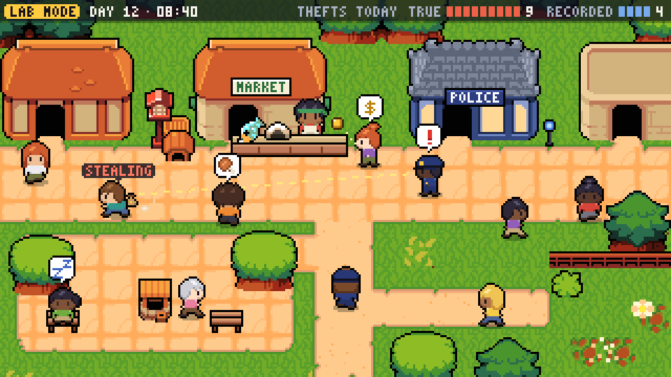
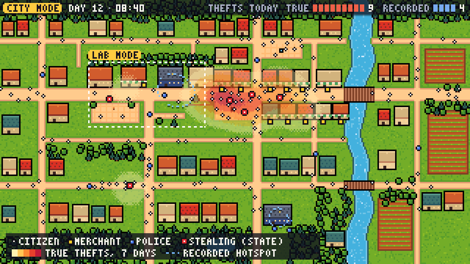
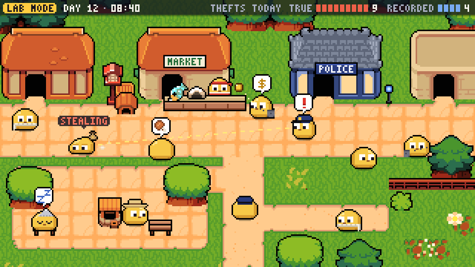
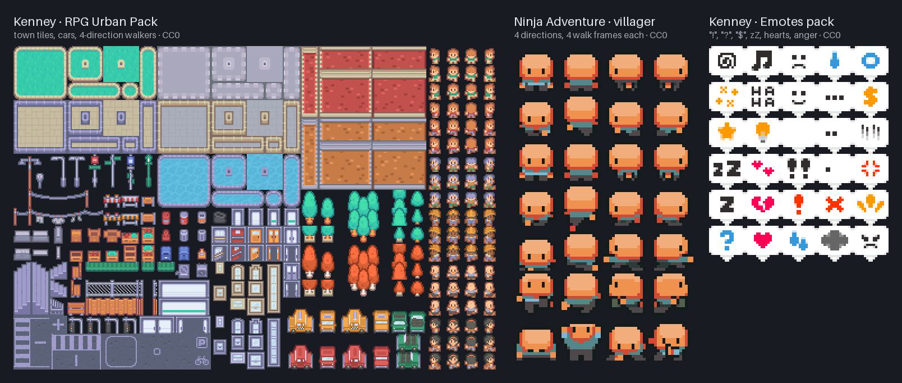

# Borrow Pokémon's grammar, never its pixels

The Dot Society can take on the look of Pokémon's Game Boy Advance and DS overworld by borrowing its grammar rather than its art: 16-pixel tiles, walking sprites with three drawn directions and a mirrored fourth, roof-and-sign buildings, a "!" that hops over whoever notices something, and a clock of discrete light periods, most of them documented to the frame in the community decompilations. The cleanest way to build it is as **three switchable skins over one renderer and one 12-byte-per-agent snapshot**: coloured dots for city mode and debugging from M0, Primer-style blobs for the lab cards from M1, and a pixel-art town drawn from an LDtk map and CC0 tiles from M3, with semantic zoom choosing among them and a toggle letting viewers override it. Every character skin should default to **one non-realistic blob body**, with jobs worn as removable caps and aprons and crime visible only as an act, because Pokémon itself codes criminals by costume and the research on shooter bias and suspect morphing, seen only through search summaries, shows how pairing an appearance with crime shifts judgments; the blob mockup made this round gets the body right but should swap its red merchant apron for teal and its thief's swag bag for the stolen item. Sprites do not reopen the engine question: a **3.6 KB custom WebGL2 renderer** prototyped for this research drew 10,000 animated, depth-sorted agents in **0.3 ms** of main-thread time per frame, against 17–19 ms for sorted PixiJS or Phaser 4 sprites. The town can come almost entirely from CC0 art that may be committed to the MIT repository, chiefly the Ninja Adventure tileset the mockups use, but no CC0 pack found has a police station, jail, officer or handcuffs, paid packs such as LimeZu's must stay out of the public repository, and Mana Seed is excluded. The look is also the lowest-risk part legally, though this report is not legal advice: apart from a patent suit over Palworld's mechanics, every Nintendo action found from 2016 to 2026 involved Pokémon names or marks, copied assets or a mimicked logo, while openly Pokémon-inspired games sell on Nintendo's own eShop. By a rough, unsourced estimate, the visual layer adds **six to nine developer-weeks** across the seven milestones. Most paid-pack licence wording, several statistics and much of the legal history come from search summaries, and the free packs' licence files from third-party GitHub copies, because the network proxy blocked itch.io, kenney.nl and most publishers; every renderer timing was taken under software rendering, so all of these need checking before launch.

## Sixteen-pixel rules make the look, and five of them must bend

### The decompilations document the grammar to the frame

The overworld that people remember from Ruby, Sapphire, Emerald, FireRed and LeafGreen rests on a handful of numbers that the pret decompilation projects expose in code and map data. The GBA screen is **240×160 pixels** built from 8×8 hardware tiles, and maps are laid out in 16×16 metatiles ([pokeemerald defines.h](https://github.com/pret/pokeemerald/blob/master/include/gba/defines.h); [fieldmap.h](https://github.com/pret/pokeemerald/blob/master/include/fieldmap.h)). Of Emerald's 245 overworld graphics, **119 are 16×32 frames** (own count), the size of the player and most townspeople ([object_event_graphics_info.h](https://github.com/pret/pokeemerald/blob/master/src/data/object_events/object_event_graphics_info.h)). A walker has nine frames, a standing pose and two steps each for south, north and west, with **east drawn as mirrored west**, and the walk plays step, stand, other step, stand in 8-frame beats ([object_event_pic_tables.h](https://github.com/pret/pokeemerald/blob/master/src/data/object_events/object_event_pic_tables.h); [object_event_anims.h](https://github.com/pret/pokeemerald/blob/master/src/data/object_events/object_event_anims.h)). Movement is tile-locked at a pixel per frame, so a tile takes 16 frames, about **268 ms, or 3.7 tiles a second** ([event_object_movement.c](https://github.com/pret/pokeemerald/blob/master/src/event_object_movement.c)). HeartGold and SoulSilver switch to 32×32, 16-colour billboard textures with 16 frames per townsperson ([pokeheartgold mmodel](https://github.com/pret/pokeheartgold/tree/master/files/data/mmodel/mmodel)), and the GBA sprites are frugal: the FireRed policeman sheet uses 12 indexed colours and the Rocket grunt 14, by the research team's count ([pokefirered people](https://github.com/pret/pokefirered/tree/master/graphics/object_events/pics/people)).

Two conventions carry most of the genre's sense of life. When a trainer spots the player, a **16×16 "!" hops about 15 pixels into place 16 pixels above its head and holds for 60 frames, roughly one second**, while the trainer turns, waits for the icon and walks over; "?" and heart icons use the same machinery ([trainer_see.c](https://github.com/pret/pokeemerald/blob/master/src/trainer_see.c); [field_effects.h](https://github.com/pret/pokeemerald/blob/master/include/constants/field_effects.h)). Sight runs in a straight line along the facing direction, and across 974 shipped trainers it reaches 1 to 7 tiles, with a **median of 2 tiles in FireRed and 3 in Emerald** (own count) ([pokefirered maps](https://github.com/pret/pokefirered/tree/master/data/maps); [pokeemerald maps](https://github.com/pret/pokeemerald/tree/master/data/maps)). HeartGold splits the day into five periods: late night 0–3, morning 4–9, day 10–16, evening 17–19 and night 20–23 ([gf_rtc.c](https://github.com/pret/pokeheartgold/blob/master/src/gf_rtc.c)). Buildings announce their function with roof colour plus an emblem, as with the red-roofed Pokémon Center and the blue-roofed Mart, although that convention was confirmed only through search summaries ([Pokémon Wiki](https://pokemon.fandom.com/wiki/Pok%C3%A9mon_Center)).

Most of this transfers directly: the 16-pixel tile, the three-direction sheet, the emote timing and anchor, short straight sight lines that viewers can learn, roof-plus-sign buildings and discrete light periods. Five conventions fight a society simulation and must bend. Tile-locked, one-agent-per-tile movement quantises time into 268 ms steps and jams crowds, so agents should path on the tile graph but render continuous, interpolated positions snapped to whole art pixels, which the plan's flow-field movement already allows. The player-centric camera gives way to free panning with an optional follow-cam on any agent. Pokémon freezes the world while a "!" plays and handles at most two approaching trainers at once ([trainer_see.h](https://github.com/pret/pokeemerald/blob/master/include/trainer_see.h)); a simulation's bubbles must never block and must be capped, with the overflow sent to a log. Police Officers battle only between 8 p.m. and 4 a.m. in Generations II and IV (search summary only; [Bulbapedia](https://bulbapedia.bulbagarden.net/wiki/Police_Officer_(Trainer_class))), a schedule-as-stereotype that patrol data, not art, should decide. And trainer classes make crime a costume, the subject of the section on bodies below.

The "!" maps one-to-one onto the simulation's pivotal moment: a witness or officer faces a theft, a bubble pops overhead for a second, and the witness reports or the officer approaches. Calibration changes who wears it. The United States has **2.3 sworn officers per 1,000 residents** ([FBI 2024](https://hrc-prod-requests.s3-us-west-2.amazonaws.com/assets/images/Reported-Crimes-in-the-Nation-Quick-Stats.pdf)), and at a calibrated city-mode police share of 0.25%, a 3× view holding about 70 agents at peak contains an officer only about one time in six (computed for this report). In calibrated city mode, most "!" bubbles therefore belong to bystanders, most recorded thefts begin as victim reports, and the clipboard travelling from a reporter to the records office becomes the main picture of recorded crime. Officer-dense scenes belong in lab cards that say they are exaggerated.

### Pokémon's feel likely survives only where 8–40 agents share a view

Pokémon's crowds are tiny. Emerald allows **16 live map objects** at once ([global.h](https://github.com/pret/pokeemerald/blob/master/include/constants/global.h)), and the outdoor towns of FireRed and Emerald hold a median of seven people, one per roughly 100 tiles in Emerald and 270 in FireRed, by the research team's count ([pokeemerald layouts](https://github.com/pret/pokeemerald/blob/master/data/layouts/layouts.json); [pokefirered layouts](https://github.com/pret/pokefirered/blob/master/data/layouts/layouts.json)). With 16-pixel tiles, a 1080p screen shows 2,025 tiles at 2×, 900 at 3× and 506 at 4×, so Pokémon density means two to twenty people on screen. Attention sets the useful ceiling. Observers track about four moving objects, up to eight if slow and one if fast ([Alvarez & Franconeri](https://dash.harvard.edu/server/api/core/bitstreams/03b15edf-7de4-449c-9d80-8c80c53ccc96/content)), and flankers closer than 0.4–0.5 times a target's eccentricity spoil identification ([Pelli & Tillman](https://www.cns.nyu.edu/~msl/courses/2223/Readings/Pelli-NatNeurosci2008.pdf)); both findings come from search summaries. At 3× on a 24-inch screen viewed from 60 cm, that means neighbours within about 1.6–2 tiles at 5° from the point of gaze (computed for this report). That supports the art research's proposed, untested caps: town and lab views of **8–40 agents, at most four "protagonists" with name tags and mini-charts, and four to six bubbles at once**, with a crowd-stack sprite and a "×N" badge wherever more than four agents share a tile. A 10,000-agent city can look like Pokémon only through a window. It needs semantic zoom, the idea from the Pad interface of drawing objects differently at different scales (search summary; [UMD HCIL](https://www.cs.umd.edu/hcil/trs/2006-09/2006-09.htm)), and districts of 100–200 agents that render as towns while the rest of the city runs unanimated.

The first town mockup made for this round shows the grammar at work ([SOURCES.md](../../mockups/SOURCES.md)). Drawn at a native 320×180 pixels, 20×11 tiles of the CC0 Ninja Adventure tileset (its 2019 Superpowers edition), and scaled 3× with nearest-neighbour sampling, it puts 12 agents and four bubbles on screen, inside the caps above. A merchant sells at a MARKET counter to a buyer with a "$" bubble and a coin in flight. A crouched citizen tagged STEALING sneaks away, and an officer outside the POLICE station has spotted them, shown by a "!" and a dotted sight line. One citizen dozes ("Zz"), another is hungry, and the HUD counts 9 true against 4 recorded thefts. The frame is exactly a 1080p screen divided by six, so on a desktop it corresponds to the closest, follow-cam zoom, and the default 3× town view would show four times the area. Its two officers among twelve people are about 70 times the calibrated police share, the kind of density a lab card must label. A second version of the same scene, with every agent redrawn as one shared blob, appears in the section on bodies below.

## Three skins share one renderer and one 12-byte snapshot

The simulation does not have to choose between coloured dots, blobs and a Pokémon-style town. All three can be skins: renderer settings that read the same snapshot and the same map, so switching between them needs neither a protocol change nor a second code path. By default, lab cards use Skin B, and city mode uses Skin A far out and Skin C close in; any viewer can override the choice.

| Skin | Ground | Agents | Events | Best for | Arrives |
|---|---|---|---|---|---|
| A: coloured dots | Per-tile average-colour minimap from the LDtk map (its zone colours until tile art arrives at M3), or a plain dark background; a density heatmap when zoomed far out | Role colour plus shape: circle citizen, square merchant, diamond police; a ring marks a theft in progress, in the true view only | Pins and pulses aggregated per district, at most three a second | City mode at 10k–100k agents, debugging, the Canvas2D fallback | M0 (heatmap M6) |
| B: Primer-style blobs | Flat zone colours from the same LDtk map | One shared blob body; jobs as accessories; Primer faces and blinks | 16×16 bubbles, capped, mirrored in the log and charts | Lab cards, teaching, share clips | M1 |
| C: pixel-art town | LDtk tilemap of CC0 tiles with a roof layer, signs and light periods | Skin B's blobs by default; a human set only as an opt-in variant | Bubbles, signs, lit windows | The GBA look at street and follow-cam zoom | M3 (justice buildings M4, procedural cities M6) |

Each agent sends two 32-bit floats for position and one **32-bit "visual word"**: **12 bytes, or 120 KB per tick at 10,000 agents (3.6 MB a second at 30 Hz) and 1.2 MB at 100,000**, replacing the per-dot colour the plan sends now; 16-bit positions would cut it to 8 bytes. The word proposed by the rendering research holds an 8-bit outfit (role and variant), a 2-bit facing hint for idle agents, a 3-bit action state (its eight are idle, walk, run, work or sit, sleep, fight, arrested and down, so the art bible's sneak and carry poses would have to replace two of them), a 5-bit emote, indoor and teleport flags, four status flags and eight bits for a palette variant or spare. Each skin reads what it needs: Skin A turns the outfit into a shape and a palette colour, while Skins B and C turn outfit, action and emote into sprite frames and bubbles. The renderer derives facing and walk frame from interpolated velocity, so nothing it computes feeds back into the deterministic simulation. One proposed status flag should go. "Wanted" is a record, and records belong to institutions, so it lives in the records layer and the inspector rather than in a bit that could draw a mark over a head. The "carrying goods" flag stays, drawn for stolen goods in the true view only.

Skins are nearly free because, in a custom renderer, dots and sprites are the same instanced draw with different fragment shaders. The research team wrote a 178-line WebGL2 prototype with four passes: a tile-index tilemap, instanced characters, a roof-and-treetop layer drawn over people, and bubbles. It also has a dot level of detail, day-night tinting and recovery from a lost graphics context, and it weighs **3.6 KB after gzip**. (The prototype, `townRenderer.js`, and the benchmark scripts sit in this research session's scratchpad, `prototypes/renderer`.) The team benchmarked it against PixiJS 8.22 and Phaser 4.2.1 doing identical work on a 256×256-tile map at 3× zoom, with 30 Hz ticks interpolated to 60 Hz, 96 animation frames and bubbles on 5% of agents ([PixiJS](https://github.com/pixijs/pixijs); [Phaser](https://github.com/phaserjs/phaser)).

| Renderer | 10k agents | 25k | 100k | Code (gzip) |
|---|---|---|---|---|
| Custom WebGL2: instanced, GPU interpolation, depth-test y-sort | **0.3 ms** | 0.6 ms | 2.3 ms | **3.6 KB** |
| PixiJS sprites, y-sorted | 18.8 ms | 45.9 ms | 298 ms | 107–215 KB |
| PixiJS ParticleContainer, unsorted | 2.9 ms | 4.9 ms | 143 ms | within PixiJS |
| Phaser 4 sprites, depth-sorted, GPU tilemap | 17.2 ms | 42.2 ms | 231 ms | 273–371 KB |
| Canvas2D, culled to the viewport | 0.4 ms | 0.9 ms | 3.8 ms | — |

*Own measurements: median main-thread time per frame, measured in headless Chromium with software WebGL (SwiftShader) on a 4-vCPU Xeon. The figures compare renderers with one another; they are not real-GPU frame rates.*

Scene-graph sprites cost CPU time per object, not per visible object. With only about 60 agents on screen, sorted PixiJS and Phaser sprites already overran a 16.7 ms frame at 10,000 agents, and y-sorting alone added about 10 ms. The custom renderer uploads positions and words once per tick and lets the vertex shader interpolate, choose facing and walk frame, and snap to whole texels. It gets y-sorting free from the depth test, which demands strictly one-bit alpha, so soft shadows need their own pass. The engines carry specific problems as well. PixiJS's iOS issue #12224, in which several tabs lose their graphics contexts for good, was still open on 5 October 2026 ([pixijs#12224](https://github.com/pixijs/pixijs/issues/12224)). Its ParticleContainer can animate frames per particle but cannot sort, and @pixi/tilemap drew a 256×256 layer blank until the team split it into 32×32 chunks, consistent with its documented default limit of 16,384 tiles per tilemap ([pixijs-userland/tilemap](https://github.com/pixijs-userland/tilemap)). Phaser 4, stable since April 2026, offers a GPU tilemap limited to one tileset without tinting, whose 4.2.1 shader paints empty cells with the tileset's corner texel, and a GPU sprite layer designed for tweened rather than simulated motion ([TilemapGPULayer.js](https://github.com/phaserjs/phaser/blob/master/src/tilemaps/TilemapGPULayer.js); [SpriteGPULayer.js](https://github.com/phaserjs/phaser/blob/master/src/gameobjects/spritegpulayer/SpriteGPULayer.js)). By the rendering research's estimate, a production version of the custom renderer, with types, the camera, an LDtk loader, the phone path, heatmaps and golden-image tests, should run to 800–1,200 lines and 6–10 KB gzip. Replacing round 2's 1.1 KB dot renderer, that lifts the planned library total from about 34 KB to about 39–43 KB gzip (computed for this report).

Semantic zoom picks the skin. The rendering research proposed thresholds by on-screen tile size and the art research proposed caps by headcount, so the renderer should take whichever of the two gives the coarser level, with about 15% hysteresis and 150 ms cross-fades. OpenTTD's code suppresses detail sprites and text effects past a zoom threshold in the same way ([OpenTTD zoom_type.h](https://github.com/OpenTTD/OpenTTD/blob/master/src/zoom_type.h)).

| Level | Skin | Tile on screen | Agents in view | Typical 1080p zoom (city) | What it shows |
|---|---|---|---|---|---|
| Z0 city | A | Under 6 CSS px (heatmap under 2.5) | Any | 1× and below | Minimap, outlined role dots or a log-scaled heatmap, district names; charts lead |
| Z1 district | C, or B without tile art | 6 px or more | Up to about 500 | 2× | Sprites with accessories and static pins for crime and justice events; faces and minor bubbles go to the ticker |
| Z2 town | C or B | 16 px or more | Up to about 40 | 4× at peak, 3× off-peak (lab cards from 2×) | Full sprites, faces, capped bubbles, signs, lab sight lines, up to four named protagonists |
| Z3 follow-cam | C or B | 16 px or more | The followed agent and neighbours | 5–6× (20×11 to 24×13 tiles) | A thought panel (needs, money, plan), captions, an inspector synced to the charts |

At 1×, a 1080p screen holds about 620 agents of a 10,000-agent city at peak, so the view drops to dots even though its tiles are 16 pixels wide, and a peak-hour 3× view, at about 70 agents, stays at district level until the viewer zooms to 4×, where about 39 remain (computed for this report). Switching costs nothing measurable: at 100,000 agents the prototype took the same 2.3 ms per frame in dot mode as in sprite mode (own measurement). Viewers can override the choice with a toolbar toggle and a URL parameter, which share links should record. Above about 4× simulation speed, walk cycles should stop and agents glide; above about 16×, the view should drop to dots.

The city mockup is Skin A drawn over a pixel-art minimap ([SOURCES.md](../../mockups/SOURCES.md)). Each 16-pixel tile shrinks to 4 pixels, and buildings become roof-coloured blocks, with striped awnings for shops and slate roofs for police stations. People become a white circle for citizens, a gold square for merchants, a blue diamond for police and a red ring for a citizen caught mid-theft. A banded heatmap shows a week of true thefts concentrated on the market street, while a dashed blue outline marks an illustrative recorded hotspot around the police stations (both placed by the mockup script, not simulated): the project's whole thesis in one frame. For analysis rather than the hook, the earlier recommendation of two synced small panels still stands, since small multiples beat animation for accuracy in Robertson and colleagues' study (search summary; [Robertson et al.](https://dl.acm.org/doi/10.1109/TVCG.2008.125)). Two details should change: the dots should take the sprites' colours, a yellow citizen, a teal merchant and a navy officer, rather than white, gold and bright blue, and the ring must vanish in the recorded view.

## One body for everyone leaves only actions to look criminal

### Colony games and Primer converge on one channel per meaning

Games that put hundreds of small figures on screen have converged on a division of labour. RimWorld's designer, paraphrased from his GDC 2017 talk in a modding guide, treats graphics "like a novel has a typeface" and strips noise because "a game like RimWorld can have hundreds of objects on the screen". He builds an intensity hierarchy with outlines: characters get thicker outlines than items, plants get dark green outlines or none, and "you can't get away with detail that's less than 3 pixels wide, unless it has a big colour contrast" ([RWModdingResources](https://github.com/spdskatr/RWModdingResources/blob/master/artstyle.md)). Prison Architect codes prisoner category by whole-body uniform colour, The Sims marks state with the plumbob, and Stardew Valley pairs a small emote set with NPC schedules written as time, place, tile and facing (search summaries only; [Prison Architect Wiki](https://prison-architect.fandom.com/wiki/Prisoner_Uniform); [Sims Wiki](https://sims.fandom.com/wiki/Plumbob); [Stardew Valley Wiki](https://stardewvalleywiki.com/Modding:Schedule_data)). Primer's code supplies the rest. Colour carries one variable at a time, such as buyer versus seller or a blue-to-red chance of fighting. Expressions carry momentary outcomes: a buyer offered a price beyond its limit gets angry eyes and a hidden mouth, a robbed blob winces, and the taker strikes an "evil pose". Blinks come every 3.3 seconds on average and last 183 ms (computed from its constants), and each market agent carries its own bar chart that rides along with it ([drawn_market.py](https://github.com/Helpsypoo/primer/blob/master/blender_scripts/tools/drawn_market.py); [drawn_contest_world.py](https://github.com/Helpsypoo/primer/blob/master/blender_scripts/tools/drawn_contest_world.py); [constants.py](https://github.com/Helpsypoo/primer/blob/master/blender_scripts/constants.py)). The shared grammar fits Primer's rule of one trait per visual channel. The body is the same for everyone, uniform colour and shape mean job, the face means a momentary feeling, a bubble means an event, ground overlays carry place statistics, and charts hold aggregates.

### Pokémon's own conventions code crime as costume

On the point this simulation exists to make, Pokémon is a cautionary example. In FireRed, by the research team's count, 48 Team Rocket trainers wear dedicated uniform sprites, black with a red chest emblem. The Burglar's battle portrait has a backwards cap, round dark glasses, stubble, a loot sack and a tiptoe pose, although on the map the six Burglars reuse a generic sprite ([pokefirered maps](https://github.com/pret/pokefirered/tree/master/data/maps); [burglar_front_pic.png](https://github.com/pret/pokefirered/blob/master/graphics/trainers/front_pics/burglar_front_pic.png)). That is the cartoon shorthand of the domino mask, prison stripes and the swag bag that Punch's "Burglar Bill" carried in 1888 (search summary; [Atlas Obscura](https://www.atlasobscura.com/articles/decoding-the-classic-burglar-outfit)). The research on appearance and threat points the same way, though this round saw it only through search summaries and without effect sizes. In a simple video game, white participants shot armed Black targets faster and decided not to shoot unarmed white targets faster ([Correll et al. 2002](https://faculty.washington.edu/jdb/345/345%20Articles/Correll%20et%20al.pdf)). Morphing a news suspect from white to Black raised support for punitive policies ([Gilliam & Iyengar 2000](https://www.researchgate.net/publication/279714850_Prime_Suspects_The_Influence_of_Local_Television_News_on_the_Viewing_Public)). NFL and NHL teams that switched to black uniforms drew more penalties ([Frank & Gilovich 1988](https://www.semanticscholar.org/paper/The-dark-side-of-self-and-social-perception:-black-Frank-Gilovich/673ae013bc538296b79325b69e08afcf3e2772e3)). Non-human characters do not escape coding either, as the recolouring of Jynx's black face to purple after a 2000 complaint about blackface imagery shows (search summary; [Jim Crow Museum](https://jimcrowmuseum.ferris.edu/question/2009/september.htm)). Abstract bodies remove skin tone and facial features as channels, but costume, colour valence and the way roles are distributed can still carry the code.

### Seven rules, and how the two mockups fare

Seven rules follow, and they apply to every skin. First, every agent shares one body in one non-realistic colour, with no hair, age, gender or ethnic dress, following the emoji standard's advice to use "a generic, non-realistic skin tone, such as RGB #FFCC22" so that no real tone becomes the default (search summary; [UTS #51](https://unicode-org.github.io/unicode-reports/tr51/tr51.html)). Second, jobs are clothes: police wear a cap and badge, merchants an apron, and both take them off at home, which teaches that the job is not the person. Third, crime is an act, with no mask, stripes, sack, black clothing, aura or lasting icon. A theft shows as a sneak and an item hopping from victim to taker, after which the taker looks like everyone else. Fourth, records are paper, drawn as reports and ledgers attached to places and institutions rather than as marks over heads. Fifth, wealth is not appearance, so there are no shabby bodies, clothes or houses by default. Sixth, police iconography is neutral: no weapons, batons, flags or heroic poses, the same emotes as everyone, and wrongful stops drawn with the same weight as arrests. Seventh, there is no luminance morality: no role wears black, and no group of agents is darker. An appearance audit, a playtest with a demographically diverse panel and an automated test that the body layer is byte-identical across roles keep the rules honest.

The two close-up mockups show what the rules change ([SOURCES.md](../../mockups/SOURCES.md)). Image 1 follows the clothing rule, since all twelve figures share one 16×20 body under their caps and aprons, but it gives citizens five hair styles and six skin tones, assigned independently of role, and it hands the stealing citizen a loot sack. Image 1b keeps the scene and redraws every agent as one warm-yellow 16×16 blob with Primer-style eyes. Jobs show only as a navy peaked cap with a gold badge and a vermillion headband and apron, and citizens carry neutral items (a scarf, satchel, straw hat or beanie) in muted colours, or nothing. That is the rule set almost exactly, with two exceptions that are cheap to fix. The thief still carries the sack, which should become the stolen item itself, the fish from the counter riding with the taker in the true view only. And the merchant wears red, the colour the HUD uses for true thefts, which the next subsection replaces with teal. The neutral items are worth keeping, on the untested assumption that they help viewers follow individuals, provided they are drawn at random, independently of role and offending, and never from the burglar's kit.

The human cast of Image 1 has a real case. Pokémon's towns are full of people, humans are more relatable than blobs, a varied cast shows diversity rather than erasing it, and role-independent assignment prevents any systematic correlation. For this project the case against is stronger. Every share clip pairs one particular body with one theft or arrest, the suspect-morphing evidence concerns exactly such single exposures, and the toy cannot choose which clip spreads. The plan's own feedback loops make it worse: wealth passes to heirs and households sort away from feared areas, so any appearance that is inherited would drift into correlation with neighbourhood, poverty and arrests (an inference, not a tested result). Skin C can still offer human characters, since the outfit field can select any sprite sheet, but only as an opt-in variant with three safeguards: appearance redrawn at random at every birth and never inherited, a CI test that appearance is independent of offending and arrest across seeds, and blobs in every preview card and share clip. The blob pays off elsewhere too. It keeps the cast far from Pokémon's human trainers, it turns the police and merchant sprites that no CC0 pack found provides into two accessory overlays, and at 16 pixels tall it fits the CC0 tileset's doorways without the four extra rows of wall that Image 1 inserted for its 20-pixel people.

### A yellow body with navy and teal accessories survives day, night and colour blindness

Image 1b's palette is worth keeping, with one change. Four candidate palettes were simulated under full protanopia, deuteranopia and tritanopia with the colorspacious library and compared in the CAM02-UCS colour space ([colorspacious](https://pypi.org/project/colorspacious/)), then checked for WCAG contrast against ground colours. All of the figures in this subsection were computed for this report, from colours sampled from the mockups, the Okabe–Ito palette and the art research's assumed test tiles for night grass (#24402A) and sand (#D8C08A) ([Okabe–Ito in Bokeh](https://github.com/bokeh/bokeh/blob/HEAD/src/bokeh/palettes.py)).

| Palette: body / police / merchant | Smallest colour difference, ΔE (normal / protan / deutan / tritan) | Body against night grass | Red or orange on a person | Verdict |
|---|---|---|---|---|
| Primer blue #3E7EA0 / navy #1F2A6B / amber #E69F00 | 32 / 32 / 30 / 30 | 2.55:1, needs a light rim | Amber apron | Workable, weak at night |
| Okabe–Ito yellow #F0E442 / blue #0072B2 / vermillion #D55E00 | 42 / 40 / 31 / 41 | 8.62:1 | Vermillion apron | Collides with crime red |
| Image 1b as drawn: yellow #F7C948 / navy #283A7C / vermillion #E34234 | 42 / 39 / 27 / 37 | 7.28:1 | Vermillion headband and apron | Collides with crime red |
| **Recommended: yellow #F7C948 / navy #283A7C / teal #2A9D8F** | **43 / 34 / 39 / 33** | **7.28:1** | **None** | **Adopt** |

All four clear the ΔE ≥ 20 bar the art research set for itself, a design choice rather than a standard, so the decision turns on meaning and on night contrast. Red and orange should belong to crime and alert glyphs, the true-theft bars and Skin A's act ring, so no person should wear them; otherwise merchants, likely the role most often robbed, would share the colour of the crime. Amber, the obvious money colour, sits only ΔE 11–13 from a yellow body, so teal takes its place, echoed in teal-and-cream awning stripes on shops while the coin glyph stays gold. The yellow body also beats Primer's blue at night: against night-tinted grass it holds **7.28:1**, where Primer blue falls to 2.55:1. By day the yellow body does not hold on its own. It measures 1.06:1 against the mockup's sand and 1.73:1 against its grass, below the 3:1 that WCAG asks of meaningful graphics ([WCAG 1.4.11](https://github.com/w3c/wcag/blob/main/understanding/21/non-text-contrast.html)), so a **1-pixel near-black outline**, at 6.4–14:1 on day ground, is mandatory on characters and bubbles and nowhere else. White eyes on yellow reach only 1.57:1, so expressions live in the dark pupils, as Image 1b already draws them. The navy cap reads at 6.75:1 against the body in any light, but navy dots in Skin A fall to 1.0–1.6:1 on night ground or a dark debug background and need a light rim there. The dot colours proposed earlier for a dark background do not survive the pixel-art minimap: Paul Tol's "muted" sand and cyan measure 1.10:1 and 1.01:1 against the art research's sand tile. That is why Skin A uses the sprites' palette, with outlines and, because WCAG forbids colour as the only cue, shapes ([WCAG 1.4.1](https://github.com/w3c/wcag/blob/main/understanding/20/use-of-color.html)). At 3 device pixels a circle and a diamond can rasterise to the same plus sign (own check), so shape-coded dots need to be at least about 5 pixels across.

The resulting first draft of an art bible fits in one table. Its numbers are proposals that no playtest has checked.

| Element | Specification |
|---|---|
| Grid and zoom | 16×16 tiles; integer zooms of 2× (district), 3× (town default), 4× (street) and 5–6× (follow-cam) at 1080p |
| Agent cell | 16×24: the blob (about 14×11 plus a 1-pixel outline, or Image 1b's 16×16) in the bottom 16×16, with 8 pixels of headroom for headgear and the hop; origin bottom-centre; bubbles anchored 16 pixels above |
| Frames | South, north and west drawn, east mirrored; idle ×2, walk ×3 played step–neutral–step–neutral, sneak ×2 (any agent), carry ×2; sleep, sit, cheer and wince facing south |
| Faces | Eight overlays derived from Primer's set: normal, blink, angry, surprise, wince, happy, sad, asleep; mouth hidden by default; blinks staggered per agent |
| Jobs | Police: navy peaked cap of about 10×4 with a 2×2 gold badge. Merchant: teal apron of about 8×5 with a 3×3 coin, plus headband. Citizen: nothing, or a random neutral item. All removed at home |
| Colours | Body #F7C948 with white eyes and dark pupils; police #283A7C; merchant #2A9D8F; red and orange reserved for crime and alert glyphs; no black, no skin tones and no white default for any agent |
| Outlines | Day: 1-pixel near-black on characters and bubbles only. Night: none needed on the yellow body; light rims on navy dots. Ground and plants unoutlined |
| Palette and atlas | 32-colour master palette; at most 15 colours per sprite (GBA 4-bit discipline) and 6–10 per character; about 75 character sprites (33 body frames, 24 face overlays and six accessory overlays in three directions) and 20 bubbles in one 256×256 sheet of 160 cells; role variants by palette swap of the accessory layer only |
| Buildings | Two channels each: shop teal-and-cream awning with a gold coin sign; police station slate roof with a plain badge and no flags; jail stone grey with bars and an occupancy counter; records office violet-grey with a ledger; homes in random neutral roofs, never by wealth; lamps pool light at night |
| Light | Morning 4–9, day 10–16, evening 17–19, night 20–3 (HeartGold's late night folded into night); tint ground and buildings only; fades of at least 2 s; a tint-off toggle |

### A dozen glyphs carry events from sprite to chart

Events use 16×16 white bubbles with a 1-pixel dark outline, since white on sand reaches only 1.78:1, and a one- or two-colour glyph with strokes at least two art pixels wide. Each bubble hops in over about 11 frames and holds for about a second, Pokémon's timing, or 1.5–2 seconds for justice events. An agent shows one bubble at a time, the screen shows four to six, and the priority order of justice, crime, economy, needs and mood decides which survive. The same glyph appears in the bubble, on the chart marker, in the legend and in the event log, so a viewer can follow a theft from the street to the true-crime line and a report to the recorded-crime line. Protagonists carry Primer-style wallet and hunger bars, and an optional particle flies from each event to its legend glyph.

| Event | Who shows it | Bubble glyph | Face or animation | Chart and log link | View |
|---|---|---|---|---|---|
| Theft | Taker | None | Sneak; the item hops from victim to taker and rides along | Hand marker on the true-crime line | True only |
| Witness sees it | Witness | "!" | Surprise eyes; turns to face the act | Log line | Both |
| Victim notices | Victim | "?" | Wince | — | Both |
| Report filed | Witness or victim | Clipboard | Walks to the station; a paper flies to the records office | Clipboard marker on the recorded-crime line | Both |
| Officer spots a suspect | Officer | "!" | Turns and approaches without freezing the world | — | Both |
| Arrest | Officer and arrestee | Handcuff ring | Escort at walking speed | Arrest count | Both |
| Jailed, released | Jail sign; agent | Bars counter; open door | Sits in the yard; cheers | Jail occupancy | Both |
| Purchase, wage | Buyer; worker | Coin; coin with "+" | Happy; cheer | Tick on the price or income chart | Both |
| Price refused | Buyer or seller | None | Angry eyes, mouth hidden | — | Both |
| Hungry, afraid, bankrupt, asleep | Agent or shop | Bread; sweat drop; empty purse; "Zz" | Sad; wince; shutter closes; eyes shut | Needs, fear and bankruptcy charts | Both |

Motion follows WCAG. Under prefers-reduced-motion or the in-app toggle, hops, bobs and camera pans stop, bubbles fade in over about 150 ms, the camera cuts, and event pulses become static rings ([WCAG 2.3.3](https://github.com/w3c/wcag/blob/main/understanding/21/animation-from-interactions.html)). Nothing flashes more than three times a second ([WCAG 2.3.1](https://github.com/w3c/wcag/blob/main/understanding/20/three-flashes-or-below-threshold.html)), and attention blinks stop within five seconds ([WCAG 2.2.2](https://github.com/w3c/wcag/blob/main/understanding/20/pause-stop-hide.html)). Primer-style blinks are staggered so a crowd never blinks in unison, and every bubble writes a glyph-prefixed line to a text log that a screen-reader live region announces at a throttled rate. Glyph legibility at 16×16 has not been tested. The clipboard, ledger, handcuff ring and bars in particular need a recognition test with novices at 2× and 3×.

## Nintendo's public actions target names, marks and pixels, not the look

This section and the licence notes in the next one summarise public notices, licence texts and press reports; they are not legal advice, and counsel should review the launch if the resemblance to Pokémon is deliberate. Public enforcement records show a consistent pattern. Apart from the Palworld patent suit, every action by Nintendo or The Pokémon Company that this research found between 2016 and 2026 targeted a project that used the POKÉMON mark or a "Poké-" name, copied Nintendo assets or code, or mimicked a Nintendo logo, and publicity often set it off. Nintendo of America's September 2016 notice to Game Jolt listed 564 game pages by the research team's count (press reported 562) and claimed "the audiovisual work, music, fictional character depictions, and other imagery". Slugs such as "tall-grass" and "monster-battle-working-title" show that its lawyers identified games by content, not only by title ([Game Jolt DMCA 2016](https://github.com/gamejolt/dmca/blob/main/2016/2016-09-02-nintendo.md)). Further notices followed in April 2018, listing 439 pages by the same count, and in December 2020, partly as a trademark notice citing the POKÉMON registration, US 2297050 ([Game Jolt DMCA 2018](https://github.com/gamejolt/dmca/blob/main/2018/2018-04-27-nintendo.md); [Game Jolt DMCA 2020](https://github.com/gamejolt/dmca/blob/main/2020/2020-12-29-nintendo.md)). The 2018 notices against mirrors of the Pokémon Essentials fan-game kit cited "characters, sprites, icons, music" and answered the question of acceptable changes with "Removal. No other changes are acceptable." ([GitHub DMCA 2018](https://github.com/github/dmca/blob/master/2018/2018-08-30-Nintendo.md)). Pokémon Uranium's download links came down a week after its release, by which time it had been downloaded 1.5 million times ([Wikipedia](https://en.wikipedia.org/wiki/Pok%C3%A9mon_Uranium)), and Pokémon Prism, a ROM hack, received a cease-and-desist days before its announced release ([Wikipedia](https://en.wikipedia.org/wiki/Pok%C3%A9mon_Prism)), both known here from search summaries. A New York card shop called The Poké Court renamed itself at Nintendo's request in 2026 (search summary; [Kotaku](https://kotaku.com/pokemon-poke-court-nintendo-trainer-nyc-store-robbed-2000669827)). On 3 September 2026, a notice against "animal-island-ui", which paired copied Animal Crossing imagery with a logo "designed to mimic" Nintendo's, disabled a network of **377 repositories** under both copyright law and the Lanham Act ([GitHub DMCA 2026](https://github.com/github/dmca/blob/master/2026/09/2026-09-03-nintendo.md)).

No public action against the look alone was found. No notice, suit or cease-and-desist in the searchable GitHub and Game Jolt archives concerns a project whose only resemblance was a top-down pixel-art style with original names and art. Private letters cannot be seen, so this is evidence from the public record, not proof. Openly Pokémon-inspired games such as Temtem, which one of its developers called "a love letter to Pokémon", Nexomon, Cassette Beasts and Coromon sell on Nintendo's own store (search summaries; [Gamereactor](https://www.gamereactor.eu/temtem-vs-pokemon-crema-games-calls-its-game-a-love-letter-to-game-freaks-title-1228023/); [Nintendo Life](https://www.nintendolife.com/news/2022/05/temtem-brings-pokemon-inspired-online-adventure-to-switch-this-september); [Nintendo: Coromon](https://www.nintendo.com/us/store/products/coromon-switch/)). When Nintendo went after a commercial lookalike, Palworld, it sued in Tokyo over patents on mechanics, among them throwing an item to capture or summon a creature and riding one to glide, not over art. Pocketpair patched out throw-to-summon and creature gliding, and the claims were later narrowed to old builds. Japan's patent office rejected a related application by citing a 2013 fan-game video, and the US patent office non-finally rejected all 26 claims of US 12,403,397 around April 2026 (search summaries; [Game Developer](https://www.gamedeveloper.com/business/pocketpair-is-changing-palworld-further-due-to-ongoing-nintendo-and-pok-mon-lawsuit); [GoNintendo](https://www.gonintendo.com/contents/61830-report-claims-nintendo-s-current-palworld-patent-case-no-longer-threatens-new); [Dexerto](https://www.dexerto.com/pokemon/nintendos-pokemon-patent-rejected-after-examiner-cites-2013-fan-game-3388757/); [Anime News Network](https://www.animenewsnetwork.com/news/2026-04-02/us-patent-office-rejects-nintendo-patent-involving-summoning-characters-to-fight/.236043)). A society simulation with no capturing, summoning or riding has essentially no overlap with those patents (an inference).

What is protected is expression and branding. Copyright covers expression such as sprites, tiles, maps, icons, music and character designs, the kinds of material the notices claim. *Tetris Holding v. Xio* (2012) found that copying expressive elements such as piece designs and colour schemes infringes even when the rules themselves are free to copy (search summary; [Wikipedia](https://en.wikipedia.org/wiki/Tetris_Holding,_LLC_v._Xio_Interactive,_Inc.)). Trademark covers POKÉMON, the POKÉ BALL, registered in 2020, and "Poké-" names (search summary; [uspto.report](https://uspto.report/TM/87982815)). A free licence clears none of this. CC0 states that "no trademark or patent rights held by Affirmer are waived", so a CC0 sprite of a capture ball is still Nintendo's problem ([CC0 1.0](https://github.com/github/choosealicense.com/blob/gh-pages/_licenses/cc0-1.0.txt)).

For this project the rules are concrete. Copy, trace or recolour nothing from Nintendo, including the decompilation repositories, which contain extracted graphics; use them, as this research did, only for numbers such as frame timings and sight ranges, which the research team treats as mechanics rather than expression. Keep "Pokémon", "Poké-" and creature names out of the title, the repository and package names, the domain, tags, store text, SEO keywords, file names and shipped code identifiers, since Nintendo's 2020 notice matched page titles. Design original buildings with generic names, such as a "Clinic", "Market", "Police Station" and "Town Hall", with no red-roofed healing centre bearing a ball emblem and no blue-roofed "Mart". Use an original or openly licensed pixel font and original or CC0 music, and avoid any title screen or logo that echoes Pokémon's. Describe the style generically, as a "GBA-era top-down pixel-art" look. A single factual README sentence naming Pokémon as an inspiration is low risk under the nominative-use test, which asks that a mark be used only as much as necessary and without implying endorsement (search summary; [Davis+Gilbert](https://www.dglaw.com/nominative-fair-use-defense-may-enable-use-of-anothers-trademark/)), but leaving the word out costs a free project little. An open-source repository raises the stakes, because one ripped sprite could take down every fork, as the 377-repository takedown above shows. The mockups pass: their sources exclude all Nintendo material, the houses are orange and the police station slate, and the signs read MARKET and POLICE ([SOURCES.md](../../mockups/SOURCES.md)). Other brands matter too: the creator of a browser "Pokémon Wordle" said it would come down on 3 October 2026 after The New York Times objected (search summary; [Siliconera](https://www.siliconera.com/fan-game-pokemon-wordle-to-be-taken-down/)).

AI image generators change ownership more than risk. Under US law in October 2026, purely AI-generated images are not copyrightable. The Copyright Office's January 2025 report concluded that prompts alone, even "exhaustive prompt engineering", do not give enough control over the output to create authorship, and the Supreme Court declined to hear *Thaler v. Perlmutter* on 2 March 2026 (law-firm summaries seen through search; [Crowell & Moring](https://www.crowell.com/en/insights/client-alerts/us-copyright-office-releases-part-2-of-artificial-intelligence-report-clarifying-copyrightability-of-generative-ai-outputs); [Holland & Knight](https://www.hklaw.com/en/insights/publications/2026/03/the-final-word-supreme-court-refuses-to-hear-case-on-ai-authorship)). Unedited generated sprites can therefore probably be copied by anyone and should be labelled CC0, while art the project wants to own must be substantially edited by hand. None of the four major generators whose terms were read (Midjourney, OpenAI, Google and Stability) warrants that its output does not infringe, so prompts must never name Pokémon, and small pixel sprites deserve a manual check for accidental resemblance.

## Free CC0 art covers the town but not the justice system

Two CC0 sources can be committed to an MIT repository with no conditions, and between them they cover most of the town. Ninja Adventure, by Pixel-boy and AAA, has about 90 character folders with four-direction, four-frame walks at 16×16, 30 emotes, dialog UI, and village, market and house tilesets. Its readme says the assets are "released under the Creative Commons Zero (CC0) license" and may be used in "your own games, even commercial ones" ([pack](https://github.com/rinn7e/ninja-adventure-indigo/tree/master/assets/Ninja%20Adventure%20-%20Asset%20Pack); [README](https://github.com/rinn7e/ninja-adventure-indigo/blob/master/assets/Ninja%20Adventure%20-%20Asset%20Pack/README.md)). Kenney's packs, also CC0, add Roguelike Modern City's 1,036 road and building tiles, the RPG Urban Pack with six walking characters, Tiny Town, a police car, and an Emotes Pack whose 30 bubbles include "!", "?", "zZ", anger and a "$" ([Kenney mirror](https://github.com/ETdoFresh/kenney.nl); [Kenney index](https://github.com/shorepine/kenney/blob/main/index.tsv)). No CC0 pack found supplies the justice system: none has a police station, jail, bank, police officer or handcuff icon. With one blob body for everyone, the character packs matter far less, because police and merchants become accessories on original sprites. The packs' job shrinks to tiles, buildings, props, UI and placeholder bubbles, and the missing buildings can be recoloured, as the mockups did by turning a CC0 tiled-roof hall into a slate-and-navy police station with an original sign plate.

The contact sheet above shows three of the four CC0 previews fetched this round: the Kenney RPG Urban Pack, a Ninja Adventure villager's walk sheet and the Kenney Emotes Pack. Their folder keeps each pack's licence file beside the image, together with commit-pinned source URLs and SHA-256 hashes ([PREVIEWS.md](../../mockups/previews/PREVIEWS.md)).

| Source | Role in the Dot Society | Licence | In the public MIT repo? | Obligations and cautions |
|---|---|---|---|---|
| Ninja Adventure (Pixel-boy & AAA) | Base town tileset, houses, market stalls, crates, an iron fence for the jail yard, dialog UI; villagers as placeholders | CC0 1.0 | Yes | None; keep its LICENSE.txt alongside; leave out culturally specific tiles |
| Kenney Roguelike Modern City, RPG Urban, Tiny Town | Alternative modern family: roads, crosswalks, a grocery store, cars, a park | CC0 | Yes | The Kenney logo is not covered (search summary); Tiny Town's own licence file was not seen, only a mirror-wide CC0 notice; re-index if mixed with Ninja Adventure |
| Kenney Emotes Pack | Placeholder bubbles until the custom glyphs exist | CC0 | Yes | 16×16, eight pixel styles |
| Universal LPC generator | Not recommended: 64×64 frames from the 32-pixel family | Per file: CC0, OGA-BY, CC-BY, CC-BY-SA or GPL | Yes, with credits | Credit every author; 2,047 of 13,915 credit rows are copyleft-only, by own count ([ULPC](https://github.com/LiberatedPixelCup/Universal-LPC-Spritesheet-Character-Generator)) |
| LimeZu Modern Exteriors ($5) and Interiors (from $1.50) | Optional modern police-station and jail themes | Custom (search summaries; Interiors' terms also in a third-party copy): use allowed; no redistribution; credit required; no AI training; free tier non-commercial | No | Private submodule or CI fetch ([LimeZu](https://limezu.itch.io/moderninteriors)) |
| Mana Seed | Excluded | Custom: no redistribution; no use "alongside any AI-generated assets", including code (search summary) | No | Conflicts with an AI-assisted codebase ([licence](https://selieltheshaper.weebly.com/user-license.html)) |
| PixelLab, Retro Diffusion | Drafts of variants, cleaned by hand | User owns output; commercial use allowed; PixelLab bars training other models (search summaries) | Yes, labelled CC0 | Never prompt with Pokémon ([PixelLab ToS](https://www.pixellab.ai/termsofservice); [Retro Diffusion](https://retrodiffusion.ai/)) |

The licence mechanics for an MIT repository are simple if art and code stay apart. The MIT notice covers "the Software" ([MIT](https://github.com/github/choosealicense.com/blob/gh-pages/_licenses/mit.txt)), so the README should say the code is MIT and the art carries its own licences. Each pack's licence file should sit beside its files, and an `assets/LICENSES.md` should record, per file, the author, a commit-pinned source URL, the licence, a SHA-256 hash and any modifications, the format the mockups' SOURCES.md and PREVIEWS.md already use. CC-BY 4.0 attribution may be given "in any reasonable manner", including a link to a credits page ([CC BY 4.0](https://github.com/creativecommons/cc-legal-tools-data/blob/main/docs/licenses/by/4.0/legalcode.en.html)). On the research team's reading, share-alike reaches only adapted art; no court ruling on games was found. CC BY-SA 3.0 excludes a "Collection" of unmodified works ([CC BY-SA 3.0](https://github.com/creativecommons/cc-legal-tools-data/blob/main/docs/licenses/by-sa/3.0/legalcode.en.html)), and GPLv3 says inclusion in an "aggregate" does not spread the licence ([GPL-3.0](https://github.com/github/choosealicense.com/blob/gh-pages/_licenses/gpl-3.0.txt)), so edited BY-SA or GPL sprites stay BY-SA or GPL while the code stays MIT. Packing sprites into an atlas reads as a change of format, which the CC FAQ says is not a forbidden technological measure ([CC FAQ](https://github.com/creativecommons/faq/blob/main/faq-en.md)). Paid and "free but restricted" packs are different. LimeZu, Cozy People, Sprout Lands, Tiny Swords, Cainos, PIPOYA, Mana Seed and Time Fantasy all forbid redistributing the files, by search summaries or third-party copies of their terms, and a public repository would make them downloadable by anyone. They belong in a private submodule or a CI step that fetches them with a secret, while forks build with CC0 placeholders; serving them inside the deployed game counts as normal use under one cataloguer's reading of LimeZu's terms ([eturner58/game-assets](https://github.com/eturner58/game-assets/blob/main/LICENSES.md)).

Mixing packs is mostly a palette problem. Ninja Adventure, Kenney, LimeZu's 16-pixel set and Time Fantasy share a 16-pixel grid, while the Liberated Pixel Cup sprites, PIPOYA and Cainos belong to a 32-pixel family that cannot be mixed in without rescaling. Even within the 16-pixel family, Ninja Adventure is warm, saturated and dark-outlined while Kenney's city is cooler and greyer, so any mix likely needs re-indexing to one master palette; the mockups look coherent because they use one pack. Ninja Adventure is the better base for the GBA look, provided its culturally specific tiles (torii gates, dojos) stay out so the town remains placeless. An all-Kenney town is the alternative if a modern city with cars is wanted, and LimeZu's roughly $6.50 of police-station and jail themes are worth buying only then (search-summary prices; [LimeZu Exteriors](https://limezu.itch.io/modernexteriors)). Avoid packs marketed as "Pokémon-like", whose selling point is resemblance ([maciaz](https://maciaz.itch.io/pokemon-like-top-down-tile-set)). Treat Tuxemon, an open-source Pokémon-like game, as study-only: most of its art is CC-BY-SA, and its claim that LimeZu packs are CC BY reflects an old listing that LimeZu's current terms contradict ([Tuxemon ATTRIBUTIONS.md](https://github.com/Tuxemon/Tuxemon/blob/development/ATTRIBUTIONS.md)). One caveat covers this whole section. The files examined came from GitHub copies rather than the authors' download pages, because kenney.nl, itch.io and OpenGameArt were blocked: a third-party Kenney mirror from July 2020, the 2019 Superpowers edition of Ninja Adventure that the mockups use, and a third-party 2026 copy of the current pack whose version is not stated. The canonical downloads and licence pages must be read before anything is committed, and the Ninja Adventure author's separate Godot demo repository, which has no licence, must not be used ([pixel-boy/NinjaAdventure](https://github.com/pixel-boy/NinjaAdventure)).

## One LDtk file and integer zoom build the town

Skin C's tilemap should be a texture of tile indices that a single full-screen pass reads with integer texel fetches, the technique Phaser 4's GPU layer also uses. A 256×256 town costs **512 KB** with four layers per texel and draws at a fixed cost per screen pixel, against 13.6 MB of vertex data per layer for @pixi/tilemap and 64 MB per layer for pre-baked chunk textures, by the rendering research's arithmetic. One 2048×2048 atlas, 16 MB uncompressed, holds 4,096 tiles plus more than a thousand character frames and stays inside every device's limit: Android phones universally support 4,096-pixel textures but only 73% support 8,192 (search summary; [web3dsurvey](https://web3dsurvey.com/webgl2/parameters/MAX_TEXTURE_SIZE)).

Pixel-perfect output needs integer zoom in device pixels, not CSS pixels. Size the canvas backing store from `devicePixelContentBoxSize`, which Safari lacks, so Safari falls back to rounding CSS width times `devicePixelRatio` ([MDN browser-compat-data](https://github.com/mdn/browser-compat-data)). Sample with `texelFetch`, snap sprites to whole texels and the camera to whole device pixels, and never scale the canvas with CSS. At fractional zoom, texels alternate between 2 and 3 pixels wide and shimmer as the camera pans, and UV-sampled atlases bleed at tile seams unless frames are extruded. On phones, render the world into a framebuffer at one pixel per texel and blit it at an integer scale. On a 1170×2532 iPhone at zoom 4 that framebuffer holds **0.19 million pixels**, so the two tile passes shade about 0.37 million fragments **instead of about 6 million**, plus one cheap full-screen blit of about 3 million (computed for this report). For the world layer, that path should replace round 2's plan to cap the device pixel ratio at 2, because a two-thirds-resolution canvas stretched by CSS cannot be relied on to be pixel-exact (an inference from the scaling rule above).

The town should be authored in **LDtk 1.5.3**, an MIT-licensed editor with a documented JSON format and an official JSON Schema ([LDtk](https://github.com/deepnight/ldtk); [JSON_DOC.md](https://github.com/deepnight/ldtk/blob/master/docs/JSON_DOC.md)). An IntGrid layer painted at the level of meaning (wall, water, road, sidewalk, grass, door) becomes the simulation's walkability grid. An Entities layer of rectangles marks homes, shops, the market, the police station, the jail and the records office, with fields for capacity, owner and opening hours, and auto-layer rules turn the IntGrid into visual tiles. The worker reads only the IntGrid and the entities, through a reader the team measured at 340 bytes gzip, and quicktype turns the schema into 30 TypeScript interfaces; the npm `ldtk` package dates from 2021 and predates LDtk 1.0. The renderer reads the generated tiles into its index texture, and Skins A and B colour the same IntGrid as a flat map. One file thus feeds both threads and all three skins, with one simulation cell equal to one 16-pixel tile, which fits the plan's 128²–256² grid. Tiled 1.12.2 is the alternative: its editor is GPL, though on the research team's reading (Tiled's own site was blocked) the maps remain the user's own data, and the pixi-tiledmap parser runs in a worker at 4.4 KB gzip by own measurement ([Tiled COPYING](https://github.com/mapeditor/tiled/blob/master/COPYING); [pixi-tiledmap](https://github.com/riebel/pixi-tiledmap)). Sprites can be drawn in Aseprite, whose command-line tool exports fixed-grid sheets with edge extrusion and padding ([Aseprite CLI](https://github.com/aseprite/docs/blob/main/cli.md)), or in the free LibreSprite (GPLv2), Pixelorama (MIT) or Piskel (Apache-2.0). A fixed grid without trimming lets the shader compute each frame's atlas cell from outfit, direction and frame number with no lookup table, and a small Node script merges tiles, characters and bubbles into the atlas.

Pokémon's towns are far too small to house the city. Emerald's towns are 20×20 tiles and its largest cities 80×40 or 60×60, at most 3,600 tiles ([layouts.json](https://github.com/pret/pokeemerald/blob/master/data/layouts/layouts.json)). By the rendering research's sizing arithmetic, ten thousand agents need a **256×256-tile town, about 18 Sootopolis Cities**, and fit only if most people live in apartment blocks: detached GBA-style houses with yards would need about 100,000 tiles of housing alone. With half the population outdoors at peak, that town averages about 0.08 people per tile, about 11 in a 15×10 GBA-sized view and about 39 in a 4× street view at 1080p, the top of the town range (computed for this report). The 25,000-agent tier needs about 400×400 tiles and the 100,000 tier between 800² and 1,024². Hand-author the 256² default in LDtk, and generate larger cities from a seeded road grid stamped with hand-made prefab blocks: an apartment block, a house row, a shop row, a market square, a police station, a jail and a park. Use wave function collapse only for decorative filler, since its JavaScript port was last published in 2021 ([WaveFunctionCollapse](https://github.com/mxgmn/WaveFunctionCollapse)). Generating with the simulation's seeded random streams, or offline at build time, keeps each seed's map identical.

## Conclusion

The pixel-art turn costs less engineering than it seems and asks more of the art direction. The renderer is a few kilobytes, the town is mostly free CC0 art, one LDtk file serves both threads, and skins turn "dots, blobs or a town" into a setting rather than a fork. The expensive decisions concern bodies. Pokémon's grammar is fit to borrow except where it encodes crime, and its two most memorable crime conventions, the Burglar's sack and the policeman who appears only at night, are precisely the cues the true-versus-recorded lesson argues against. Keeping the tiles, walks, bubbles and clock while inverting those two conventions is the art direction in one sentence. A blob cast in a GBA-style town is also an identity that sits far from anything Nintendo owns and that no asset pack has to supply.

The look also makes the earlier tension between realism and legibility visible. The Pokémon feel probably lives only where 8–40 agents share a view, which is exactly the scale of the labelled, exaggerated lab cards. Calibrated city mode, by contrast, is a data visualisation in which an officer appears in about one 3× view in six and the clipboard, not the badge, carries the recorded-crime story. The skins mirror that division of labour: blobs and the town for teaching, dots and heatmaps for the calibrated city. Nobody has yet tested whether viewers read the result as intended, so glyph, palette and fairness tests with novices, colour-blind players and a diverse panel belong in M1, before the art hardens.

## Implementation plan: the visual layer, milestone by milestone

This plan adds the visual layer to the seven existing milestones, from M0 (pipeline) to M6 (scale and sharing). Each milestone lists its tasks, an automated or observable exit check, and a rough effort. The efforts are unsourced one-developer estimates totalling about **29–45 developer-days**, on top of the existing milestone estimates; AI coding assistance is likely to shorten the code far more than the pixel art (an inference). Skin A arrives at M0, Skin B at M1 and Skin C at M3.

### M0 Pipeline: Skin A, the visual word and the map contract

- [ ] Generalise the planned `DotRenderer` into one WebGL2 `WorldRenderer` (`init`, `resize`, `setMap`, `pushSnapshot`, `draw`, `setSkin`, `setLod`, `dispose`) on one context with the existing context-loss handling, starting from the research prototype.
- [ ] Switch the frame plane to snapshot v1: float32 x and y plus a 32-bit visual word per agent (12 bytes), replacing the per-dot colour. Document the bits in `sim-protocol`, make indoor and teleport flags part of the simulation contract, and leave out any "wanted" bit.
- [ ] Build Skin A: instanced signed-distance shapes (circle citizen, square merchant, diamond police, ring for an act in progress), colours from a role-palette texture holding the sprites' yellow, navy and teal in place of round 2's Tol muted set, a 1-pixel dark outline on light ground and a light rim on dark ground, and dots at least 5 device pixels across.
- [ ] Load `town.ldtk` in the worker through a hand-written IntGrid and Entities reader with quicktype-generated types, treat one simulation cell as one 16-pixel tile, and draw the IntGrid's zone colours as Skin A's minimap.
- [ ] Build the camera: integer device-pixel zoom steps, `devicePixelContentBoxSize` with a Safari fallback, texel and device-pixel snapping, and no CSS scaling of the canvas.
- [ ] Add the skin switch: a `?skin=dots|blobs|town` parameter, a toolbar toggle and an automatic policy object, with unbuilt skins falling back to dots.
- [ ] Lay out `assets/` by licence family with each pack's licence file, start `assets/LICENSES.md` (file, author, commit-pinned URL, licence, SHA-256, modifications), git-ignore a private slot for paid packs, and stub the Aseprite-to-atlas build with a placeholder silhouette atlas.
- [ ] Add CI checks: golden-frame pixel statistics in Chromium, Firefox and WebKit; outline contrast of at least 3:1 against every ground colour; role colour differences of at least ΔE 20 under three simulated dichromacies; a lint that rejects "pokemon", "poké", "pkmn" and similar strings in shipped identifiers, file names and metadata; and a library budget of about 45 KB gzip, a little above the 39–43 KB estimate.

**Exit check:** Skin A draws a 10,000-agent replay in at most 1 ms of main-thread render time per frame in CI's software-GL Chromium (the prototype took 0.3 ms). Golden-frame statistics agree at zooms of 1–4× and device pixel ratios of 1, 1.5 and 2 in all three engines, and every new CI check passes.

**Effort:** 4–6 developer-days.

### M1 Lab mode: Skin B, the blob cast and the first glyphs

- [ ] Draw the blob sheet on 16×24 cells: south, north and west (east mirrored), idle ×2, walk ×3, sneak ×2 and carry ×2, plus sit, sleep, cheer and wince; eight face overlays; the navy cap with its gold badge; the teal apron and headband; and four neutral citizen items.
- [ ] Draw M1's 16×16 bubbles ("!", "?", coin, "Zz", bread), using Kenney's CC0 emotes as placeholders until they exist.
- [ ] Add the sprite pass: instanced quads with atlas cells computed from outfit, direction and frame; facing and walk frame from interpolated velocity; depth-test y-sorting with one-bit alpha; face overlays; and staggered Primer blinks.
- [ ] Add the bubble pass: one bubble per agent and four to six on screen, the priority order justice > crime > economy > needs > mood, a ticker for the overflow, and a glyph-prefixed log line for every bubble.
- [ ] Stage Skin B on the flat zone-colour map: up to 40 agents, no more than four protagonists with Primer-style wallet and hunger bars that ride with the sprite, and coin particles that fly to the chart legend.
- [ ] Drive faces from the lab rules: angry eyes and a hidden mouth on a refused price, a happy mouth on a purchase, and a wince with a "?" on a victim.
- [ ] Show the contest's takes as acts only, a sneak and the item hopping from victim to taker, with no thief bubble, sack, mask or colour.
- [ ] Implement reduced motion for the sprites: no hops, bobs or pans, 150 ms fades, camera cuts and static rings, alongside round 2's start-paused rule from M0.
- [ ] Run the IP gate before the public launch: original or CC0 art only, `assets/LICENSES.md` complete, "Pokémon" absent from every name and tag, the style described generically, and a "What this toy leaves out" note explaining why every agent looks the same.
- [ ] Playtest the palette with colour-blind players and the blob cast with a demographically diverse panel, before the art hardens.
- [ ] Optional: pull Skin C's tile pass forward and author one 30×17-tile LDtk lab screen in the CC0 tileset, at a cost of 3–5 more days.

**Exit check:** In a recognition test with about ten novices at 2× and 3×, at least eight identify each role and each M1 glyph (a proposed bar). The body layer is byte-identical across roles, a 40-agent card never shows more than six bubbles, and a reduced-motion golden run contains no hops or pans.

**Effort:** 6–9 developer-days, about half of it pixel art.

### M2 Economy: money glyphs that link the street to the charts

- [ ] Draw and wire the economy glyphs: a coin with "+" for wages, an empty purse and a closing shutter for bankruptcy, and stock pips on stalls.
- [ ] Use one coin glyph for purchase bubbles, price-chart ticks and the legend.
- [ ] Add a follow-the-money view in the inspector that animates coins between counterparties.

**Exit check:** An automated table check confirms that every economy event the core emits maps to exactly one glyph, used in the bubble, the log, the chart marker and the legend, and a replay shows price-chart ticks coinciding with purchase bubbles.

**Effort:** 1–2 developer-days.

### M3 City life: Skin C, the LDtk town and the light

- [ ] Re-download Ninja Adventure from its canonical page, confirm the CC0 text, drop the culturally specific tiles, and re-index the rest to the 32-colour master palette.
- [ ] Set up the LDtk project: IntGrid values for wall, water, road, sidewalk, grass and door; auto-layer rules; an "above" layer for roofs and treetops; and Entities for homes, shops, workplaces and the market, with capacity, owner and opening hours.
- [ ] Hand-author the 256×256 default town with apartment blocks, and save the house row, shop row, market square and park as prefab LDtk levels.
- [ ] Add the tile pass (an RGBA16UI tile-index texture read with `texelFetch`, with animated tiles) and the "above" pass drawn over characters.
- [ ] Add the phone path, a texel-resolution framebuffer blitted at integer scale, and retire the device-pixel-ratio cap of 2 for the world layer.
- [ ] Add four light periods that tint only ground and buildings, with lit windows and lamps, fades of at least 2 s, a tint-off toggle, and light rims on navy dots at night.
- [ ] Turn on automatic skins (A at city zoom, C from district zoom inward), with 15% hysteresis, 150 ms cross-fades and demotion when a view exceeds its agent cap, and keep the manual override.
- [ ] Add the follow-cam at 5–6× with a 3×2-tile dead zone and a thought panel synced to the inspector.
- [ ] Draw the civic signals: teal-and-cream shop awnings with a gold coin sign, and home roofs chosen at random, never by wealth.
- [ ] Optional: a human sheet for Skin C as an opt-in variant, with appearance redrawn at every birth, never inherited, and covered by the appearance audit.

**Exit check:** One LDtk file drives both walkability and tiles, with CI confirming that every walkable cell has a ground tile and every zone entity a building. Ten thousand agents in the 256² town stay within budget at 3× in CI and are re-measured on one mid-range Android phone and one iPhone. Character and bubble edges (dark outlines by day; the yellow body or white fill at night) clear 3:1 against every walkable tile in every light period, switching skins by zoom or by hand drops no frame, and the framebuffer path is pixel-exact at a device pixel ratio of 3.

**Effort:** 8–12 developer-days, 3–5 of them authoring the town.

### M4 Crime and police: justice glyphs, buildings and the two views

- [ ] Build the justice buildings from recoloured CC0 tiles: a police station with a slate roof and a plain badge sign (no flags), a jail with bars, a fenced yard and an occupancy counter, and a records office with a ledger sign.
- [ ] Choreograph the justice events: a witness "!" with a 3-tile straight sight line (shown as an overlay in lab mode), a victim "?", clipboard reports that travel to the records office, a handcuff ring with an escort at walking speed, bars on jailing and an open door on release, and wrongful stops drawn with the same weight as arrests.
- [ ] Filter true-view cues (the carried item, Skin A's act ring) out of the recorded view, and show true and recorded crime as two synced small panels whose lines carry the hand and clipboard glyphs.
- [ ] Keep record states (none, suspected, arrest, incarcerated, parole, discharged) at the records office and in the inspector, never over heads.
- [ ] Audit police iconography (cap and badge only; no weapons, batons, flags or heroic poses; the same emotes as citizens) and drive patrol schedules from simulation data, never night-only.
- [ ] Draw patrol-route and station overlays for Skin A and district zoom, and label any lab card whose police share exceeds the calibrated 0.2–0.5%.

**Exit check:** An automated appearance audit over 50 seeds finds that, apart from true-view act cues, no rendered attribute differs between agents who stole and agents who did not, and that job accessories depend only on job and neutral items only on a random draw. A render-filter test proves that the recorded view never shows a true-view cue, and every justice event yields a bubble, a log line and a chart glyph.

**Effort:** 4–6 developer-days.

### M5 Society and policy: wealth and fear without stereotypes

- [ ] Add the opt-in wealth lens, fear-of-crime and trust-in-police meters, and rate-limited sweat-drop and heart bubbles.
- [ ] Show policy changes through places and overlays (station staffing, patrol density, shop shutters), never through how agents look.

**Exit check:** The appearance audit, extended to wealth, finds no rendered attribute that correlates with wealth decile outside the opt-in lens.

**Effort:** 1–2 developer-days.

### M6 Scale and sharing: dots and heatmaps at 100,000, and a clean launch

- [ ] Finish semantic zoom for 25,000 and 100,000 agents: a Skin A heatmap from render-side 128×128 bins with a log ramp, visible-set compaction, and optional 16-bit positions at 8 bytes per agent.
- [ ] Generate cities of 400² to 1,024² tiles from a seeded road grid stamped with LDtk prefab blocks, with wave function collapse only for filler and a seed-to-map hash test.
- [ ] Extend the Canvas2D fallback to all three skins: cached tile chunks, culled sprite draws and `fillRect` dots.
- [ ] Encode skin, zoom and camera in share URLs, and render each scenario's 1200×600 preview card from Skin C with blob characters and alt text.
- [ ] Ship a credits screen covering every asset (CC0 thanks, any CC-BY credits, LimeZu if bought), and describe the look as "GBA-era top-down pixel art" in all launch copy.

**Exit check:** On a desktop, 100,000 agents stay within budget at city zoom in Skin A and at street zoom in Skin C (the prototype took 2.3 ms at 100,000). A procedural map's hash is identical across engines for a given seed, a share URL restores the same skin and frame, and the launch metadata passes the name lint.

**Effort:** 5–8 developer-days.

## Open questions to close before the art hardens

| Open question | What it decides | How to close it |
|---|---|---|
| Canonical licence wording for Ninja Adventure, Kenney and LimeZu, and Mana Seed's AI clause | Which packs can be committed, bought or ruled out | Read the authors' own pages; ask LimeZu whether an open-source web build may serve its PNGs |
| Frame times on real GPUs and phones | The 25k phone tier and the framebuffer path | Run the benchmark on a mid-range Android phone and an iPhone 13–16 |
| Whether novices read the 16×16 justice glyphs | The event vocabulary | A recognition test at 2× and 3× during M1 |
| How the palette works for colour-blind viewers | The role palette | Playtests with colour-blind players; simulation is only a proxy |
| Whether the blob cast reads as fair and relatable | Whether Skin C ever offers human characters | A demographically diverse playtest panel at M1 |
| Effect sizes behind the stereotype studies | How the "What this toy leaves out" page cites them | Read Correll et al., Gilliam & Iyengar and Frank & Gilovich in full |
| Black and White's overworld details and HeartGold's night tint | Optional refinements to the camera and the light | Not needed for launch |
