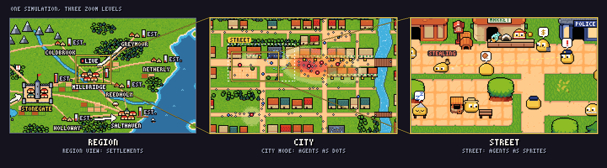
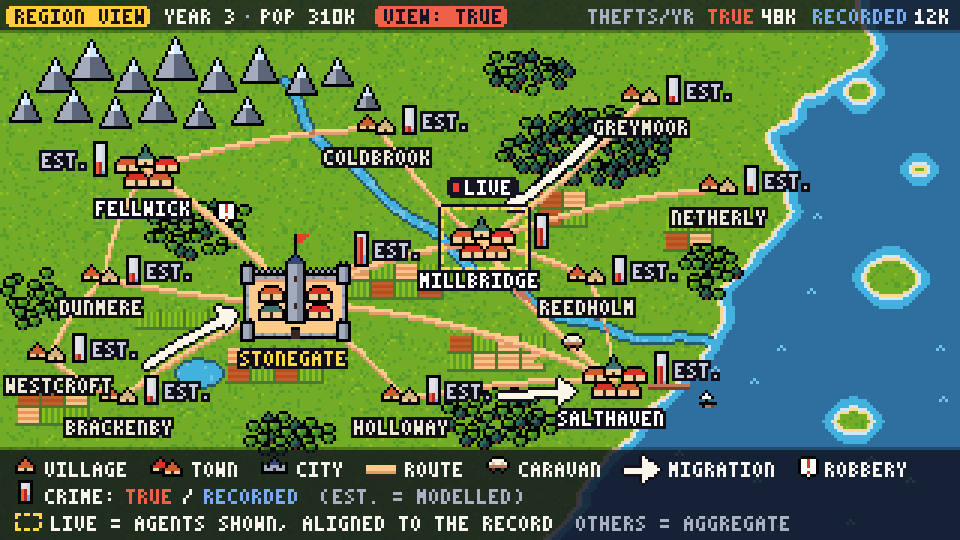

# Count the country, simulate the street

The Dot Society can grow from one city into villages, cities and a whole country if every settlement exists at all times as a small integer ledger, with head-counts by role and integer-cent sector accounts that a stock-flow model advances once per simulated day, while individual agents exist only in the settlement being watched, spawned from that ledger, aligned to it and folded back into it. Every game found that spans scales keeps the same split between cheap records and detailed instances, from Dwarf Fortress's world populations to the 65,536 walking "instances" that, by a community guide's count, Cities: Skylines draws from a million citizens. The arithmetic suits a browser: in the research team's Node prototypes a settlement-day cost about **0.5 µs**, so 10,000 settlements advance a day in **5 ms** and save in **0.22 MB** gzip, and **100,000 agents spawn from a ledger in 7 ms** with every person and cent conserved, whereas a one-to-one national agent model needs about 47 seconds per simulated quarter on one core. The design turns on who owns history when the viewer looks away, and the recommended default is **shadow-canonical**: the ledger is the canonical history of every settlement, the watched one included, so a seed yields the same country wherever anyone looks and notable people persist across visits, while agents decide who, where and when but never how many. Today's single city stays as City mode with agents canonical, and a "consequential focus" mode, in which watched agents rewrite history, should ship only as a labelled opt-in. The ledgers' rules should be fitted from headless runs of the city model and tested against cross-sectional regularities used as ranges rather than constants: output rises with population at an exponent near **1.11** in US metros, while income in England and output in Germany are statistically linear; serious crime scales near 1.16 and homicide near 1.0; settlement sizes follow Zipf's law, with about **one city of 100,000 per million people**; trade decays with distance at an elasticity near **−0.9** and commuting near −2; property victimisation is about **3.4 times** higher in cities than in the countryside; and small towns field about **twice** the national police density. Countries should be generated rather than drawn: a seeded mesh pipeline built terrain, rivers, 1,000 rank-sized settlements and a road network in **0.6 s**, street maps regenerate on demand in 5–60 ms, and six discrete zoom levels carry the viewer from country to follow-cam. The work adds small hooks to M0, M2, M4, M5 and M6 and three post-launch milestones, M7–M9, roughly **13–19 developer-weeks** in all by an unsourced estimate. Because the crime-scaling, trade-distance and victimisation targets, like many others, rest on search summaries, and every timing on Node rather than phones, both need checking before any constant is hard-coded.

## A browser can run a country of ledgers but not a country of people

National-scale agent models exist, but none found runs in a browser or changes its detail around a viewer. Axtell's model of the US private sector put about **120 million agents** on parallel hardware and reproduced more than two dozen empirical features of firms and labour flows ([Axtell, AAMAS 2016](https://cmepr.gmu.edu/wp-content/uploads/2017/09/Axtell-AAMAS-p806.pdf); search summary). The Bank of Italy's BeforeIT.jl runs Austria at one agent per person, and its benchmark script records **about 46.7 seconds per simulated quarter** on one core of a Ryzen 5 5600H and 21.6 seconds on four threads; by default it scales economies down 1:1,000, and its Italy example runs at 1:2,000 with about 30,000 households ([benchmark_w_matlab.jl](https://github.com/bancaditalia/BeforeIT.jl/blob/main/examples/benchmark_w_matlab.jl); [BeforeIT.jl](https://github.com/bancaditalia/BeforeIT.jl)). AgentTorch's model cards describe 8.4 million synthetic New Yorkers ([model card](https://github.com/AgentTorch/AgentTorch/blob/master/agent_torch/models/macro_economics/model_card.md)). The research team's stand-in for the Dot Society agent model, covering movement, police climbing a hotspot field, offence decisions and purchases over struct-of-arrays columns, cost **50–90 ns per agent-tick**, or 5.2 ms per tick at 100,000 agents and 49 ms at a million ([bench_abm_grid.mjs](prototypes/lod/bench_abm_grid.mjs)). A country of ten million people at street-level time steps would therefore need about half a second per tick before the real model's extra rules, so a browser cannot run a country of people. It can run a country of ledgers. A per-settlement stock-flow model with eleven keyed stochastic flows, integer-cent transfers, and migration and trade with four neighbours cost **about 0.5 µs per settlement-day**, flat from 1,000 to a million settlements. That is 5 ms per simulated day for 10,000 settlements, with the ledger summing to exactly zero and population conserved ([bench_agg.mjs](prototypes/lod/bench_agg.mjs)). These are Node measurements of simplified stand-ins on one Xeon core, not browser or phone timings.

Games that span scales have converged on one pattern: a cheap record that always exists, plus an expensive instance that exists only near the viewer. Dwarf Fortress keeps a count of each creature population per region, flags local populations that must be "offloaded" back into that count, points every spawned animal back at the population it came from, and stores a site's named, persistent figures apart from its anonymous inhabitant counts ([df.regionpop.xml](https://github.com/DFHack/df-structures/blob/master/df.regionpop.xml); [df.wilderpop.xml](https://github.com/DFHack/df-structures/blob/master/df.wilderpop.xml); [df.site.xml](https://github.com/DFHack/df-structures/blob/master/df.site.xml)). Cities: Skylines 1 caps the people visibly walking at **65,536 "citizen instances"** while counting up to 1,048,576 citizens, according to a community guide ([Steam guide](https://steamcommunity.com/sharedfiles/filedetails/?id=2712549268); search summary). Stellaris 4.0 grouped its pops so that most effects that once touched one pop now touch 100, citing late-game performance ([Dev Diary #372](https://forum.paradoxplaza.com/forum/developer-diary/stellaris-dev-diary-372-modding-pop-groups-and-jobs.1729994/); search summary). STALKER's A-Life, whose engine source is open, brings a character online inside `switch_distance × (1 − f)` and takes it offline beyond `switch_distance × (1 + f)`. That hysteresis band prevents thrashing, and a time budget caps offline updates. The switch manager is also seeded from the CPU clock, so its world cannot be replayed ([alife_switch_manager_inline.h](https://github.com/OpenXRay/xray-16/blob/master/src/xrGame/alife_switch_manager_inline.h); [alife_update_manager.cpp](https://github.com/OpenXRay/xray-16/blob/master/src/xrGame/alife_update_manager.cpp)). In Dwarf Fortress and Cities: Skylines at least, the count is the truth, and instances are drawn from it and returned to it.

The same games accept that looking changes outcomes, and players find the seams. X4: Foundations scripts ships separately for the visible and the low-attention states, and players describe its out-of-sector combat as closer to turn-based dice than to what they watch ([X4 mod scripts](https://github.com/A11ectus/X4-Subsystem-Targeting-Orders); [Steam discussion](https://steamcommunity.com/app/392160/discussions/0/840627496100645234/), forum summary). A community reverse-engineering of Mount & Blade II: Bannerlord's auto-resolve finds that simulated battles favour defenders, never penalise infantry and rank cavalry worst. Settlements get a **2:1 to 7:1 defensive advantage**, so whether the player fights in person can change who wins ([combat simulation gist](https://gist.github.com/jzebedee/be076d28f162c8d05fd7d2d72109a46f)). The Dot Society has to make this choice openly, and the decision section below does.

Agent-based modellers scale in four ways, and each keeps totals while losing structure. Super-individuals let one agent stand for N people ([Scheffer et al. 1995](https://www.sciencedirect.com/science/article/abs/pii/030438009400055M); search summary). In a spatial aphid model they "caused significant changes to the model dynamics, both spatially and temporally", and aggregate statistics hid the deviations once one stood for more than about ten individuals ([Parry & Evans 2008](https://ui.adsabs.harvard.edu/abs/2008EcMod.214..141P/abstract); search summary). Hybrid models switch a region between agents and equations when its counts cross a threshold, as Bobashev and colleagues did for cities in an epidemic network ([Bobashev et al. 2007](https://www.researchgate.net/publication/261459282_A_Hybrid_Epidemic_Model_Combining_The_Advantages_Of_Agent-Based_And_Equation-Based_Approaches); search summary). Multi-level models aggregate agents away from the user's focus, which Navarro and colleagues reported gave "a major gain in CPU time … for a very limited loss of consistency" in urban simulation ([Navarro et al. 2011](https://hal.science/hal-01288047); search summary). Archetypes share one decision across a group, which pays off only when decisions are expensive, as with AgentTorch's language-model calls ([behavior.py](https://github.com/AgentTorch/AgentTorch/blob/master/agent_torch/core/llm/behavior.py)).

To see what aggregation loses for crime, the team ran a Short-style burglary model on a 64×64 lattice, with parameters recalled from the paper's ranges rather than checked. Volume survived, at 0.997–1.018 burglaries per unit of offender inflow, because each burglar leaves after one burglary; the pattern did not. Hotspots put **47–59% of burglaries in the top 5% of sites, against 10–21% without them**, and halved the number of active burglars, 199 against 410, because hotspots make burglars strike sooner ([short_model.mjs](prototypes/lod/short_model.mjs)). Volume conservation belongs to Short's model only. Dot Society offenders persist and their volume depends on deterrence and the economy, so every aggregate must emulate volume and carry a concentration index beside it. Super-individuals are a poor fit for crime, by inference, since no study found compared them on crime models: a super-thief standing for N people commits N crimes on one tile and inflates the very self-excitation the hotspot field feeds on.

## Four simulation tiers share one canonical ledger per settlement

The architecture below is the research team's synthesis; no published design was found that combines microsimulation alignment with viewer-driven detail in a game. It runs four simulation tiers on one simulated calendar.

| Tier | What runs | Who gets it | Measured cost, one desktop core |
|---|---|---|---|
| Agent | The existing struct-of-arrays agent model on its LDtk map | The watched settlement; above the device cap (10,000 agents on phones by default, 100,000 on desktops), only the districts in view | 50–90 ns per agent-tick; 100,000 agents ≈ 5 ms per tick |
| District | A stock-flow ledger per district plus a coarse crime lattice, about 16×16 per city | The rest of a watched city, and neighbouring towns still in view at City zoom | ≈0.5 µs per district-day (extrapolated from the settlement benchmark) plus ≈30 ns per lattice cell-step; 16×16 ≈ 8 µs |
| Settlement | A stock-flow ledger per settlement | Every other town and city, every day | ≈0.5 µs per settlement-day; 10,000 settlements ≈ 5 ms per day |
| Region | A regional account holding a "rural remainder" | Hamlets too small to list, and far regions | Negligible |

*Costs are the team's Node measurements of simplified stand-ins ([bench_abm_grid.mjs](prototypes/lod/bench_abm_grid.mjs); [bench_agg.mjs](prototypes/lod/bench_agg.mjs)); the real models will cost more.* The district window matters more than it first appears. On a phone, any town above 10,000 people is seen through it. A capital of 165,000, the size a 1.2-million-person country would have under Zipf's law with a 200-person floor, needs one even on a desktop.

A settlement ledger holds about 30–80 numbers. People sit in integer compartments for the employed, unemployed, merchants and firm owners, police and jailed, optionally split into three age and three wealth bands. Money sits in integer-cent accounts for households, firms, local government and the police budget; these are stored as Float64, which is exact below 2^53, about 9.0 × 10^15 cents. The market holds price and wage indices, inventory, vacancies and the firm count. Crime holds true offences (cumulative and over the last 21-day month), recorded offences, arrests, the share of offences in the top 5% of places, and the police deployment mode.

Each day the ledger draws integer flows. Hires and separations follow the vacancy rate and firm liquidity; wages move from firms to households and are then taxed; consumption follows Godley–Lavoie-style propensities to spend out of income and wealth. Price revisions arrive as the share of firms repricing, which is about 9% of months in Lengnick's own model and 9–12% for US regular prices ([Lengnick replication](https://github.com/avakeeling199/Lengnick-replication); [Nakamura & Steinsson](https://ideas.repec.org/a/oup/qjecon/v123y2008i4p1415-1464..html), search summary). Offences come from a hazard in unemployment, wealth and deterrence, adjusted for concentration; recorded offences are true ones thinned at a reporting rate; and arrests, releases, migration and trade complete the day. Draws stay integer and stochastic. When a mean is below 8 they use stochastic rounding; otherwise they use a normal approximation from a 4,096-entry inverse-normal table and `sqrt` ([common.mjs](prototypes/lod/common.mjs)). That keeps the small-number variance villages need, which is why Bobashev's hybrid switches to equations only when counts are large. A money check passed: Godley and Lavoie's model SIM, run in integer cents with government spending of 2,000 cents a period and a 20% tax, climbed from 3,846 in period 1 to exactly **10,000 = G/θ from period 60**, with the ledger summing to zero every period ([sim_sfc.mjs](prototypes/lod/sim_sfc.mjs); [model SIM notebook](https://github.com/kennt/monetary-economics)).

Every hazard should be fitted from headless runs of the city agent model. That is the surrogate approach Lamperti, Roventini and Sani used to cut agent-model calibration time ([Lamperti et al. 2018](https://ideas.repec.org/p/fce/doctra/1709.html); search summary). The fit has three steps. First, the city runs over a design of seeds, city sizes, police shares and unemployment shocks, logging daily flows by district. Second, each hazard becomes a binned lookup table or a generalised linear model evaluated in fixed-point arithmetic, which is small, deterministic and needs no neural network. Third, docking compares ledger trajectories with agent fold-ups on means, variances, autocorrelation and concentration, and accepts a fit that lies inside the agent model's seed-to-seed spread. No published emulator was found for Lengnick's economy, or for a Short-type crime model at settlement scale. Emulator quality is therefore the largest unknown in the design.

Zooming in turns a ledger into people. The spawner fills exact counts per compartment, shuffles them with keyed draws, houses them by LDtk capacity, matches jobs to firm sizes and draws posted prices around the price index. Cash is apportioned exactly. Each agent gets floor(balance × weight ÷ total weight), and the leftover cents, fewer than the number of agents, go one each to agents along a keyed stride. The hotspot field comes from a revisit cache, or from a per-map template scaled to the ledger's volume and concentration. In the prototype, which left out LDtk lookups, job matching and GPU upload, spawning took **3.4 ms for 10,000 agents, 7.1 ms for 100,000 and 67 ms for a million**, and folding back took under half a millisecond at 100,000. The round trip conserved every person and cent, the same (seed, settlement, day) reproduced the same people, and spawned wealth had a Gini near 0.47 ([bench_spawn.mjs](prototypes/lod/bench_spawn.mjs)).

Exactness has a numerical edge, because floor(H·w/W) is exact only while H·w stays below 2^53. When the prototype apportioned 98,765,432,101 cents across 10,000 settlements in 3.45 ms, four quota products crossed that bound. The result still matched an exact BigInt recomputation (checked for this report), but nothing guarantees it, so production code needs a BigInt branch.

While a settlement is watched, its ledger keeps running. It sets the day's budget for every flow that crosses the boundary (migration, births, deaths, trade, taxes and transfers), and the agents execute those budgets exactly. Interior totals such as hires, separations, offences and arrests are aligned with "alignment by sorting", the method of the microsimulation tool LIAM2, in which "for each category, the N individuals with the highest scores are selected" ([LIAM2 processes.rst](https://github.com/liam2/liam2/blob/master/doc/usersguide/source/processes.rst)). LIAM2's documentation advises adding a random component to the score so that low scorers are not starved. It settles fractional needs with a uniform draw, and it can carry each period's error into the next target. The agents' own rules still decide where and when, so hotspots, patrol routes and posted prices stay emergent. A 1% re-alignment by full sort took 4.6 ms at 10,000 agents and 19.4 ms at 100,000; partial selection would be faster ([bench_spawn.mjs](prototypes/lod/bench_spawn.mjs)).

```ts
// Keyed draw: depends only on (seed, entity, tick, stream), never on call order (lowbias32 hash).
const mix32 = (x: number): number => {
  x ^= x >>> 16; x = Math.imul(x, 0x7feb352d);
  x ^= x >>> 15; x = Math.imul(x, 0x846ca68b);
  return (x ^ (x >>> 16)) >>> 0;
};
export const draw = (seed: number, entity: number, tick: number, stream: number): number =>
  mix32(mix32(mix32(mix32(seed ^ 0x85ebca6b) ^ entity) ^ tick) ^ (stream + 0x9e3779b9));
// Hash the seed first: with seed ^ entity, two seeds that differ only in low bits
// would give the same draws, shuffled among entities.

// Alignment by sorting: move exactly `need` agents from state `from` to `to`, highest score first.
// score = fixed-point propensity from the agent's own state + keyed noise; ties broken by index.
export function alignBySorting(state: Uint8Array, from: number, to: number,
                               need: number, score: Float64Array): number {
  const pool: number[] = [];
  for (let i = 0; i < state.length; i++) if (state[i] === from) pool.push(i);
  pool.sort((a, b) => score[b] - score[a] || a - b);
  const n = Math.min(need, pool.length);
  for (let k = 0; k < n; k++) state[pool[k]] = to;
  return need - n;                       // shortfall, carried into tomorrow's target
}
```

Money then lives in two ledgers, and each is exactly zero-sum. The canonical ledger holds the settlement accounts, the national accounts and MINT, which is the only source and sink of money. Agents never touch it. The micro-ledger of agents' cents is apportioned from the canonical ledger and changes across the boundary only through mirrored flows. The watched settlement's total therefore always equals the canonical total. Only the split between households and firms can drift, and a reconciliation transfer at the day boundary pulls it back into a band. Zooming out drops the micro-ledger and, for the most recently visited cities only, caches the settlement's notables, about 1–5% of people (officers, firm owners and anyone with a record) at about 32 bytes each, together with a 32×32 16-bit hotspot field of 2 KB and the firms' price list. The notables are the counterpart of Dwarf Fortress's named figures, and they prevent "a new police chief every visit".

Five rules keep all of this replayable. The first is keyed draws: every random draw comes from the keyed generator above, which cost 6.2 ns per draw in Node against 7.7 ns for a sequential sfc32 closure and passed a 16-bucket χ² test across a million entities, at 15.1 on 15 degrees of freedom ([bench_rng.mjs](prototypes/lod/bench_rng.mjs)). The agent and aggregate layers take separate salts, so no focus change can shift another draw anywhere in the country. The second is plan, then apply: flows between settlements are planned from a read-only snapshot and then applied as integer additions, so iteration order cannot matter, and two runs of 10,000 settlements over 365 days gave identical hashes ([bench_agg.mjs](prototypes/lod/bench_agg.mjs)). The third is exact arithmetic: the core uses only the operations ECMAScript specifies exactly (+, −, ×, ÷, `sqrt`, `floor` and `imul`), because the standard leaves exp, log, pow, sin and their kin "implementation-approximated" ([ECMAScript spec](https://github.com/tc39/ecma262/blob/main/spec.html)). The project's earlier cross-engine test, run in Node and Deno rather than in browsers, found that V8 15.0, the engine in Chrome 150, which switched to LLVM's math library, changed `exp` on about 9.6% of inputs relative to older V8 ([V8 15.0 ieee754.cc](https://github.com/v8/v8/blob/15.0-lkgr/src/base/ieee754.cc)), so transcendental curves come from build-time tables. The fourth is that tier switches which write canonical state happen only at day boundaries and are logged like player commands. The fifth is that a day step time-sliced to spare phones is double-buffered and committed at the boundary, so slicing cannot change results.

At each day boundary, property tests assert four things: accounts plus MINT sum to zero; population equals the starting count plus births minus deaths; spawn followed by fold is an identity; and replay hashes match. WebGPU does not loosen any of this. WGSL lets implementations "reassociate operations" and fuse them ([WGSL spec](https://github.com/gpuweb/gpuweb/blob/main/wgsl/index.bs)), so a GPU core is bit-reproducible across devices only if it is integer-only. Firefox also still lacks WebGPU on Linux and Android ([GPU.json](https://github.com/mdn/browser-compat-data/blob/main/api/GPU.json)). GPU compute should therefore drive only non-canonical crowds and rendering.

The known failure modes have standard mitigations. Agents are spawned indoors or at their scheduled places and cross-faded in, so they do not pop into view. Calibration limits rate jumps at a switch, and panels driven by the ledger are labelled "estimated". STALKER-style hysteresis and a minimum dwell of one simulated day prevent thrashing, villages keep integer stochastic flows rather than continuous equations, and caching only notables keeps saves small. On desktops the budget is comfortable. At 30 Hz a frame allows 33 ms. The agent tier takes about 5 ms per tick at 100,000 agents, and 10,000 ledgers take about 5 ms per simulated day, spread over that day's ticks. Memory is 34–64 bytes per agent and 100–1,000 bytes per ledger. A 10,000-settlement country saved in **224 KB gzip** after a simulated year, and a 100,000-agent city with its hotspot field in 1.3 MB. The storage risk is history. Ten years of weekly series for 1,000 settlements took 6–14 MB gzip on synthetic data ([savesize.mjs](prototypes/worldmaps/savesize.mjs)), so history should be kept weekly for the last year and monthly before that, quantised and delta-coded. Phones were not measured; the safe course is to time-slice the day step and keep phones at the 10,000-agent default.

## Decision: the ledger owns history and agents act it out

Only one settlement, or a few districts of a large city, can run as agents at once on a phone, and only a few settlements on a desktop. As a result, three desirable properties cannot all hold for every settlement. **Viewing independence** means the same seed and inputs produce the same country whoever looks where; **agent causality** means what individual agents do changes macro history; and **persistence** means people met on one visit are still there on the next, with consistent stories. If watched agents change history while unwatched settlements have none, history depends on where the viewer looked. Agents can change history without that observer effect only if the set of agent-run settlements is fixed in advance and runs whether watched or not. That costs CPU every tick, and every other settlement can then show only agents that cannot change anything. And if agents never change history, people persist only by being cached and quietly re-aligned to the ledger. That is a version of Sunshine-Hill and Badler's "alibi generation", which fills in an agent's past when a viewer looks closely ([Sunshine-Hill & Badler, AIIDE](https://ojs.aaai.org/index.php/AIIDE/article/view/12389); search summary).

| Option | How it works | Viewing independence | Agent causality | Persistence | Cost and risk |
|---|---|---|---|---|---|
| **Shadow-canonical** (recommended for country mode) | The ledger runs for every settlement every day, the watched one included; agents are spawned from it and aligned to it and never write canonical state | Yes, by construction | No: agents choose who, where and when; the ledger sets how many | Notables cached and re-aligned; anonymous residents re-drawn on each visit | Emulator error shows up as alignment nudges; a crime wave that tips among the agents reaches the country only if the emulator predicts it |
| **Consequential focus** (labelled opt-in) | Agents are canonical while watched and fold exactly into the ledger on exit; each focus change is a logged input at a day boundary | Only for the same seed, inputs and focus log | Yes, wherever the viewer looks | Yes | Two viewers of one seed get different countries; country-level claims depend on the viewing path; seams of the X4 and Bannerlord kind |
| **Fixed live set** (today's City mode, with one city) | Settlements chosen at world creation run as agents every tick; all others behave as under shadow-canonical | Yes | Yes, in the fixed set only | Yes | CPU every tick: one 10,000-agent city on phones, perhaps one to three cities on desktops |
| **Detached fork** (stepping stone) | "Open in City mode" starts a separate agent run from a settlement's ledger; nothing flows back | Yes | Only inside the fork | No | Cheapest; a what-if rather than a zoom |

**Recommended default: shadow-canonical history for country mode, City mode unchanged as a fixed live set of one, consequential focus only as a labelled opt-in, and the detached fork as the first and cheapest form of zoom.** Four reasons support it. The project's edge over quick clones is verifiability, meaning share links that replay identically and on-screen claims backed by properly powered tests across seeds; under consequential focus, "this country's theft rate" would depend on the order in which a viewer opened towns, so no country-level claim could be certified independently of the viewing path. A simulation whose lesson is that observation distorts the record should not let observation change the truth. Games that accept an observer effect ship seams that players notice and exploit, as X4's out-of-sector combat and Bannerlord's auto-resolve show. And the price is small, since the ledger runs anyway and spawning and daily alignment cost milliseconds.

The default gives up agent causality in country mode, and that cost is real. Policy still works, because player commands write canonical state under every option, but a policy change acts through the fitted hazards rather than through the agents. Three mitigations follow. A divergence meter shows daily z-scores of agent fold-ups against the ledger in a developer panel and logs them for refits. The fork lets any agent-level experiment run with agents canonical in City mode. And if the meter shows the emulator missing dynamics that matter, pinned live cities chosen at world creation add agent causality without an observer effect, at a fixed CPU cost.

The choice also changes how zooming feels, as a consequence of the design rather than a tested result. Under consequential focus, a switch writes history, so it must wait for the next day boundary like any logged command. Under shadow-canonical, a switch writes nothing canonical, so agents can appear at once. They are keyed by the logged entry tick and placed indoors or at their scheduled places, with alignment starting at the next day boundary. Only the micro-state shown depends on when the viewer arrived. Both options need hysteresis on the zoom threshold, a minimum dwell of one day, and spawning keyed by (seed, settlement, entry time, purpose). With those in place, zooming into the same place at the same moment produces the same people in any run under shadow-canonical, and in any run with the same focus log under consequential focus. Any agent the viewer follows, names or inspects should be promoted to a notable, so that the people a viewer cares about are the ones who persist.

## Measured regularities tie villages, towns and cities into one country

Settlements connect through goods, people, money and crime, and each channel has measured regularities that a country of ledgers should reproduce. The table collects the targets, and the subsections give the rules behind them. Most figures were computed for this research from open data in public repositories; the FBI staffing figures were read in full, and the rest come from studies and official statistics seen only through search summaries.

| Link between settlements | Target band for tests | Evidence |
|---|---|---|
| Output and wages against population | β 1.08–1.15, rejecting β = 1 | US metros 2013: 1.113 (1.089–1.137); OECD metros 2010: 1.124 ([edugalt/scaling](https://github.com/edugalt/scaling), computed) |
| Serious property crime and robbery | β 1.05–1.3 | US: 1.16 ([Bettencourt et al. 2007](https://wiki.santafe.edu/images/images/3/36/Bettencourt_et_al_2007.pdf), search summary); EU robbery file 1.28–1.38 (computed) |
| Homicide and other violent deaths | β ≈ 1.0, not rejecting 1 | EU 1.01–1.03; Brazil 0.99–1.02 ([Eurostat data](https://github.com/edugalt/scaling/tree/master/data/eurostat), computed) |
| Roads and other networks | β 0.80–0.88 | US 2013: 0.846 ([metropolitan-miles.csv](https://github.com/edugalt/scaling/blob/master/data/usa/metropolitan-miles.csv), computed) |
| Households and employment | β ≈ 1.0 | England and Wales 2011: 0.97–1.00 ([UK data](https://github.com/edugalt/scaling/tree/master/data/uk), computed) |
| Settlement sizes | ζ 0.9–1.2; about 1 place of 100,000+ and 11–18 of 10,000+ per million people | GeoNames, 11 countries ([all-the-cities](https://registry.npmjs.org/all-the-cities), computed) |
| Spacing | Clark–Evans R 1.1–1.25 for small places, 0.9–1.1 for large ones | Germany and Iowa (computed from GeoNames) |
| Growth | Annual spread ≈ 1 percentage point; slight tilt toward large places | US metros 2010–22 ([population data](https://github.com/edugalt/scaling/blob/master/data/usa/us_2010_2022_population.csv), computed) |
| Goods trade | Distance elasticity −0.9 ± 0.2; price gaps inside the transport band | 1,467 estimates ([Disdier & Head 2008](https://econpapers.repec.org/RePEc:tpr:restat:v:90:y:2008:i:1:p:37-48), search summary) |
| Commuting | Distance exponent ≈ −2; about two-thirds work in their home county | New York 2011 ([scikit-mobility data](https://github.com/scikit-mobility/scikit-mobility/tree/master/examples), computed) |
| Migration | 3.6–5.5% a year between settlements; rural youth 1.5–1.9% a year | US 2022–24 and 65 countries (search summaries; sources below) |
| Property victimisation | Urban : suburban : rural ≈ 3.4 : 1.7 : 1 (±30%) | NCVS 2023 ([BJS](https://bjs.ojp.gov/document/PropertyCrime_2023.pdf), search summary) |
| Recorded crime | Urban ÷ rural 1.5–2 | England 2023/24 ([Defra](https://www.gov.uk/government/statistics/communities-and-households-statistics-for-rural-england/e-crime), search summary) |
| Police | 4.5 officers per 1,000 in towns under 10,000; 2.3 nationally; 2.6 in county agencies | FBI 2024 ([Quick Stats](https://hrc-prod-requests.s3-us-west-2.amazonaws.com/assets/images/Reported-Crimes-in-the-Nation-Quick-Stats.pdf), read in full) |
| Response time | Rural median ≈ 2× urban | Ambulance studies ([PMC review](https://www.ncbi.nlm.nih.gov/pmc/articles/PMC9778378/), search summary) |
| Village food | 20–43% of food value produced at home | Rural Africa 2008–22 ([LSMS-ISA study](https://www.sciencedirect.com/science/article/pii/S2211912424000014), search summary) |

### Scaling exponents are bands to test, not constants to impose

Urban scaling describes a city quantity Y that grows as N^β with population N. Bettencourt and colleagues' 2007 estimates for the US, seen through search summaries, put new patents at β ≈ 1.27, serious crime at 1.16 and petrol stations at 0.77 ([Bettencourt et al. 2007](https://wiki.santafe.edu/images/images/3/36/Bettencourt_et_al_2007.pdf)). The research team refitted the open data behind Leitão and colleagues' work ([edugalt/scaling](https://github.com/edugalt/scaling)). It found **β = 1.113 (95% CI 1.089–1.137)** for GDP across 381 US metros in 2013, with a typical metro about 30% off the line. Road length gave 0.846 (0.818–0.877). Aggregate commuting time gave 1.088 in 2010 and 1.068 in 2022, so commuting time per person rises 5–6% per doubling of city size.

The exponents are not constants. In the same repository's data, income in England and Wales scales linearly (0.97–1.01), German city GDP at 1.02 is indistinguishable from 1, and OECD patents do not reject linearity. Brazilian municipal GDP jumps from **1.04 to 1.29 when places under 50,000 are dropped** (all computed). Arcaute and colleagues varied the density and commuting thresholds that define English cities. They found that "population size alone does not provide enough information to describe or predict the state of a city", and that exponents fluctuate considerably ([Arcaute et al. 2015](https://royalsocietypublishing.org/rsif/article/12/102/20140745/35313/Constructing-cities-deconstructing-scaling); search summary). Even the estimator matters. English train stations give β = 0.49 by log-least-squares that drops the 260 clusters without a station, and 1.08 by quasi-Poisson regression that keeps them (computed).

The rule follows from that fragility. Superlinearity should emerge in the agent tier from interaction rates: job contacts, customers per firm and targets per offender rise with density, and detection falls with anonymity. The ledgers should inherit it through the emulator fitted across city sizes. The exponents then serve as test bands. Above the 100,000-agent ceiling, where no agent runs exist, they also serve as priors for extrapolation (an inference).

Glaeser and Sacerdote bound the crime mechanism. Higher pecuniary returns explain at most about a quarter of the big-city crime premium, and lower arrest or recognition odds at most a fifth. A third to a half comes from factors such as family structure ([Glaeser & Sacerdote 1999](https://ideas.repec.org/p/nbr/nberwo/5430.html); search summary). Loot and detection together should therefore explain **no more than about 45%** of the simulated gradient, leaving the rest to who lives where and to peer effects. A persistent residual per settlement reproduces the observed scatter. Its log standard deviation should be near 0.25 for output (the US metro figure is 0.26) and near 0.4 for infrastructure.

Five continuous-integration tests make the bands checkable. Slopes should be fitted on at least 20–30 settlements spanning two to three orders of magnitude: with 30 settlements spread log-uniformly from 1,000 to a million, the 95% interval is about ±0.045, and with 10 it is about ±0.08 (computed for a residual standard deviation of 0.25). Each exponent should be tested against β = 1 by likelihood ratio, and only GDP-like quantities should reject it. Counts that include zeros should be fitted by Poisson or negative-binomial maximum likelihood, since dropping zeros biased Brazilian AIDS deaths from 1.16 to 0.74. The settlements should be re-aggregated under a second boundary rule that merges places by commuting, with a report of how far β moves, because a simulation whose exponent never moves is suspiciously over-tuned. And the cross-section should be judged at a fixed date, not along one city's growth path.

### Zipf's law and market towns fix how many places exist, and where

Above a size threshold, settlement sizes follow a Pareto tail whose exponent ζ is near 1. Nitsch's meta-analysis of 515 estimates put the average near 1.1, and Soo's study of 73 countries found it often significantly different from 1 ([Soo 2005](https://legacy.econ.tuwien.ac.at/hanappi/AgeSo/rp/Soo_2005.pdf); search summary). The team fitted GeoNames places of 1,000 or more people. For places of 10,000 or more across eleven countries, ζ ranged from 0.88 (Mexico) to 1.40 (France), and all 381 US metros gave 0.91 ± 0.13 ([all-the-cities](https://registry.npmjs.org/all-the-cities); [US metro data](https://github.com/edugalt/scaling/blob/master/data/usa/USmetro_gdp_pop_2013); computed). Measured against national populations recalled rather than checked, rich countries have **about one place of 100,000 or more per million people, 11–18 of 10,000 or more and 50–130 of 1,000 or more**. In 2024, 75% of the 19,479 US incorporated places had fewer than 5,000 people ([Census Vintage 2024](https://www.census.gov/newsroom/press-releases/2025/vintage-2024-popest.html); search summary).

Most places in a plausible country are therefore villages. Under exact Zipf, the largest settlement is N divided by the harmonic number of the settlement count. A country of a million people with a 200-person floor has a largest town of about 140,000 and about 700 settlements; 70 of them have 2,000 or more people, and 14 have 10,000 or more. GeoNames places cover only about 77% of the US population (computed), so a generator also needs a dispersed rural population, which the region tier holds.

Placement follows central-place logic. In Germany, places of 1,000 or more are slightly more regular than random (Clark–Evans R = 1.18, with a mean nearest neighbour of 4.2 km), while places of 100,000 or more are slightly clustered (R = 0.92). Raising the threshold a hundredfold multiplied the equivalent hexagonal spacing by 9.3, close to the √100 that Zipf implies (computed from GeoNames). Skinner's surveys of rural China found standard market towns serving about **18 villages**, six in an inner ring and twelve beyond, averaging a little over 100 farm households. Markets met from every tenth day in remote areas to every other day in busy ones ([Skinner](https://escholarship.org/content/qt51x4g3qh/qt51x4g3qh.pdf?t=o0wtmd); search summary).

A generator should therefore place capitals, then towns, then villages, on a jittered hexagonal or Poisson-disc pattern whose spacing scales with the square root of the area per settlement. It should test R at 1.1–1.25 for small places and 0.9–1.1 for large ones. Services should exist only where the catchment (a settlement plus its dependent villages) clears a threshold population. The number of Lengnick firms then depends on catchment rather than on a settlement's own size; the thresholds themselves are unverified and should stay tunable.

Growth follows Gibrat's law only roughly. US metros grew 0.65% a year on average from 2010 to 2022 with a spread of 1.02 points, and grew a little faster and steadier above a million ([population data](https://github.com/edugalt/scaling/blob/master/data/usa/us_2010_2022_population.csv); computed). Simulated settlements should draw annual growth with that spread, a slight upward tilt with size and a reflecting floor at the minimum village size. The size distribution should keep ζ within 0.9–1.2 after 50 years.

### Goods chase price gaps, migrants chase expected wages, commuters go home

Trade should follow margins rather than a fixed gravity matrix. Project Alice, an open-source re-implementation of Victoria 2, ships goods between markets when the destination price beats the origin price plus costs ([economy_trade_routes.cpp](https://github.com/schombert/Project-Alice/blob/main/src/economy/economy_trade_routes.cpp); [economy_constants.hpp](https://github.com/schombert/Project-Alice/blob/main/src/economy/economy_constants.hpp)). The destination price is taken net of losses of 1% per 6,000 km. The costs are tariffs, a merchant cut (5% on foreign routes, 0.1% on domestic ones) and a transport price per km. Route volume then moves in proportion to the normalised margin, with a daily decay of at least 0.999, and the transport a route uses becomes demand for transport services.

Adapted to integer ledgers, the margin for a good shipped from i to j is p_j(1 − λd) − p_i(1 + μ) − τd, and the flow moves toward max(0, δ·flow + k·(a·flow + b)·margin ÷ p_j). Shipped goods leave i and arrive at j less booked losses, and in steady state every connected pair with spare transport capacity keeps its price gap within the transport cost plus margin. Victoria 3's market access, the share of a state's trade its infrastructure can carry ([Victoria 3 wiki](https://vic3.paradoxwikis.com/Market); search summary), suggests where gaps may exceed that band: in the simulation, an isolated village whose road saturates would see famine-style price spikes (an inference).

Two checks keep this honest. First, regressing simulated trade on the partners' outputs and distance should give an elasticity near −0.9, the mean of 1,467 estimates from 103 papers ([Disdier & Head 2008](https://econpapers.repec.org/RePEc:tpr:restat:v:90:y:2008:i:1:p:37-48); search summary). Second, merchant agents in a watched settlement should move inventories and pay through the ledger rather than overwrite prices. A Warband-derived mod pulls a town's price 20% of the way toward a caravan's carried price on each visit, which halves a gap every 3.1 visits ([tldmod module_scripts.py](https://github.com/tldmod/tldmod/tree/master/ModuleSystem)). That is a rate to check, not a mechanism to copy. Freeciv's trade income rises with distance ([traderoutes.c](https://github.com/freeciv/freeciv/blob/main/common/traderoutes.c)), a game reward that real trade inverts.

People move on two clocks, migration and commuting. Between 7.8% (Current Population Survey) and 11.8% (American Community Survey) of Americans moved in 2024, and in 2022, 53.5% of movers stayed within their county ([Axios](https://www.axios.com/2025/11/30/us-moving-rate-map); [Census](https://www.census.gov/library/stories/2023/09/why-people-move.html); search summaries). A settlement should therefore lose about **3.6–5.5% of its people a year** to other settlements. In data on 65 countries, Young found that one in four or five rural-raised people moves to a city as a young adult ([Young 2013](https://researchonline.lse.ac.uk/id/eprint/46872/); search summary). That is an annual hazard of about 1.5–1.9% between ages 15 and 30 (computed), so 20–25% of a village birth cohort should live in towns after fifteen years.

Destinations can follow the Harris–Todaro expected wage, which is the posted wage times the chance of finding work, minus a moving cost that rises with distance. A gravity or radiation kernel spreads movers across destinations. On New York's 2011 county commuting flows, the parameter-free radiation model matched the data about as well as gravity with a distance exponent of −2: the two models shared 52% and 51% of commuters with the observed flows ([radiation.py](https://github.com/scikit-mobility/scikit-mobility/blob/master/skmob/models/radiation.py); computed).

Commuting is a separate, daily process. In New York, **66% of workers worked in their home county, and more than 99% commuted less than 100 km** between county centres. Flows fell at a distance exponent of −2.3 by least squares and −2.0 in scikit-mobility's constrained fit ([gravity.py](https://github.com/scikit-mobility/scikit-mobility/blob/master/skmob/models/gravity.py); computed). Commuters keep their residence and household ledger at home and earn at work. Commuting is therefore a cross-settlement income flow, not a population flow, and its links should exist only within a daily range of about 50–100 km.

### Crime per head rises with size while police per head falls

Crime per head rises with settlement size. The 2023 National Crime Victimization Survey, seen only in a summary, put property victimisation at **192 per 1,000 households in urban areas, 98 in suburban and 57 in rural** ([BJS](https://bjs.ojp.gov/document/PropertyCrime_2023.pdf)). Its total of 102 looks low beside those components and should be checked against the tables. FBI data for 2019 put violent crime at 391 per 100,000 in cities outside metropolitan areas, against 208 in non-metropolitan counties ([FBI 2019](https://ucr.fbi.gov/crime-in-the-u.s/2019/crime-in-the-u.s.-2019/topic-pages/violent-crime); search summary). England recorded 59 crimes per 1,000 people in rural areas against 99 in urban areas outside London in 2023/24 ([Defra](https://www.gov.uk/government/statistics/communities-and-households-statistics-for-rural-england/e-crime); search summary). Across US states in 2009, violent crime rose by 4.3 per 100,000 for each percentage point of urban population, a correlation of 0.43, or 2.7 and 0.34 without Washington, DC (computed from [statecrime.csv](https://github.com/statsmodels/statsmodels/blob/main/statsmodels/datasets/statecrime/statecrime.csv)).

These ratios roughly agree with the scaling exponents: between a village of about 1,000 people and a city of about a million, 1,000^0.16 ≈ 3, close to the 3.4 urban-to-rural property ratio. The test targets are 3.4 : 1.7 : 1 for urban, suburban and rural victimisation (±30%), and 1.5–2 for recorded crime. The smaller gradient in recorded crime suggests lower reporting in cities, a different crime mix or a different urban definition, and the two figures come from different countries.

Policing runs the other way. FBI staffing data for 2024, read in full, show **2.3 sworn officers per 1,000 inhabitants nationally but 4.5 in cities under 10,000**, the highest of any city group, and 2.6 in county agencies, across 14,917 reporting agencies ([FBI 2024 Quick Stats](https://hrc-prod-requests.s3-us-west-2.amazonaws.com/assets/images/Reported-Crimes-in-the-Nation-Quick-Stats.pdf)). Rural help arrives late. In a systematic review of emergency medical response, 93% of the studies that found a rural–urban difference found rural times longer. One US study reported medians of 7 minutes urban against over 14 rural, and 90th percentiles of 12 and 26 ([PMC review](https://www.ncbi.nlm.nih.gov/pmc/articles/PMC9778378/); search summary; ambulance rather than police data).

The rules follow. Small towns fund more officers per head, and villages rely on a county or regional force spread thin. Capture odds should depend on response time over distance rather than on officers per head, so rural clearance can be low even where staffing is high. Ledgers carry volume and the concentration index, while the Short field and hot-spot patrols run only in the agent tier and, coarsened, in the district tier, because a national lattice at Short's time step would cost too much: a 1,024×1,024 lattice took 32 ms per step in the Node stand-in ([bench_abm_grid.mjs](prototypes/lod/bench_abm_grid.mjs)). Monthly village crime counts will be mostly zeros and ones, so tests should pool years and use Poisson likelihoods. On routes, robbery is a hazard per km that rises with bandit pressure, traffic, darkness and cargo value and falls with patrols; no published values were found, so it is a labelled design parameter.

### Villages need a second goods channel and a weekly market

A village is not a scaled-down city. In World Bank surveys of rural sub-Saharan Africa from 2008 to 2022, households produced **20–33% of the food value they consumed** across countries. In single countries the share ran from 19.5% (Niger) to 42.8% (Ethiopia) ([ScienceDirect 2024](https://www.sciencedirect.com/science/article/pii/S2211912424000014); search summary, which gave both 20% and 33%, probably for different samples). Agricultural employment scales sublinearly with settlement size in England and Wales (β 0.85–0.92, computed).

A simulated village should therefore book own production as a goods flow from farm to household outside the cent ledger, so that self-provisioning can never create money, and report it as imputed income. It should run one general shop with posted prices per roughly 100 households, leaving specialised trades to a market town that serves about 18 villages, and unemployed villagers should work their own farms by default, as Project Alice does for peasants without jobs ([economy_pops.cpp](https://github.com/schombert/Project-Alice/blob/main/src/economy/economy_pops.cpp)). A market should meet every 7 days (every 2–10 by density), where itinerant merchants on a circuit of about six villages and the town come together. Harvests should arrive once or twice a year into stored stocks, so food prices climb toward the lean season until imports arrive, within the trade band, and kin should lend small sums that net to zero within the village. Two tests check the result. Money and transactions per head in a village should fall well below a city's at equal real consumption, and consumption shocks should correlate across households more than income shocks do. These anchors describe low-income agrarian villages. A modern European or American village grows far less of its own food, so the generator needs at least an agrarian and a modern preset.

### National accounts close to the cent

Godley and Lavoie's Model REG, two regions sharing one government and one central bank, is the template for national accounts ([REG notebook](https://github.com/kennt/monetary-economics/blob/master/Chapter%206%20Model%20REG.ipynb)). Each region's exports are the other's imports. A single national tax rate (θ = 0.2 in the notebook's base case) automatically shifts fiscal resources toward a region whose demand falls. Money is created only when the central bank buys government bills.

Five identities should hold exactly every day, in integer units. Each settlement's population equals yesterday's plus births, minus deaths, plus net migration, with internal migration cancelling out nationally. The money supply is constant except at explicit issue or destruction through MINT. Each settlement's change in private net wealth equals government net spending there plus its net exports plus commuters' net wages plus the cash migrants bring in net of what they take out, with net exports and migrants' cash each summing to zero nationally. Goods balance per settlement, counting stock in transit and booked losses, with own production in the goods identity but never the money identity. And theft moves cents or goods without changing national money, while recorded crime never exceeds true crime. Interest on government bills flows to settlements by their residents' holdings, and integer rounding goes to an explicit rounding account. Project Alice's rule that unsold global supply "is trashed" at the end of each day ([economy_design.md](https://github.com/schombert/Project-Alice/blob/main/docs/economy_design.md)) is the kind of leak a ledger-exact simulation must avoid. Uniform national taxes, with services and police paid per settlement, move money toward poorer settlements automatically. An explicit grant of α × (the national tax base per head − the settlement's) × population can be offered as a slider. Policing should default to local forces, with a national police as an option that moves officers rather than adding them.

The hand-off test closes the loop. Watch a settlement for T days, stop watching it for T more, and compare it with a twin that was never watched. Per-capita output, prices, crime and money must agree within the ledger's noise, and every identity must hold exactly at the switch. The test has teeth only under consequential focus; under shadow-canonical, watching writes nothing canonical, so it passes by construction and the divergence meter carries the check instead.

## A seeded mesh draws the country and six zoom levels show it

### A 1,000-settlement country generates in 0.6 seconds

A mesh pipeline suits a seeded simulation in a worker: about 10,000–30,000 Voronoi cells for the whole country, stored as typed arrays. Two open generators show the way. The first is Azgaar's Fantasy Map Generator (FMG), which is MIT-licensed and says maps made with it are "yours, for any purpose". It runs a declared pipeline from grid and heightmap, through rivers, biomes, a habitability rank, settlements, states and routes, to markets ([FMG policy](https://github.com/Azgaar/Fantasy-Map-Generator/wiki/Policy); [generation-pipeline.ts](https://github.com/Azgaar/Fantasy-Map-Generator/blob/b944003c14/src/generators/generation-pipeline.ts)). Its default of 10,000 cells is "the only recommended value", and it warns above 50,000 ([graph-density.ts](https://github.com/Azgaar/Fantasy-Map-Generator/blob/b944003c14/src/data/graph-density.ts)). Its routes start from an Urquhart graph, the Delaunay triangulation minus each triangle's longest edge. They are routed by Dijkstra, with costs for height and habitability and a 0.5× discount for reusing a road, so roads merge into trunks ([routes-generator.ts](https://github.com/Azgaar/Fantasy-Map-Generator/blob/b944003c14/src/generators/routes-generator.ts)). The second is Red Blob's mapgen4, which is Apache-licensed and computes in a worker. It "can support 1 million+ Voronoi cells" but looks best around 25,000, and it ships precomputed Poisson points as quantised 16-bit pairs ([mapgen4 README](https://github.com/redblobgames/mapgen4/blob/c1d8cb018a/README.org)).

The team built a comparable pipeline. It starts from jittered-grid points and Delaunator, adds six-octave simplex noise with a continental falloff, and runs four priority-flood and flow-accumulation passes, three of them with stream-power incision. An FMG-like habitability score then drives score-sorted placement with minimum spacing and rank-size populations. The route graph runs Delaunay → minimum spanning tree → greedy spanner, adding an edge wherever the detour exceeds 1.6×, and each edge is routed by A* on the mesh with slope, river and road-reuse costs, before multi-source Dijkstra regions and Markov names finish the map. It generated **a 1,000-settlement country in 0.59 s on 30,000 cells**, and in 1.37 s on 100,000, in cold Node, with identical fingerprints across three runs on the same engine ([country.mjs](prototypes/worldmaps/country.mjs)). It produced about two route edges per settlement, of which 1–5% found no land path and would become sea lanes. A 1,000-settlement country stored in about 24 KB gzip for the settlement table, 10 KB for the route graph and 12–16 KB for delta-coded road geometry, plus 31 KB for optional terrain columns.

Determinism needs care. ECMAScript leaves sin, cos, exp, pow, hypot and atan2 "not precisely specified" ([ECMAScript spec](https://github.com/tc39/ecma262/blob/main/spec.html)). The popular fast Poisson-disc sampler calls `Math.cos` and `Math.sin` to place candidates ([fast-poisson-disk-sampling.js](https://github.com/kchapelier/fast-2d-poisson-disk-sampling/blob/master/src/fast-poisson-disk-sampling.js)), while Delaunator uses only exactly specified operations apart from one constant, `Math.pow(2, -52)` ([delaunator](https://github.com/mapbox/delaunator/blob/main/index.js)). Three changes should make regeneration independent of the browser engine, though no browser has tested it: a jittered grid or shipped points, sizes ranked as P₁/k by plain division, and replacements for the `Math.hypot` and `Math.pow` calls the benchmark still used. The simpler alternative is to store the arrays in the save and keep the seed as provenance.

On licences, FMG, mapgen2 and mapgen4, Delaunator, d3-delaunay and simplex-noise may be copied with their notices. Watabou's TownGeneratorOS (GPL-3.0) and probabletrain's MapGenerator (LGPL-3.0) are for ideas only ([TownGeneratorOS](https://github.com/watabou/TownGeneratorOS/blob/7fbc87a939/README.md); [MapGenerator](https://github.com/probabletrain/MapGenerator/blob/f487e4cee3/README.md)).

### Generate the country, hand-make the heroes, build streets on demand

LDtk, the map editor the town already uses, can hold a Pokémon-sized region of 15–20 linked settlements. Its level form, however, clamps width and height to 4,096 px, exactly a 256×256-tile city at 16 px, and it offers no level of detail ([LevelInstanceForm.hx](https://github.com/deepnight/ldtk/blob/6d69bd1d6b/src/electron.renderer/ui/LevelInstanceForm.hx); [JSON_DOC.md](https://github.com/deepnight/ldtk/blob/6d69bd1d6b/docs/JSON_DOC.md)). Pokémon Emerald's entire outdoor overworld is 50 maps and 126,180 tiles, about two 256² cities ([pret map data](https://github.com/pret/pokeemerald/tree/731ad5bfd6/data/maps); computed).

Hand-making therefore suits tutorials, story scenarios and hero settlements; the hand-authored default town can become the country's showcase settlement. Countries of 100–1,000 settlements should be generated, with LDtk serving as a library of prefab blocks, village kits and hero towns, loaded lazily through its separate level files. FMG's JSON and GeoJSON exports offer a hybrid: sculpt a showcase country in FMG and convert it at build time ([FMG Knowledge Base](https://github.com/Azgaar/Fantasy-Map-Generator/wiki/Knowledge-Base)).

Street maps should be generated when the viewer zooms in. Each uses a per-settlement seed, hash(worldSeed, settlementId, generatorVersion), plus context from the country: tier, population, the bearings at which routes arrive, river crossing, coast and sea direction, biome, port, crossroads and walls. FMG hands almost that list to Watabou's city generator ([burgs-generator.ts](https://github.com/Azgaar/Fantasy-Map-Generator/blob/b944003c14/src/generators/burgs-generator.ts)). Cataclysm: DDA's overmap likewise knows where cities, roads and building types are, while resolving layouts lazily and keeping them ([OVERMAP.md](https://github.com/CleverRaven/Cataclysm-DDA/blob/6c506a7544/doc/JSON/OVERMAP.md)).

The team's tile-grid generator uses integer-only randomness, entry points from route bearings, turn-penalised A* arterials to a central plaza with bridges, BSP blocks with two-tile streets, and zone-weighted prefab packing. In Node it built **a 48×48 village in 5 ms, a 128×128 town in 28 ms and a 256×256 city in 59 ms** once warm (first runs took 11–63 ms), byte-identically on every run, with outputs of 0.2–4.4 KB gzip, so regenerating is cheaper than storing ([town.mjs](prototypes/worldmaps/town.mjs)). The tiers follow. Villages of up to about 2,000 people come from hand-made LDtk kits with procedural dressing, 20×20 to 48×48 tiles; towns of about 2,000–20,000 come from BSP blocks and prefabs, 64–128 tiles across; and cities of 20,000 or more are 256×256 tiles and above, zoned into districts whose prefab variants reflect wealth and crime. Saves keep only edits and the generator version.

### Six discrete levels replace one continuous zoom

From country to street the scale changes by about 800–1,600×. That runs from about 200 m per pixel, for a 200 km country on a 1,000-pixel screen, to about 0.125–0.25 m per pixel for 16-pixel tiles, assuming each tile covers 2–4 m, an unverified guess. No single zoom stays legible across that range, and the games surveyed instead switch among two to four representations. Pokémon Emerald's Town Map is a 28×15-square symbolic map on which 16 towns and cities take one square each and routes take one to six ([region_map.c](https://github.com/pret/pokeemerald/blob/731ad5bfd6/src/region_map.c); [region_map_sections.json](https://github.com/pret/pokeemerald/blob/731ad5bfd6/src/data/region_map/region_map_sections.json)). Dwarf Fortress steps from world to region to local by fixed factors of 16 and 48 ([DFHack Maps.rst](https://github.com/DFHack/dfhack/blob/c872dc4c64/docs/api/Maps.rst)). Victoria 3 swaps its terrain map for a "paper map" when zoomed out and offers more than 40 map modes ([Victoria 3 wiki](https://vic3.paradoxwikis.com/Map_modes); search summary). The Dot Society's visual plan already defines three skins (A, coloured dots; B, Primer-style blobs; C, a pixel-art town) and four city zoom levels, Z0 to Z3. The country adds two levels above them.

| Level | Shows | Simulation tier behind it | Drawing | Labels and overlays |
|---|---|---|---|---|
| Country | The whole country | Settlement and region tiers | The mesh drawn into a small offscreen framebuffer, palette-quantised and upscaled with nearest filtering, or an 8-px Town-Map-style tilemap; settlement squares by tier; trunk routes | Capitals and cities only; flows between regions as bundled trunks |
| Region | A province | Same, plus route ledgers | The same mesh at higher density; every settlement icon and road | All names; flow bands per route; sampled caravan icons above a value threshold |
| City (Z0) | One settlement fills the screen | Agent tier for the watched settlement, as a district window above the cap | Skin A dots over the per-tile minimap; a heatmap far out | District overlays for hotspots, prices and police beats; inflows and outflows at entry tiles |
| District (Z1) | A few blocks | Agent tier | Skin C, or B without tiles | Static pins for crime and justice events |
| Town (Z2) | A street | Agent tier | Skin C or B | Capped bubbles, signs and named protagonists |
| Follow-cam (Z3) | One agent | Agent tier | Skin C or B | A thought panel, captions and an inspector synced to the charts |

Map modes should be pure functions from aggregate state to a base colour and a stripe colour per entity. That is the pattern OpenVic uses for its two dozen province modes ([Mapmode.cpp](https://github.com/OpenVicProject/OpenVic-Simulation/blob/dd311914fb/src/openvic-simulation/map/Mapmode.cpp)), and it lets dots, blobs and pixel skins share the modes at every level. Crime then needs no separate view: the base colour shows the true rate and the stripe the recorded rate, or a "dark figure" mode shows recorded over true.

Flows of trade, migration, couriers and commuters should follow real route geometry as directed, side-offset bands whose width scales with volume. OpenTTD's link-graph overlay works this way, drawing a link's two directions as parallel lines coloured by saturation ([linkgraph_gui.cpp](https://github.com/OpenTTD/OpenTTD/blob/4b5f010b41/src/linkgraph/linkgraph_gui.cpp)). Flows should be aggregated into region trunks at the Country level and into entry points at the City level. Only the selected flow gets animated particles, and those are capped; FMG animates 30 trade deals by default ([trade-animation-options.ts](https://github.com/Azgaar/Fantasy-Map-Generator/blob/b944003c14/src/data/trade-animation-options.ts)).

Transitions cross-fade across a zoom band anchored at the cursor, with the visual plan's 15% hysteresis and 150 ms fades, and snap to integer scales at street level. Interior generation, which takes 5–60 ms, starts as soon as a settlement is hovered or the view passes Region, and "fly to" jumps use a short fade. Label groups carry minimum and maximum zoom bands, as FMG's do ([labels-renderer.ts](https://github.com/Azgaar/Fantasy-Map-Generator/blob/b944003c14/src/renderers/labels/labels-renderer.ts)).

One focus state, made of level, entity, map mode and time window, drives the camera, the charts and a breadcrumb (Country › Region › Settlement › District). Charts re-key to the focused entity's series and share colour scales with the legend.

The worker sends per-settlement and per-route aggregates each tick. Fully re-sending 48 floats for each of 1,000 settlements would take about 200 KB a tick, so it sends only changed fields, or updates less often at country zoom, and streams agent buffers only for the watched settlement. Country imagery is drawn at runtime from the mesh. Pre-rendered images are worth keeping only for share previews, where a 512² overview is about 31 KB ([raster.mjs](prototypes/worldmaps/raster.mjs)). Kenney's Minimap Pack offers 150 route and marker glyphs at 8×8 px, described as CC0 in search summaries, although its GitHub mirror has no licence file ([Kenney mirror](https://github.com/shorepine/kenney/tree/3694c6879e/2d/Minimap%20Pack/Tiles)).



The scale-ladder mockup (Image 4) compresses this ladder into three panels ([SOURCES.md](../../mockups/SOURCES.md)). Its REGION panel is a crop of the region map with MILLBRIDGE boxed. Its CITY panel is Skin A at Z0, with dots over the minimap, a true-theft heatmap and a recorded hotspot outline. Its STREET panel is Skin C's pixel-art town with its default blob cast, at Z2. The ladder was revised to correct its labels: the first panel is now labelled REGION, matching its Region-level crop, and the third, which had read "lab mode", now reads STREET, because in country mode the street is the same calibrated simulation seen closer, while lab mode remains a separate, labelled and deliberately exaggerated scenario.

### Routes become places, and the mockups now carry four corrections

Every route edge should be an entity with its own ledger, holding its endpoints, tier (highway, road, track or sea) and polyline; its length, terrain mix, travel time by mode and capacity; its traffic by type (freight, commuters, couriers and migrants); its bandit pressure and patrol level; and its incidents, both true and recorded. Incidents become recorded only when reported, and reporting depends on patrols and on couriers reaching a police post, so routes feed the true-versus-recorded map with realistic delays. Three games show routes as places. Pokémon makes routes their own maps, from 20×20 to 140×20 tiles ([pret layouts](https://github.com/pret/pokeemerald/blob/731ad5bfd6/data/layouts/layouts.json)). RimWorld generates a temporary local map when a caravan is ambushed ([RimWorld wiki](https://rimworldwiki.com/wiki/Caravan); search summary). FMG's journeys give each transport type a speed and a number of travel hours per day, as in "a caravan walks about 8, a ship under sail runs 24" ([FMG Journeys](https://github.com/Azgaar/Fantasy-Map-Generator/wiki/Journeys)). Applied here, routes are flow bands at the Country level, and bands plus sampled caravan icons at the Region level. Only when a viewer watches a route does it become a seeded strip map, 20–40 tiles wide, where caravans, bandits and patrols spawn as agents aligned to the route's ledger.

Place names come from a seeded Markov generator such as foswig (MIT), trained on an original corpus, with suffixes chosen by site. An order-3 chain produced 1,000 unique names in about 15 ms in Node, but needed a filter pass. A CI check should reject names that exactly or nearly match (edit distance 1–2) Pokémon place names, which are taken from the pret data and used only as a test fixture ([foswig](https://github.com/mrsharpoblunto/foswig.js/blob/62ef9c625f/README.md); [region_map_sections.json](https://github.com/pret/pokeemerald/blob/731ad5bfd6/src/data/region_map/region_map_sections.json)).



The region mockup (Image 3) gets the grammar right ([SOURCES.md](../../mockups/SOURCES.md)). Settlement icons are sized by tier, crime bars peak at the capital and roads link the places. Two caravans travel, a robbery marker sits on the forest road, and migration bands run along the roads to the capital, the live town and SALTHAVEN. The mockup was revised to apply four corrections. First, it is now labelled a Region view, because its twelve named places cannot be a whole country: a 1.2-million-person country generated by the Zipf rule above would hold about 820 settlements of 200 or more people, 16 of them over 10,000 (computed for this report), so the Country level must thin labels to cities, and those ledgers would cost about 0.4 ms per simulated day at the prototype's rate. Second, its HUD now shows 12,000 of 48,000 thefts recorded, in line with a theft reporting rate of about 25% in the 2024 victimisation survey ([BJS](https://bjs.ojp.gov/library/publications/criminal-victimization-2024); search summary), and its crime bars pair true and recorded columns, marked "EST." wherever a settlement runs as a ledger. Third, the migration arrows now run along roads as bands rather than chords, and a VIEW: TRUE chip marks the robbery "!" as a true-view cue, which the recorded view should show only once the robbery is reported. Finally, a legend now says what the gold LIVE tag on MILLBRIDGE means under shadow-canonical: "agents shown, aligned to the record".

## Conclusion

The country changes what the project's central asset is. In City mode the agents are the model. In country mode the emulator becomes the model, and the agents become its most detailed witnesses. The emulator is a fitted table of hazards that turns a district's unemployment, policing and wealth into tomorrow's hires, thefts and arrests. Its quality, not agent count or rendering, is the risk to retire first. It also hands the explorable a new artifact: the hazard curves are a legible summary of what thousands of headless street-level runs taught, and a viewer can inspect them beside the map. Validation shifts too. A single city can be judged only against patterns its designers chose. A country can be judged against some of the most replicated regularities in social science (scaling with size, Zipf's law and distance decay), and these also make natural bet cards: will the capital have more theft per person than its villages, and how much more?

The observer-effect choice is not only engineering. A simulation built to show how observation distorts the record should not let observation change the truth, and shadow-canonical history is the architecture in which the lesson and the mechanics agree. The trade-off it accepts, agents acting out a history they cannot change, is honest only if it is visible. That is why the LIVE tag, the "estimated" labels and the divergence meter matter as much as the alignment code.

## Implementation plan: from one city to a country

This plan adds the country to the seven existing milestones, from M0 (pipeline) to M6 (scale and sharing), in two parts. The first part is small hooks in M0, M2, M4, M5 and M6, which are cheap now and expensive to retrofit: keyed randomness and a day boundary, a city that can start from a ledger and fold back into one, logs of every flow the emulator must learn, and save and link formats with room for a country. The second part is three new milestones after M6, so country mode is a post-launch expansion that does not delay lab and city modes. M7 builds the country of ledgers headless. M8 draws it and ships country mode, with a detached fork into City mode. M9 adds true zoom, with spawn, alignment and fold. M7's ledgers and terrain-free generator need only M0's randomness and ledger, so they could start in parallel once M0 lands. Its emulator, however, must wait for the calibrated agent model of M2–M5.

Each milestone lists its tasks, an automated or observable exit check, and a rough effort. The efforts are unsourced one-developer estimates, totalling about **63–95 developer-days, or 13–19 developer-weeks**, on top of the existing plan. AI coding assistance is likely to shorten the code more than the village-kit authoring and emulator tuning (an inference).

| Milestone | Country work added | Effort |
|---|---|---|
| M0 Pipeline | Keyed counter-based randomness, a day-boundary phase, ledger namespaces, exact apportionment, plan-then-apply flows | 2–3 days |
| M2 Economy | A city that spawns from and folds into a ledger; daily flow logs; a headless design runner | 2–3 days |
| M4 Crime and police | Crime flow logs, a portable hotspot field, the size-gradient decomposition | 1–2 days |
| M5 Society and policy | City size added to the calibration sweep, whose logs train the emulator | ≈1 day |
| M6 Scale and sharing | Country save sections, focus-log share links, a context-driven city generator | 2–3 days |
| M7 Country of ledgers (new) | A headless country: ledgers, emulator, national accounts, flows, village rules, CI targets | 19–28 days |
| M8 Country map (new) | Generated map, Country and Region views, map modes, flows, routes, fork into City mode | 13–20 days |
| M9 Zoom across scales (new) | Spawn, alignment and fold; interiors; district window; village agents; route strips; opt-in consequential focus | 23–35 days |

### M0 Pipeline: keyed randomness and a day boundary for every scale

- [ ] Implement `draw(seed, entity, tick, stream)` as a counter-based hash using only `Math.imul`, xor and shifts (the research prototype's lowbias32 construction), keep the existing rule of keying draws to stable IDs, and give the agent and aggregate layers separate salts.
- [ ] Reserve ledger account ranges for the central bank (MINT), the national treasury, per-settlement sector accounts (households, firms, local government, police budget) and a rounding account, keeping the one-line Σ = 0 invariant.
- [ ] Add a day-boundary phase to the fixed-step loop where aggregate commits and any tier switch that writes canonical state take effect, and record focus changes as tick-stamped inputs alongside player commands.
- [ ] Add an exact apportionment utility (largest remainder, ties by index, leftover cents along a keyed stride) with a BigInt path whenever total × weight reaches 2^53.
- [ ] Add a plan-then-apply helper for any flow between entities, plus a metamorphic test that shuffles iteration order.
- [ ] Extend the lint against `Math` transcendental functions and `**` to world-generation and map code.

**Exit check:** The same (seed, entity, tick, stream) returns the same draw whether entities are visited forwards, backwards or shuffled. A 16-bucket χ² test over a million entities passes (the prototype scored 15.1 on 15 degrees of freedom). Apportionment property tests over 10,000 random cases, including totals above 2^53 ÷ 4,095, always sum exactly and match a BigInt reference. Logging a focus change that touches nothing leaves the replay hash unchanged.

**Effort:** 2–3 developer-days.

### M2 Economy: a city that starts from a ledger and folds back into one

- [ ] Write `spawnFromLedger(record, seed, time)` and use it as the city's initializer: exact role counts, a keyed shuffle, homes by LDtk capacity, jobs matched to firm sizes, cash apportioned exactly from sector balances with 12-bit lognormal weights, and posted prices drawn around the record's price index.
- [ ] Write `foldToLedger(state)`, returning exact sums by compartment and account plus recent rates.
- [ ] Log daily flows per district in headless runs: hires, separations, wage bill, consumption, the share of firms repricing and the size of their changes, vacancies, firm entries and exits, and taxes.
- [ ] Add a headless design runner over seeds × city sizes (1,000 to 100,000 agents) × police shares × unemployment shocks, writing columnar logs for the emulator.

**Exit check:** Spawn then fold returns the record exactly, in people and cents, for 1,000 random records. The same (seed, record, time) gives a byte-identical city on Node, Bun and Deno. Spawning 100,000 agents takes at most 10 ms in Node, excluding LDtk lookups (the prototype took 7.1 ms). A spawned city's MSER-5 burn-in is no longer than the hand-built start's.

**Effort:** 2–3 developer-days.

### M4 Crime and police: crime a ledger can carry

- [ ] Log true and recorded offences, arrests, releases and the top-5% concentration share per district per day.
- [ ] Export and import the hotspot field as a 32×32 Uint16 grid (2 KB), with upsampling for revisits.
- [ ] Make potential targets per offender grow with density and detection fall with anonymity, and log each channel's contribution to offending.
- [ ] Add a police reaction-delay parameter for the district tier.

**Exit check:** District logs sum exactly to city totals, and recorded crime never exceeds true crime on any district-day. A re-imported field keeps the top-5% share within 0.05 of the original (a proposed bar). In a size sweep from 1,000 to 100,000 agents, holding loot and detection at their 1,000-agent values removes no more than about 45% of the per-capita theft gradient, Glaeser and Sacerdote's bound.

**Effort:** 1–2 developer-days.

### M5 Society and policy: one sweep that also trains the emulator

- [ ] Add city size as a factor in the planned Latin hypercube calibration sweep and keep each run's daily flow logs, so the runs that calibrate patterns and sensitivity also train the emulator.

**Exit check:** The emulator fitter reads the sweep's logs without conversion, and the design covers at least four city sizes between 1,000 and 100,000 agents.

**Effort:** About 1 developer-day.

### M6 Scale and sharing: saves, links and generators with room for a country

- [ ] Add country sections to the save format (settlement ledgers, route ledgers, regions and markets, per-settlement edit diffs, the notables cache, multi-resolution history and generator versions), each compressed with `CompressionStream` gzip and stored in OPFS or IndexedDB.
- [ ] Extend share URLs with `mode=country`, the world seed, generator versions and the focus log.
- [ ] Parameterise the procedural city generator by a context record (tier, population, route-entry bearings, river, coast and sea direction, biome, port, crossroads, walls) and seed it with hash(worldSeed, settlementId, generatorVersion).

**Exit check:** A save holding 10,000 settlement ledgers stays under about 0.3 MB gzip (the prototype's year-end state was 0.22 MB). A share URL with a focus log restores the same canonical hash. The generator returns byte-identical maps across Node, Bun, Deno and three browsers for 100 random context records.

**Effort:** 2–3 developer-days.

### M7 Country of ledgers: every settlement advanced daily, headless

- [ ] Build the settlement store as typed arrays: people by state (employed, unemployed, merchants and owners, police, jailed) with optional three age by three wealth bands; integer-cent accounts; market indices, inventory, vacancies and firm counts; and crime (true and recorded, the last 21 days, arrests, concentration and police mode).
- [ ] Implement the daily flows as integer stochastic draws, using stochastic rounding below a mean of 8 and otherwise a 4,096-entry inverse-normal table plus `sqrt`, with price revisions as a share of firms repricing.
- [ ] Fit the emulator from the M2, M4 and M5 logs, with each hazard as a binned lookup table or a fixed-point generalised linear model, and dock ledger trajectories against agent fold-ups on held-out runs.
- [ ] Add the national layer on Model REG: one treasury, a central bank as the only issuer, a uniform national tax, services and police paid per settlement, Hamilton apportionment, an optional equalisation grant, and local police with an optional national force.
- [ ] Add inter-settlement flows, planned and then applied: margin-driven trade per good with losses and stock in transit, monthly migration by expected wage over a gravity or radiation kernel, commuting as cross-settlement wage income within about 100 km, and movers carrying their cents.
- [ ] Add village rules to the ledger (own production outside the cent ledger, a market cycle of 2–10 days by density, seasonal harvests into stored stocks and the youth migration hazard), and add the region tier for unlisted hamlets.
- [ ] Add a terrain-free generator for tests: Zipf sizes, hexagonal or Poisson-disc spacing by level, Gibrat growth with a reflecting floor, and a Delaunay, spanning-tree and spanner route graph.
- [ ] Add the CI suite: daily identities; the integer-cent SIM known answer; the five scaling tests; Zipf and spacing; the trade band, shock, gravity and conservation tests; migration and commuting decay; and crime ratios, staffing and response times.

**Exit check:** Ten thousand settlements advance one simulated day in at most 10 ms in desktop Node (the prototype took 5.1 ms), and every identity holds exactly every day over 20 seeds × 50 simulated years. Integer-cent SIM reaches exactly Y = 10,000 = G/θ. For each logged flow, the ledger's mean, variance and lag-1 autocorrelation fall within the 5–95% seed band of agent fold-ups on held-out runs. On at least 30 settlements spanning three orders of magnitude, the GDP-like exponent's interval overlaps 1.08–1.15 and rejects 1, while homicide-like and household exponents do not reject 1. ζ stays within 0.9–1.2 for 50 years. The trade distance elasticity is −0.9 ± 0.2, commuting decays at about −2, and migration between settlements runs at 3.6–5.5% a year. Urban-to-rural property victimisation is 3.4 ± 30%, and officers per 1,000 peak in towns under 10,000. An export shock to one region is partly offset by a rise in its net fiscal inflow within the year.

**Effort:** 19–28 developer-days, 5–8 of them for the emulator.

### M8 Country map: country mode with a fork into City mode

- [ ] Build the terrain stage of the mesh generator in the worker: jittered-grid or shipped points (no trigonometry), Delaunator, template plus noise elevation with a continental falloff, priority-flood, flow accumulation, two or three stream-power passes and habitability.
- [ ] Place settlements on the mesh, capitals then towns then villages, with spacing and P₁/k sizes.
- [ ] Build routes as Delaunay → spanning tree → spanner, routed by A* with slope, bridge and road-reuse costs, with sea lanes where no land path exists, plus multi-source Dijkstra regions and market territories.
- [ ] Add names: a seeded foswig chain on an original corpus, site suffixes, and the CI filter against Pokémon place names (a test fixture only) and a profanity list.
- [ ] Draw the Country and Region levels: the mesh drawn into a small palette-quantised framebuffer or an 8-px tilemap, settlement icons by tier, routes by tier, and label bands by zoom.
- [ ] Implement map modes as (state, entity) → {base, stripe}, with true crime as base and recorded crime as stripe, plus modes for population, growth, clearance, police, prices, wages, trade and danger.
- [ ] Draw flows as directed, side-offset bands along routes, aggregated per level, with capped particles for the selected flow.
- [ ] Display route ledgers (traffic, bandit pressure, patrols and incidents), showing robbery markers in the recorded view only once they are reported.
- [ ] Add the focus state, the breadcrumb and charts re-keyed by focus, with shared colour scales and "estimated" labels on every ledger-driven panel.
- [ ] Add "Open in City mode": a detached City-mode run seeded from a settlement's ledger and labelled as a what-if.
- [ ] Add multi-resolution history (weekly for a year, monthly before that), quantised to Uint16 with delta coding.

**Exit check:** A 1,000-settlement country on 30,000 cells generates in at most 1.5 s in desktop Chromium, and its fingerprint (elevation, roads and names) is identical in Chromium, Firefox and WebKit. The name filter passes 1,000 seeds. Country and Region views take at most 2 ms of main-thread render time per frame in CI's software-GL Chromium (a proposed bar). A render-filter test checks that the recorded view never shows a true-only cue. A fork's fold at its first tick equals the source ledger. A save with ten years of history stays under about 3 MB gzip, since history alone came to about 1.9 MB on synthetic data after weekly-then-monthly retention.

**Effort:** 13–20 developer-days.

### M9 Zoom across scales: agents aligned to the ledger

- [ ] Turn camera focus into switch requests with hysteresis (enter below z(1 − f), leave above z(1 + f)) and a minimum dwell of one simulated day, logged as inputs.
- [ ] Spawn on focus with M2's spawner, keyed by (seed, settlement, entry tick, purpose), placing agents indoors or at their scheduled places and loading notables and the cached field, or a per-map template scaled to the ledger's volume and concentration.
- [ ] Align interior totals daily by sorting with error carry, execute boundary flows exactly, and release arrivals and remove departures at entry tiles.
- [ ] Keep two ledgers: the canonical one, untouched by agents, and an apportioned micro-ledger that changes across the boundary only through mirrored flows, with a reconciliation band between households and firms.
- [ ] Show a divergence meter of daily z-scores per flow in the developer panel, and log it for emulator refits.
- [ ] Fold on leave: drop the micro-ledger and cache in an LRU the notables (officers, owners, anyone with a record, anyone the viewer followed or named), the 2 KB field and the price list.
- [ ] Build interiors by tier (LDtk village kits with procedural dressing, BSP towns with prefabs, cities from M6's generator), with prefetch on hover and cross-fades.
- [ ] Add the district window: above the device cap, run agents only in the districts in view, and the district tier with a 16×16 crime lattice elsewhere.
- [ ] Add village agent rules: one general shop, own-farm work as the default for the unemployed, kin credit that nets to zero, and a market day with itinerant merchants.
- [ ] Add the route strip view: a seeded strip map 20–40 tiles wide whose caravans, bandits and patrols are aligned to the route's ledger.
- [ ] Add consequential focus as an opt-in, with an observer-effect notice and the focus log in share URLs.
- [ ] Optional: add pinned live settlements chosen at world creation (one on phones, up to three on desktops), agent-canonical and folded exactly into the national accounts every day.

**Exit check:** Under shadow-canonical, canonical replay hashes are identical across three different focus logs for one seed; under consequential focus, they are identical for the same log. Every switch is a spawn-fold identity, both ledgers sum to zero every day, and the micro-ledger total equals the canonical total at every tick. Zooming from Region to City shows agents without a dropped frame, with interior generation (at most 60 ms; the prototype took 59 ms warm in Node) and spawning (at most 10 ms) started on hover and hidden by the cross-fade. On presets, daily |z| < 2 on at least 95% of flow-days (a proposed bar). A camera oscillating across the threshold causes at most one switch per dwell period. Notables and followed agents reappear on revisits with consistent records. Under consequential focus, the hand-off twin test keeps per-capita output, prices, crime and money within the ledger's noise; under shadow-canonical it passes by construction, so the divergence meter does that job. A village preset shows money and transactions per head well below the city's at equal real consumption.

**Effort:** 23–35 developer-days, 3–5 of them authoring village kits.

## Open questions to close before country mode hardens

| Open question | What it decides | How to close it |
|---|---|---|
| How large the alignment nudges are with the real emulator | Whether shadow-canonical feels natural or needs pinned live cities | Build M7's docking test and read the divergence meter on presets |
| Whether viewers notice non-causal agents, or exploit an observer effect | The default, and whether consequential focus ships | Playtest both with novices using bet cards |
| Bettencourt's full 2007 table with intervals, and Arcaute's range of exponents across city definitions | The scaling bands | Read the PNAS 2007 and J. R. Soc. Interface 2015 papers |
| A police-staffing exponent, and FBI staffing for every population group | Police per head by settlement size | FBI tables 70–74; the BJS census of law enforcement agencies |
| FBI property-crime rates and clearance by population group; NCVS reporting by urban, suburban and rural location | Crime multipliers and recorded-to-true ratios by settlement class | Open FBI table 16 and the BJS reporting tables |
| Short et al.'s parameters, and whether a concentration index can be emulated | Crime concentration in the district and settlement tiers | Read Short 2008; fit on agent runs |
| Day-step, spawn and generation times on phones and in browser workers | The phone tier for country mode | Run the benchmarks on an iPhone and a mid-range Android |
| Price gaps against distance within countries | The trade band and the transport cost τ | Read Atkin and Donaldson and the Engel–Rogers literature |
| Self-provisioning, kin credit and seasonal prices in modern villages | The agrarian and modern village presets | Survey data beyond LSMS-ISA |
| Central-place service thresholds | Which services each settlement offers | Read Christaller and Berry–Garrison; keep the thresholds tunable |
| Robbery hazards and reporting delays on routes | The route danger model | No published values were found; tune and label them as design |
| The Kenney Minimap Pack licence, and LDtk with hundreds of prefab levels | Country-view glyphs and the prefab library | Read kenney.nl; load-test a prefab project |
| The legal standing of generated names close to real or Pokémon names | How strict the name filter must be | Seek legal advice if the project goes commercial |
