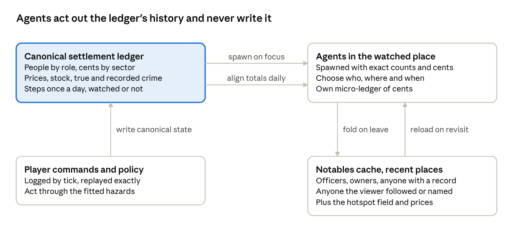

# Villages, cities and countries

Oct 5, 2026 · @Rd

## Bottom line

Every settlement always exists as a small integer ledger; agents exist only where the viewer looks. They are spawned from the ledger, aligned to it each simulated day and folded back on exit. Every scale-spanning game found keeps this split between cheap records and detailed instances, from Dwarf Fortress to Cities: Skylines.

The arithmetic fits a browser tab. In Node, a settlement-day cost about 0.5 µs, so 10,000 settlements advance a day in 5 ms and save in 0.22 MB gzip. Spawning 100,000 agents from a ledger took 7 ms, not counting map lookups, job matching or GPU upload. A country of individual people would not fit: at 50–90 ns per agent-tick, ten million people need about half a second per tick.

- **The ledger owns history ("shadow-canonical").** One seed yields the same country wherever anyone looks, and notable people persist between visits. Agents choose who, where and when, never how many; today's single city stays as City mode.
- **Rules are fitted, then tested against measured bands.** Each ledger hazard is fitted from headless runs of the city model. Tests treat cross-city regularities as ranges: output scales with population at β ≈ 1.11 in US metros (income in England and output in Germany scale linearly), sizes follow Zipf's law, and trade decays with distance at about −0.9.
- **Countries are generated, and streets built on demand.** A seeded mesh pipeline built terrain, rivers, 1,000 settlements and roads in 0.6 s. Street maps regenerate in 5–60 ms once warm, and six zoom levels run from country to follow-cam.
- **The cost is about 13–19 developer-weeks in all.** Small hooks go into M0, M2, M4, M5 and M6 now, and three milestones, M7–M9, follow launch (an unsourced estimate).

Every timing is Node on one desktop core, not a phone, and the crime-scaling, trade-distance and victimisation targets rest on search summaries. Check both before hard-coding any constant.

## Concept mockup

One simulation, three zoom levels: a country of villages, towns and a capital, one settlement simulated as individuals, and the rest as cheaper aggregate models. Original art in the same style as the town mockups; all place names are invented.


**Region view.** STONEGATE, the walled capital, three towns and eight villages; at the wider Country zoom only cities would be labelled. Each place pairs a red true-crime bar with a thinner blue recorded one, marked EST. where it runs as a ledger. Migration moves along the roads, and the red "!" is a robbery that only the true view shows before anyone reports it. MILLBRIDGE is LIVE: its agents are on screen, aligned to the record. The HUD counts 48k true thefts this year against 12k recorded, a 25% recording rate.


**The zoom.** The region view shows settlements, City mode shows agents as dots, and the street shows them as blob sprites; the gold boxes mark each step in. The aim is for one seed to drive all three, so zooming in reveals detail rather than starting a new simulation; the architecture section covers what that takes.

## Four tiers share one ledger per settlement

Detail follows the camera: agents run only in the watched settlement, and cheaper ledgers run everywhere else on one simulated calendar. No published design combines microsimulation alignment with viewer-driven detail, so this is the research team's synthesis.

| Tier | What runs | Who gets it | Cost, one desktop core |
| --- | --- | --- | --- |
| Agent | The struct-of-arrays agent model on its LDtk map | The watched settlement; above the device cap (10,000 agents on phones, 100,000 on desktops), only the districts in view | 50–90 ns per agent-tick; 100,000 agents ≈ 5 ms a tick |
| District | A ledger per district plus a 16×16 crime lattice | The rest of a watched city, and neighbouring towns still in view at City zoom | ≈ 0.5 µs per district-day (extrapolated); ≈ 8 µs per lattice step |
| Settlement | A ledger per settlement | Every other town and village, every day | ≈ 0.5 µs per settlement-day; 10,000 settlements ≈ 5 ms a day |
| Region | A regional account holding the "rural remainder" | Hamlets too small to list | Negligible |

Costs are Node measurements of simplified stand-ins, so the real models will cost more. On a phone, any town above 10,000 people is seen through the district window. A 165,000-person capital, as Zipf's law gives a 1.2-million-person country with a 200-person floor, needs it even on a desktop.

A settlement ledger holds 30–80 numbers: people by role, integer cents by sector, price and wage indices, inventory, vacancies, and true and recorded crime with a concentration index. Each day it draws integer flows for hires, separations, wages, taxes, consumption, repricing, offences, arrests, migration and trade. Draws stay integer and stochastic, so villages keep their small-number noise: stochastic rounding below a mean of 8, otherwise a 4,096-entry inverse-normal table.



Money lives in two ledgers. MINT is the only source and sink, and the agents' micro-ledger always totals exactly what the canonical ledger holds; only the split between households and firms can drift, and a day-boundary transfer pulls it back.

- **Spawn:** exact counts per role, a keyed shuffle, homes by LDtk capacity, jobs by firm size, and cash apportioned exactly (floor of balance × weight ÷ total, leftover cents one each along a keyed stride). In Node, leaving out LDtk lookups, job matching and GPU upload, it took 3.4 ms for 10,000 agents, 7.1 ms for 100,000 and 67 ms for a million, conserving every person and cent.
- **Align:** the ledger sets each day's boundary flows (births, deaths, migration, trade, taxes), which agents execute exactly. Interior totals such as hires and arrests use LIAM2's [alignment by sorting](https://github.com/liam2/liam2/blob/master/doc/usersguide/source/processes.rst); a 1% re-alignment took 4.6 ms at 10,000 agents.
- **Fold:** zooming out drops the micro-ledger and caches the notables (1–5% of people at about 32 bytes each), a 2 KB hotspot field and the price list, so the town keeps its police chief between visits.

Aggregation keeps crime volume but loses its pattern. In a Short-style burglary test, hotspots put 47–59% of burglaries in the top 5% of sites, against 10–21% without them. Every ledger therefore carries a concentration index beside crime volume, and a super-agent standing for N thieves is ruled out.

```ts
// Keyed draw: depends only on (seed, entity, tick, stream), never on call order (lowbias32 hash).
const mix32 = (x: number): number => {
  x ^= x >>> 16; x = Math.imul(x, 0x7feb352d);
  x ^= x >>> 15; x = Math.imul(x, 0x846ca68b);
  return (x ^ (x >>> 16)) >>> 0;
};
export const draw = (seed: number, entity: number, tick: number, stream: number): number =>
  mix32(mix32(mix32(mix32(seed ^ 0x85ebca6b) ^ entity) ^ tick) ^ (stream + 0x9e3779b9));
// Hash the seed first: with seed ^ entity, two seeds that differ only in low bits
// would give the same draws, shuffled among entities.

// Alignment by sorting: move exactly `need` agents from state `from` to `to`, highest score first.
// score = fixed-point propensity from the agent's own state + keyed noise; ties broken by index.
export function alignBySorting(state: Uint8Array, from: number, to: number,
                               need: number, score: Float64Array): number {
  const pool: number[] = [];
  for (let i = 0; i < state.length; i++) if (state[i] === from) pool.push(i);
  pool.sort((a, b) => score[b] - score[a] || a - b);
  const n = Math.min(need, pool.length);
  for (let k = 0; k < n; k++) state[pool[k]] = to;
  return need - n; // shortfall, carried into tomorrow's target
}
```

### Decision: the ledger owns history

Only one settlement can run as agents at a time on a phone, and only a few on a desktop, so three properties cannot all hold everywhere: the same country whoever looks, agents that change history, and people who persist between visits.

| Option | How it works | Same country whoever looks? | Agents change history? | People persist? | Cost and risk |
| --- | --- | --- | --- | --- | --- |
| **Shadow-canonical** (recommended for country mode) | The ledger runs every settlement every day, the watched one included; agents are spawned from it, aligned to it and never write it | Yes, by construction | No: agents choose who, where and when; the ledger sets how many | Notables cached and re-aligned; other residents re-drawn each visit | Emulator error shows as alignment nudges; a crime wave among agents reaches the country only if the emulator predicts it |
| **Consequential focus** (labelled opt-in) | Watched agents are canonical and fold exactly into the ledger on exit; each focus change is a logged input at a day boundary | Only for the same seed, inputs and focus log | Yes, wherever the viewer looks | Yes | Two viewers of one seed get different countries; seams like those players exploit in X4 and Bannerlord |
| **Fixed live set** (today's City mode, one city) | Settlements chosen at world creation run as agents every tick; the rest behave as under shadow-canonical | Yes | Only in the fixed set | Yes | CPU every tick: one 10,000-agent city on phones, one to three cities on desktops |
| **Detached fork** (first step) | "Open in City mode" starts a separate agent run from a settlement's ledger; nothing flows back | Yes | Only inside the fork | No | Cheapest; a what-if rather than a zoom |

Recommended: shadow-canonical for country mode, City mode unchanged as a fixed live set of one, consequential focus only as a labelled opt-in, and the fork as the first, cheapest zoom. Share links must replay identically and on-screen claims must be certifiable; under consequential focus a country's theft rate would depend on which towns a viewer opened. A simulation about how observation distorts the record should also not let observation change the truth.

The default gives up agent causality in country mode. Policy still works, because player commands write canonical state under every option, but it acts through the fitted hazards. A divergence meter, the fork and optional pinned live cities offset that cost.

### Five rules keep every scale replayable

1. **Keyed draws.** Every draw is `draw(seed, entity, tick, stream)`: 6.2 ns in Node against 7.7 ns for a sequential sfc32, and χ² = 15.1 on 15 degrees of freedom over a million entities. Agents and ledgers use separate salts.
2. **Plan, then apply.** Flows between settlements are planned from a read-only snapshot and applied as integer additions, so iteration order cannot matter; two 365-day runs of 10,000 settlements hashed identically.
3. **Exact arithmetic.** The core uses only +, −, ×, ÷, `sqrt`, `floor` and `imul`, which ECMAScript specifies exactly; transcendental curves come from build-time tables.
4. **Day boundaries.** Tier switches that write canonical state happen only at day boundaries and are logged like player commands.
5. **Double buffering.** A day step time-sliced to spare phones commits at the boundary, so slicing cannot change results.

At each day boundary, property tests check four things: accounts plus MINT sum to zero, population matches births, deaths and migration, spawn-then-fold is an identity, and replay hashes match. Keep WebGPU out of the canonical core unless it is integer-only, because [WGSL](https://github.com/gpuweb/gpuweb/blob/main/wgsl/index.bs) lets implementations reassociate float operations.

**Memory and saves.** Agents take 34–64 bytes each and ledgers 100–1,000 bytes. A 10,000-settlement country saved in 224 KB gzip after a simulated year, and a 100,000-agent city with its hotspot field in 1.3 MB. History is the storage risk: ten years of weekly series for 1,000 settlements took 6–14 MB, so keep weekly data for one year and monthly before that, quantised and delta-coded.

## Measured regularities tie villages, towns and cities together

Settlements connect through goods, people, money and crime, and each link has a measured regularity to test against. Treat each as a band, not a constant: exponents shift with the country, the city definition and even the estimator.

| Link between settlements | Target band for tests | Evidence |
| --- | --- | --- |
| Output and wages vs population | β 1.08–1.15, rejecting β = 1 | US metros 2013: 1.113 (1.089–1.137); OECD metros 2010: 1.124 ([edugalt/scaling](https://github.com/edugalt/scaling), computed) |
| Serious property crime and robbery | β 1.05–1.3 | US: 1.16 ([Bettencourt et al. 2007](https://wiki.santafe.edu/images/images/3/36/Bettencourt_et_al_2007.pdf), search summary); EU robbery 1.28–1.38 (computed) |
| Homicide and other violent deaths | β ≈ 1.0, not rejecting 1 | EU 1.01–1.03; Brazil 0.99–1.02 (computed) |
| Roads and other networks | β 0.80–0.88 | US 2013: 0.846 (computed) |
| Households and employment | β ≈ 1.0 | England and Wales 2011: 0.97–1.00 (computed) |
| Settlement sizes | Zipf ζ 0.9–1.2; about 1 place of 100,000+ and 11–18 of 10,000+ per million people | GeoNames, 11 countries (computed; national populations unchecked) |
| Spacing | Clark–Evans R 1.1–1.25 for small places, 0.9–1.1 for large ones | Germany and Iowa (computed) |
| Growth | Annual spread ≈ 1 percentage point; slight tilt toward large places | US metros 2010–22 (computed) |
| Goods trade | Distance elasticity −0.9 ± 0.2; price gaps inside the transport band | 1,467 estimates ([Disdier & Head 2008](https://econpapers.repec.org/RePEc:tpr:restat:v:90:y:2008:i:1:p:37-48), search summary) |
| Commuting | Distance exponent ≈ −2; two-thirds work in their home county | New York 2011 (computed) |
| Migration | 3.6–5.5% a year between settlements; rural youth 1.5–1.9% a year | US 2022–24 and 65 countries (search summaries) |
| Property victimisation | Urban : suburban : rural ≈ 3.4 : 1.7 : 1 (±30%) | NCVS 2023 ([BJS](https://bjs.ojp.gov/document/PropertyCrime_2023.pdf), search summary) |
| Recorded crime | Urban ÷ rural 1.5–2 | England 2023/24 (search summary) |
| Police | 4.5 officers per 1,000 in towns under 10,000; 2.3 nationally; 2.6 in county agencies | [FBI 2024 Quick Stats](https://hrc-prod-requests.s3-us-west-2.amazonaws.com/assets/images/Reported-Crimes-in-the-Nation-Quick-Stats.pdf), read in full |
| Response time | Rural median ≈ 2× urban | Ambulance studies ([PMC review](https://www.ncbi.nlm.nih.gov/pmc/articles/PMC9778378/), search summary) |
| Village food | 20–43% of food value produced at home | Rural Africa 2008–22 (search summary) |

### Scaling should emerge, not be imposed

Superlinearity should come from interaction rates in the agent tier: job contacts, customers per firm and targets per offender rise with density, and detection falls with anonymity. The ledgers inherit it through the emulator fitted across city sizes. Loot and detection may explain at most about 45% of the crime gradient ([Glaeser & Sacerdote](https://ideas.repec.org/p/nbr/nberwo/5430.html), search summary); the rest comes from who lives where and from peer effects.

CI should fit slopes on at least 20–30 settlements spanning two to three orders of magnitude, which gives a 95% interval near ±0.045 at 30 settlements (for a residual SD of 0.25). Counts with zeros need Poisson or negative-binomial likelihood: dropping zeros biased Brazilian AIDS deaths from 1.16 to 0.74. Re-aggregating places by commuting should move β a little, since an exponent that never moves is suspiciously over-tuned.

### Most places are villages

Under exact Zipf, the largest settlement is N divided by the harmonic number of the settlement count. A million people with a 200-person floor gives a largest town near 140,000 and about 700 settlements, 70 of them above 2,000 people and 14 above 10,000. Place capitals, then towns, then villages on jittered hexagonal spacing; a standard market town served about 18 villages in [Skinner's](https://escholarship.org/content/qt51x4g3qh/qt51x4g3qh.pdf?t=o0wtmd) surveys of rural China (search summary).

Draw annual growth with a spread of about one percentage point, a slight tilt toward large places and a reflecting floor at the minimum village size. Zipf's ζ should stay within 0.9–1.2 after 50 years.

### Goods chase price gaps

Ship a good from i to j when the margin is positive, the rule [Project Alice](https://github.com/schombert/Project-Alice/blob/main/src/economy/economy_trade_routes.cpp) uses for its Victoria 2 economy, adapted here to integer ledgers:

```latex
m_{ij} = p_j\,(1 - \lambda d_{ij}) - p_i\,(1 + \mu) - \tau d_{ij}
```

Here λ is the loss per km, μ the merchant cut and τ the transport price per km. Route volume moves toward the normalised margin with a daily decay, so connected pairs with spare transport capacity keep price gaps inside the transport band. Merchant agents in a watched town move inventories through the ledger rather than overwriting prices.

### People move on two clocks

Migration is monthly. Destinations follow the Harris–Todaro expected wage (posted wage × job-finding chance, minus a moving cost that rises with distance) over a gravity or radiation kernel. On New York's 2011 county flows, the parameter-free [radiation model](https://github.com/scikit-mobility/scikit-mobility/blob/master/skmob/models/radiation.py) matched about as well as gravity with a distance exponent of −2.

Commuting is daily and is an income flow, not a population flow. Commuters keep their household ledger at home and earn at work, within a daily range of about 50–100 km.

### Crime rises with size while police per head falls

Small US towns field 4.5 officers per 1,000 against 2.3 nationally, yet rural help arrives late: in ambulance studies the rural median response is about twice the urban one. Capture odds should therefore depend on response time over distance, so rural clearance can stay low where staffing is high. The Short field runs only in the agent and district tiers; monthly village crime is mostly zeros and ones, so tests pool years with Poisson likelihoods.

### Villages need a second goods channel

Book own production as goods outside the cent ledger, so self-provisioning never creates money; rural African households produced 20–33% of the food value they ate. Run one general shop per \~100 households, a market every 7 days (2–10 by density) with itinerant merchants, harvests once or twice a year into stores, and kin credit that nets to zero. Ship an agrarian and a modern preset, since a modern village grows far less of its own food.

### National accounts close to the cent

Godley and Lavoie's [Model REG](https://github.com/kennt/monetary-economics/blob/master/Chapter%206%20Model%20REG.ipynb) is the template: one treasury, one central bank as the only issuer, and a uniform national tax that shifts money toward a region whose demand falls. Five identities hold exactly every day, in integer units:

1. **Population:** yesterday's, plus births, minus deaths, plus net migration.
2. **Money:** constant except for explicit issue or destruction through MINT.
3. **Private net wealth:** changes by government net spending, net exports, commuters' net wages and migrants' net cash; exports and migrants' cash each sum to zero nationally.
4. **Goods:** balance per settlement, counting stock in transit and booked losses; own production counts here but never in money.
5. **Crime:** theft moves cents or goods without changing national money, and recorded crime never exceeds true crime.

Integer rounding goes to an explicit rounding account. Under consequential focus, a hand-off test closes the loop: watch a settlement, stop watching it, and compare it with a never-watched twin. Under shadow-canonical that test passes by construction, so the divergence meter does the work.

## Generate the country, hand-make the heroes, build streets on demand

A seeded mesh pipeline built a 1,000-settlement country on 30,000 cells in 0.59 s (1.37 s on 100,000 cells) in cold Node, with identical fingerprints across three runs on the same engine. It stored in about 24 KB gzip for settlements, 10 KB for routes and 12–16 KB for road geometry.

1. **Points:** a jittered grid or shipped Poisson points, never trigonometry, triangulated with [Delaunator](https://github.com/mapbox/delaunator).
2. **Elevation:** six-octave simplex noise with a continental falloff.
3. **Water:** priority-flood, flow accumulation and stream-power incision for rivers.
4. **Settlements:** a habitability score like [Azgaar's Fantasy Map Generator](https://github.com/Azgaar/Fantasy-Map-Generator) (FMG); capitals, then towns, then villages, with minimum spacing and rank-size populations P₁/k.
5. **Routes:** Delaunay → minimum spanning tree → greedy spanner (add an edge where the detour exceeds 1.6×), each edge routed by A\* with slope, river and road-reuse costs; the 1–5% of edges with no land path would become sea lanes.
6. **Regions and names:** multi-source Dijkstra regions, and names from a seeded [foswig](https://github.com/mrsharpoblunto/foswig.js) Markov chain on an original corpus (1,000 unique names in about 15 ms in Node), filtered in CI against Pokémon place names.

FMG (MIT), [mapgen4](https://github.com/redblobgames/mapgen4) (Apache-2.0), Delaunator, d3-delaunay and simplex-noise may be copied with their notices. Watabou's TownGeneratorOS (GPL-3.0) and probabletrain's MapGenerator (LGPL-3.0) are for ideas only. For engine-independent regeneration, replace `Math.cos` and `Math.sin` in Poisson-disc samplers and `Math.hypot` and `Math.pow` in the pipeline, or store the arrays in the save and keep the seed as provenance. No browser has tested cross-engine regeneration yet.

**Hand-make only the heroes.** [LDtk](https://github.com/deepnight/ldtk) clamps a level to 4,096 px, a 256×256-tile city at 16 px, and has no level of detail. Pokémon Emerald's whole overworld is 126,180 tiles, about two such cities. Keep LDtk for tutorials, story scenarios, showcase towns and a library of prefab blocks and village kits.

**Build streets when the viewer zooms in.** Each street map is seeded with hash(worldSeed, settlementId, generatorVersion) plus the country's context: tier, population, route bearings, river, coast, biome, port, crossroads and walls.

| Tier | Population | Built from | Size | Generation (Node, warm) |
| --- | --- | --- | --- | --- |
| Village | Up to ≈ 2,000 | LDtk kits with procedural dressing | 20×20 to 48×48 tiles | 5 ms at 48×48 |
| Town | ≈ 2,000–20,000 | BSP blocks and prefabs | 64–128 tiles across | 28 ms at 128×128 |
| City | 20,000+ | Districts zoned with prefab variants by wealth and crime | 256×256 tiles and up | 59 ms at 256×256 |

First runs took 11–63 ms. Maps came out byte-identical on every run at 0.2–4.4 KB gzip, so regenerating beats storing; saves keep only edits and the generator version.

### Six zoom levels, from country to one agent

Country to street spans about 800–1,600× in scale, more than one continuous zoom keeps legible, so the view switches between six levels. The bottom four are the city's existing Z0–Z3.

| Level | Shows | Tier behind it | Drawing | Labels and overlays |
| --- | --- | --- | --- | --- |
| Country | The whole country | Settlement and region | The mesh in a small palette-quantised framebuffer, or an 8-px tilemap | Capitals and cities; flows as trunks between regions |
| Region | A province | Settlement, plus route ledgers | The same mesh, denser; every settlement icon and road | All names; flow bands per route; sampled caravans |
| City (Z0) | One settlement | Agents, as a district window above the cap | Skin A dots over the minimap; a heatmap far out | Hotspots, prices and police beats; flows at entry tiles |
| District (Z1) | A few blocks | Agents | Skin C, or B without tiles | Crime and justice pins |
| Town (Z2) | A street | Agents | Skin C or B | Capped bubbles, signs, named people |
| Follow-cam (Z3) | One agent | Agents | Skin C or B | A thought panel, captions and an inspector synced to the charts |

- **Map modes** are pure functions, (state, entity) → {base, stripe}, so dots, blobs and pixel skins share them. True crime is the base colour and recorded crime the stripe, so crime needs no separate view.
- **Flows** of trade, migration, couriers and commuters are directed, side-offset bands along real roads, with width by volume, as in [OpenTTD's link graph](https://github.com/OpenTTD/OpenTTD/blob/4b5f010b41/src/linkgraph/linkgraph_gui.cpp). Only the selected flow gets particles, and those are capped.
- **Routes are places.** Each route keeps a ledger of traffic, bandit pressure, patrols, and true and recorded incidents. A watched route becomes a seeded strip map 20–40 tiles wide.
- **Transitions** cross-fade at the cursor with 15% hysteresis and 150 ms fades. Interior generation starts on hover, and a breadcrumb (Country › Region › Settlement › District) re-keys the charts.
- **Worker traffic** carries only changed per-settlement fields, since a full resend of 48 floats for 1,000 settlements is about 200 KB a tick. Agent buffers stream for the watched settlement only.

## What this adds to the plan

Country mode ships after launch and does not delay Lab or City mode. Five existing milestones get cheap hooks now and three new milestones follow M6; their tasks and exit checks are in the Implementation plan tab.

| Milestone | Country work added | Effort |
| --- | --- | --- |
| M0 Pipeline | Keyed counter-based randomness, a day-boundary phase, ledger namespaces, exact apportionment, plan-then-apply flows | 2–3 days |
| M2 Economy | A city that spawns from and folds into a ledger; daily flow logs; a headless design runner | 2–3 days |
| M4 Crime and police | Crime flow logs, a portable hotspot field, the size-gradient decomposition | 1–2 days |
| M5 Society and policy | City size in the calibration sweep, whose logs train the emulator | ≈ 1 day |
| M6 Scale and sharing | Country save sections, focus-log share links, a context-driven city generator | 2–3 days |
| M7 Country of ledgers (new) | A headless country: ledgers, emulator, national accounts, flows, village rules, CI targets | 19–28 days |
| M8 Country map (new) | Generated map, Country and Region views, map modes, flows, routes, fork into City mode | 13–20 days |
| M9 Zoom across scales (new) | Spawn, alignment and fold; interiors; district window; village agents; route strips; opt-in consequential focus | 23–35 days |

The total is about 63–95 developer-days, or 13–19 weeks, by an unsourced estimate. The emulator is the largest risk, since no published emulator exists for Lengnick's economy or a Short-type crime model at settlement scale, so build M7's docking test first.

**Open questions**

| Open question | What it decides | How to close it |
| --- | --- | --- |
| How large the alignment nudges are with the real emulator | Whether shadow-canonical feels natural or needs pinned live cities | Build M7's docking test and read the divergence meter on presets |
| Whether viewers notice non-causal agents, or exploit an observer effect | The default, and whether consequential focus ships | Playtest both with novices using bet cards |
| Day-step, spawn and generation times on phones and in browser workers | The phone tier for country mode | Run the benchmarks on an iPhone and a mid-range Android |
| Bettencourt's 2007 table with intervals, and Arcaute's range of exponents | The scaling bands | Read the PNAS 2007 and J. R. Soc. Interface 2015 papers |
| Police staffing and property crime by population group; victim reporting by location | Police per head and crime multipliers by settlement class | FBI tables 16 and 70–74; BJS reporting tables |
| Short et al.'s parameters, and whether a concentration index can be emulated | Crime concentration in the district and settlement tiers | Read Short 2008; fit on agent runs |
| Price gaps against distance within countries | The trade band and the transport cost τ | Atkin and Donaldson; the Engel–Rogers literature |
| Self-provisioning, kin credit and seasonal prices in modern villages | The agrarian and modern village presets | Survey data beyond LSMS-ISA |
| Central-place service thresholds | Which services each settlement offers | Christaller and Berry–Garrison; keep the thresholds tunable |
| Robbery hazards and reporting delays on routes | The route danger model | No published values found; tune them and label them as design |
| The Kenney Minimap Pack licence, and LDtk with hundreds of prefab levels | Country-view glyphs and the prefab library | Read kenney.nl; load-test a prefab project |
| The legal standing of generated names close to real or Pokémon names | How strict the name filter must be | Seek legal advice if the project goes commercial |

## Sources

93 links from this round, grouped by topic. Opened means read in full on GitHub, npm or an official file; summary means seen only in search results, so check it before relying on it. Team prototypes (Node benchmarks of the ledger, spawner, map and street generators) are local research files and are not linked.

**Scale, games and agent models**

- [Axtell, AAMAS 2016](https://cmepr.gmu.edu/wp-content/uploads/2017/09/Axtell-AAMAS-p806.pdf) · summary
- [BeforeIT.jl benchmark\_w\_matlab.jl](https://github.com/bancaditalia/BeforeIT.jl/blob/main/examples/benchmark_w_matlab.jl) · opened
- [BeforeIT.jl](https://github.com/bancaditalia/BeforeIT.jl) · opened
- [AgentTorch model card](https://github.com/AgentTorch/AgentTorch/blob/master/agent_torch/models/macro_economics/model_card.md) · opened
- [DFHack df.regionpop.xml](https://github.com/DFHack/df-structures/blob/master/df.regionpop.xml) · opened
- [DFHack df.wilderpop.xml](https://github.com/DFHack/df-structures/blob/master/df.wilderpop.xml) · opened
- [DFHack df.site.xml](https://github.com/DFHack/df-structures/blob/master/df.site.xml) · opened
- [Cities: Skylines Steam guide](https://steamcommunity.com/sharedfiles/filedetails/?id=2712549268) · summary
- [Stellaris Dev Diary #372](https://forum.paradoxplaza.com/forum/developer-diary/stellaris-dev-diary-372-modding-pop-groups-and-jobs.1729994/) · summary
- [STALKER alife\_switch\_manager\_inline.h](https://github.com/OpenXRay/xray-16/blob/master/src/xrGame/alife_switch_manager_inline.h) · opened
- [STALKER alife\_update\_manager.cpp](https://github.com/OpenXRay/xray-16/blob/master/src/xrGame/alife_update_manager.cpp) · opened
- [X4 mod scripts](https://github.com/A11ectus/X4-Subsystem-Targeting-Orders) · opened
- [X4 Steam discussion](https://steamcommunity.com/app/392160/discussions/0/840627496100645234/) · summary
- [Bannerlord combat simulation gist](https://gist.github.com/jzebedee/be076d28f162c8d05fd7d2d72109a46f) · opened
- [Scheffer et al. 1995](https://www.sciencedirect.com/science/article/abs/pii/030438009400055M) · summary
- [Parry & Evans 2008](https://ui.adsabs.harvard.edu/abs/2008EcMod.214..141P/abstract) · summary
- [Bobashev et al. 2007](https://www.researchgate.net/publication/261459282_A_Hybrid_Epidemic_Model_Combining_The_Advantages_Of_Agent-Based_And_Equation-Based_Approaches) · summary
- [Navarro et al. 2011](https://hal.science/hal-01288047) · summary
- [AgentTorch behavior.py](https://github.com/AgentTorch/AgentTorch/blob/master/agent_torch/core/llm/behavior.py) · opened

**Architecture and determinism**

- [Lengnick replication](https://github.com/avakeeling199/Lengnick-replication) · opened
- [Nakamura & Steinsson](https://ideas.repec.org/a/oup/qjecon/v123y2008i4p1415-1464..html) · summary
- [Godley–Lavoie notebooks (model SIM)](https://github.com/kennt/monetary-economics) · opened
- [Lamperti et al. 2018](https://ideas.repec.org/p/fce/doctra/1709.html) · summary
- [LIAM2 processes.rst](https://github.com/liam2/liam2/blob/master/doc/usersguide/source/processes.rst) · opened
- [ECMAScript spec](https://github.com/tc39/ecma262/blob/main/spec.html) · opened
- [V8 15.0 ieee754.cc](https://github.com/v8/v8/blob/15.0-lkgr/src/base/ieee754.cc) · opened
- [WGSL spec](https://github.com/gpuweb/gpuweb/blob/main/wgsl/index.bs) · opened
- [MDN browser-compat-data GPU.json](https://github.com/mdn/browser-compat-data/blob/main/api/GPU.json) · opened
- [Sunshine-Hill & Badler, AIIDE](https://ojs.aaai.org/index.php/AIIDE/article/view/12389) · summary

**Regularities between settlements**

- [edugalt/scaling](https://github.com/edugalt/scaling) · opened
- [Bettencourt et al. 2007](https://wiki.santafe.edu/images/images/3/36/Bettencourt_et_al_2007.pdf) · summary
- [edugalt/scaling: Eurostat data](https://github.com/edugalt/scaling/tree/master/data/eurostat) · opened
- [edugalt/scaling: metropolitan-miles.csv](https://github.com/edugalt/scaling/blob/master/data/usa/metropolitan-miles.csv) · opened
- [edugalt/scaling: UK data](https://github.com/edugalt/scaling/tree/master/data/uk) · opened
- [all-the-cities](https://registry.npmjs.org/all-the-cities) · opened
- [edugalt/scaling: US population 2010–22](https://github.com/edugalt/scaling/blob/master/data/usa/us_2010_2022_population.csv) · opened
- [Disdier & Head 2008](https://econpapers.repec.org/RePEc:tpr:restat:v:90:y:2008:i:1:p:37-48) · summary
- [scikit-mobility: New York commuting data](https://github.com/scikit-mobility/scikit-mobility/tree/master/examples) · opened
- [BJS: property crime, NCVS 2023](https://bjs.ojp.gov/document/PropertyCrime_2023.pdf) · summary
- [Defra: crime in rural England](https://www.gov.uk/government/statistics/communities-and-households-statistics-for-rural-england/e-crime) · summary
- [FBI 2024 Quick Stats](https://hrc-prod-requests.s3-us-west-2.amazonaws.com/assets/images/Reported-Crimes-in-the-Nation-Quick-Stats.pdf) · opened
- [PMC: rural–urban EMS response review](https://www.ncbi.nlm.nih.gov/pmc/articles/PMC9778378/) · summary
- [LSMS-ISA own-production study (2024)](https://www.sciencedirect.com/science/article/pii/S2211912424000014) · summary
- [Arcaute et al. 2015](https://royalsocietypublishing.org/rsif/article/12/102/20140745/35313/Constructing-cities-deconstructing-scaling) · summary
- [Glaeser & Sacerdote 1999](https://ideas.repec.org/p/nbr/nberwo/5430.html) · summary
- [Soo 2005](https://legacy.econ.tuwien.ac.at/hanappi/AgeSo/rp/Soo_2005.pdf) · summary
- [edugalt/scaling: US metro GDP 2013](https://github.com/edugalt/scaling/blob/master/data/usa/USmetro_gdp_pop_2013) · opened
- [Census Vintage 2024](https://www.census.gov/newsroom/press-releases/2025/vintage-2024-popest.html) · summary
- [Skinner](https://escholarship.org/content/qt51x4g3qh/qt51x4g3qh.pdf?t=o0wtmd) · summary
- [Project Alice economy\_trade\_routes.cpp](https://github.com/schombert/Project-Alice/blob/main/src/economy/economy_trade_routes.cpp) · opened
- [Project Alice economy\_constants.hpp](https://github.com/schombert/Project-Alice/blob/main/src/economy/economy_constants.hpp) · opened
- [Victoria 3 wiki: Market](https://vic3.paradoxwikis.com/Market) · summary
- [tldmod module\_scripts.py](https://github.com/tldmod/tldmod/tree/master/ModuleSystem) · opened
- [Freeciv traderoutes.c](https://github.com/freeciv/freeciv/blob/main/common/traderoutes.c) · opened
- [Axios: US moving rate](https://www.axios.com/2025/11/30/us-moving-rate-map) · summary
- [Census: why people move](https://www.census.gov/library/stories/2023/09/why-people-move.html) · summary
- [Young 2013](https://researchonline.lse.ac.uk/id/eprint/46872/) · summary
- [scikit-mobility radiation.py](https://github.com/scikit-mobility/scikit-mobility/blob/master/skmob/models/radiation.py) · opened
- [scikit-mobility gravity.py](https://github.com/scikit-mobility/scikit-mobility/blob/master/skmob/models/gravity.py) · opened
- [FBI 2019](https://ucr.fbi.gov/crime-in-the-u.s/2019/crime-in-the-u.s.-2019/topic-pages/violent-crime) · summary
- [statsmodels statecrime.csv](https://github.com/statsmodels/statsmodels/blob/main/statsmodels/datasets/statecrime/statecrime.csv) · opened
- [Project Alice economy\_pops.cpp](https://github.com/schombert/Project-Alice/blob/main/src/economy/economy_pops.cpp) · opened
- [Godley–Lavoie model REG notebook](https://github.com/kennt/monetary-economics/blob/master/Chapter%206%20Model%20REG.ipynb) · opened
- [Project Alice economy\_design.md](https://github.com/schombert/Project-Alice/blob/main/docs/economy_design.md) · opened

**Maps, generators and zoom**

- [FMG policy](https://github.com/Azgaar/Fantasy-Map-Generator/wiki/Policy) · opened
- [FMG generation-pipeline.ts](https://github.com/Azgaar/Fantasy-Map-Generator/blob/b944003c14/src/generators/generation-pipeline.ts) · opened
- [FMG graph-density.ts](https://github.com/Azgaar/Fantasy-Map-Generator/blob/b944003c14/src/data/graph-density.ts) · opened
- [FMG routes-generator.ts](https://github.com/Azgaar/Fantasy-Map-Generator/blob/b944003c14/src/generators/routes-generator.ts) · opened
- [mapgen4 README](https://github.com/redblobgames/mapgen4/blob/c1d8cb018a/README.org) · opened
- [fast-2d-poisson-disk-sampling](https://github.com/kchapelier/fast-2d-poisson-disk-sampling/blob/master/src/fast-poisson-disk-sampling.js) · opened
- [Delaunator index.js](https://github.com/mapbox/delaunator/blob/main/index.js) · opened
- [Watabou TownGeneratorOS](https://github.com/watabou/TownGeneratorOS/blob/7fbc87a939/README.md) · opened
- [probabletrain MapGenerator](https://github.com/probabletrain/MapGenerator/blob/f487e4cee3/README.md) · opened
- [LDtk LevelInstanceForm.hx](https://github.com/deepnight/ldtk/blob/6d69bd1d6b/src/electron.renderer/ui/LevelInstanceForm.hx) · opened
- [LDtk JSON\_DOC.md](https://github.com/deepnight/ldtk/blob/6d69bd1d6b/docs/JSON_DOC.md) · opened
- [pret/pokeemerald map data](https://github.com/pret/pokeemerald/tree/731ad5bfd6/data/maps) · opened
- [FMG Knowledge Base](https://github.com/Azgaar/Fantasy-Map-Generator/wiki/Knowledge-Base) · opened
- [FMG burgs-generator.ts](https://github.com/Azgaar/Fantasy-Map-Generator/blob/b944003c14/src/generators/burgs-generator.ts) · opened
- [Cataclysm: DDA OVERMAP.md](https://github.com/CleverRaven/Cataclysm-DDA/blob/6c506a7544/doc/JSON/OVERMAP.md) · opened
- [pret/pokeemerald region\_map.c](https://github.com/pret/pokeemerald/blob/731ad5bfd6/src/region_map.c) · opened
- [pret/pokeemerald region\_map\_sections.json](https://github.com/pret/pokeemerald/blob/731ad5bfd6/src/data/region_map/region_map_sections.json) · opened
- [DFHack Maps.rst](https://github.com/DFHack/dfhack/blob/c872dc4c64/docs/api/Maps.rst) · opened
- [Victoria 3 wiki: Map modes](https://vic3.paradoxwikis.com/Map_modes) · summary
- [OpenVic Mapmode.cpp](https://github.com/OpenVicProject/OpenVic-Simulation/blob/dd311914fb/src/openvic-simulation/map/Mapmode.cpp) · opened
- [OpenTTD linkgraph\_gui.cpp](https://github.com/OpenTTD/OpenTTD/blob/4b5f010b41/src/linkgraph/linkgraph_gui.cpp) · opened
- [FMG trade-animation-options.ts](https://github.com/Azgaar/Fantasy-Map-Generator/blob/b944003c14/src/data/trade-animation-options.ts) · opened
- [FMG labels-renderer.ts](https://github.com/Azgaar/Fantasy-Map-Generator/blob/b944003c14/src/renderers/labels/labels-renderer.ts) · opened
- [Kenney Minimap Pack (GitHub mirror)](https://github.com/shorepine/kenney/tree/3694c6879e/2d/Minimap%20Pack/Tiles) · opened
- [pret/pokeemerald layouts.json](https://github.com/pret/pokeemerald/blob/731ad5bfd6/data/layouts/layouts.json) · opened
- [RimWorld wiki: Caravan](https://rimworldwiki.com/wiki/Caravan) · summary
- [FMG Journeys](https://github.com/Azgaar/Fantasy-Map-Generator/wiki/Journeys) · opened
- [foswig.js](https://github.com/mrsharpoblunto/foswig.js/blob/62ef9c625f/README.md) · opened
- [BJS: criminal victimization 2024](https://bjs.ojp.gov/library/publications/criminal-victimization-2024) · summary
